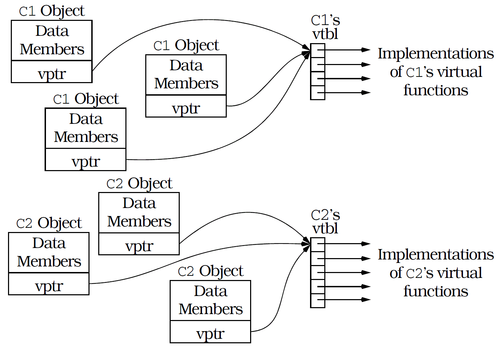

# _Effective C++_ Notes

- Notes of reading <u>Scott Meyers</u>'s _Effective C++_ series:
    1. *[`Effective C++`](https://github.com/AXIHIXA/Memo/blob/master/notes/cpp/effective_cpp_notes_01_effective_cpp.md)*
    2. ***[`More Effective C++`](https://github.com/AXIHIXA/Memo/blob/master/notes/cpp/effective_cpp_notes_02_more_effective_cpp.md)***
    3. *[`Effective STL`](https://github.com/AXIHIXA/Memo/blob/master/notes/cpp/effective_cpp_notes_03_effective_stl.md)*
    4. *[`Effective Modern C++`](https://github.com/AXIHIXA/Memo/blob/master/notes/cpp/effective_cpp_notes_04_effective_modern_cpp.md)*


---

## 🌱 _More Effective C++_

### 🎯 Chapter 1. Basics

### 📌 Item 1: Distinguish between pointers and references


First, recognize that there is **no** null reference. 
A reference must always refer to some object. 
As a result, if you have a variable whose purpose is to refer to another object, 
but it is possible that there might not be an object to refer to,
you should make the variable a pointer, because then you can set it to null. 
On the other hand, if the variable must always refer to an object, 
i.e., if your design does **not** allow for the possibility that the variable is null, 
you should probably make the variable a reference.


The following code is undefined behavior (compilers can generate output to do anything they like):
```c++
char * pc = nullptr;  // set pointer to null
char & rc = *pc;      // make reference to refer to de-referenced null pointer
```
Because a reference must refer to an object, C++ requires that references be initialized:
```c++
std::string & rs;        // error! References must be initialized

std::string s("xyzzy");
std::string & rs = s;    // okay, rs refers to s

// Pointers are subject to no such restriction:
std::string * ps;        // uninitialized pointer: valid but risky
```
The fact that there is no such thing as a null reference implies that 
it can be more efficient to use references than to use pointers. 
That’s because there’s no need to test the validity of a reference before using it:
```c++
void printDouble(const double & rd)
{
    std::cout << rd << '\n';
}
```
Pointers, on the other hand, should generally be tested against null:
```c++
void printDouble(const double * pd)
{
    if (pd)
    {
        std::cout << pd << '\n';
    }
}
```
Another important difference between pointers and references is that
pointers may be reassigned to refer to different objects (low-high-level `const`ness).
A reference, however, always refers to the object with which it is initialized (fixed high-level `const`ness): 
```c++
std::string s1("Nancy");
std::string s2("Clancy");
std::string & rs = s1;     // rs refers to s1
std::string * ps = &s1;    // ps points to s1
rs = s2;                   // rs still refers to s1, 
                           // but s1’s value is now "Clancy"
ps = &s2;                  // ps now points to s2; s1 is unchanged
```
In general, you should use a pointer 
whenever you need to take into account the possibility 
that there’s nothing to refer to (in which case you can set the pointer to null) 
or whenever you need to be able to refer to different things at different times 
(in which case you can change where the pointer points). 
You should use a reference whenever you know there will always be an object to refer to, 
and you also know that once you’re referring to that object, 
you’ll never want to refer to anything else.


There is one other situation in which you should use a reference, 
and that’s when you’re implementing certain operators. 
The most common example is `operator[]`. 
This operator typically needs to return lvalue (something that can be used as the target of an assignment):
```c++
std::vector<int> vec(10);
vec[5] = 10;
```
If `std::vector<int>::operator[]` returned a pointer, this last statement would have to be written this way:
```c++
*vec[5] = 10;
```
But this makes it look like `vec` is a vector of pointers, which it’s not. 
For this reason, you’ll almost always want `operator[]` to return a reference. 
(For an interesting exception to this rule, see Item 30.)
References, then, are the feature of choice 
when you know you have something to refer to 
and when you’ll never want to refer to anything else. 
They’re also appropriate when implementing operators whose syntactic requirements make the use of pointers undesirable. 
In all other cases, stick with pointers.


### 📌 Item 2: Prefer C++-style casts


### 📌 Item 3: Never treat arrays polymorphically

- Polymorphism does **not** work with pointer arithmetic. 
  Array operations always involve pointer arithmetic, so they **do** not work with polymorphism. 


One of the most important features of inheritance is that 
you can manipulate derived class objects 
through pointers and references to base class objects. 
Such pointers and references are said to behave _polymorphically_, as if they had multiple types. 


C++ also allows you to manipulate _arrays_ of derived class objects through base class pointers and references. 
This is **no** feature at all, because it almost **never** works the way you want it to.


For example, suppose you have a class `BST` (for binary search trees) 
and a second class, `AVL`, that inherits from `BST`:
```c++
template <typename T>
class BST { ... };

template <typename T>
class AVL : public BST<T> { ... };

// Note that for parameter types,
// `const BST<T> []` is essentially same as a `const BST<T> *`!
template <typename T>
void printBSTArray(std::ostream & cout, const BST<T> array[], int numElements)
{
    for (int i = 0; i < numElements; ++i)
    {
        cout << array[i] << '\n';
    }
}

BST bstArray[10];
printBSTArray(cout, bstArray, 10);  // fine

AVL avlArray[10];
printBSTArray(cout, avlArray, 10);  // works fine?
```
Compilers will accept this function call without complaint.
But, `array[i]` is really just shorthand for the expression `*(array + i)`. 
We know that when passed as to function parameters, 
`array` is implicitly cast to a pointer to the beginning of the array, 
but how far away from the memory location pointed to by `array` is the memory location pointed to by `array + i`? 
The distance between them is `i * sizeof(an object in the array)`, 
because there are `i` objects between `array[0]` and `array[i]`. 
In order for compilers to emit code that walks through the array correctly, 
they must be able to determine the size of the objects in the array. 
This is easy for them to do. 
The parameter `array` is declared to be of type array-of-`BST`, 
so each element of the array must be a `BST`, and the distance between `array` and `array + i` must be `i * sizeof(BST)`.


At least that’s how your compilers look at it. 
But if you’ve passed an array of `AVL` objects to `printBSTArray`, 
your compilers are probably wrong. 
In that case, they’d assume each object in the array is the size of a `BST`, 
but each object would actually be the size of an `AVL`. 
Derived classes usually have more data members than their base classes, 
so derived class objects are usually larger than base class objects. 
We thus expect a `AVL` object to be larger than a `BST` object. 
If it is, the pointer arithmetic generated for `printBSTArray` will be **wrong** for arrays of `AVL` objects, 
and there’s no telling what will happen when `printBSTArray` is invoked on a `AVL`array. 
Whatever does happen, it’s a good bet it won’t be pleasant.


The problem pops up in a different guise if you try to 
delete an array of derived class objects through a base class pointer. 
Here’s one way you might innocently attempt to do it:
```c++
void deleteArray(std::ostream & lout, BST array[])
{
    lout << "Deleting array at address " << static_cast<void *>(array) << '\n';
    delete [] array;
}

AVL * avlArray = new AVL[50];
deleteArray(std::cout, avlArray);
```
You can’t see it, but there’s pointer arithmetic going on here, too. 
When an array is deleted, a destructor for each element of the array must be called (see Item 8). 
When compilers see the statement `delete [] array;`,
they must generate code that does something like this:
```c++
// destruct the objects in *array in the inverse order in which they were constructed
for (int i = the number of elements in the array - 1; 0 <= i; --i)
{
    array[i].BST::~BST();
}
```
Just as this kind of loop failed to work when you wrote it, 
it will fail to work when your compilers write it, too. 
The language specification says 
**the result of deleting an array of derived class objects through a base class pointer is undefined**, 
but we know what that really means:
executing the code is almost certain to lead to grief. 


Polymorphism and pointer arithmetic simply don’t mix. 
Array operations almost always involve pointer arithmetic, so arrays and polymorphism don’t mix.


Note that you’re unlikely to make the mistake of treating an array polymorphically 
if you avoid having a concrete (non-abstract) class (like `AVL`) inherit from another concrete class (such as `BST`).
As Item 33 explains, designing your software so that concrete classes never inherit from one another has many benefits. 
I encourage you to turn to Item 33 and read all about them. 


### 📌 Item 4: Avoid gratuitous default constructors

- If the default constructor can not initialize all members meaningfully, 
  Other member functions will have to invalidate the data members. 
- `Delete`ing default constructors when not able to initialize all members meaningfully can lead to problems. 
  Some templates require the default constructors of their type parameters.


A default constructor (i.e., a constructor that can be called with no arguments)
is the C++ way of saying you can get something for nothing. 
Constructors initialize objects, 
so default constructors initialize objects without any information from the place where the object is being created. 
Sometimes this makes perfect sense. 
Objects that act like numbers, for example, may reasonably be initialized to zero or to undefined values. 
Objects that act like pointers may reasonably be initialized to null or to undefined values. 
Data structures like linked lists, hash tables, maps, and the like may reasonably be initialized to empty containers. 


Not all objects fall into this category. 
For many objects, there is no reasonable way to 
perform a complete initialization in the absence of outside information. 
For example, an object representing an entry in an address book 
makes no sense unless the name of the thing being entered is provided. 
In some companies, all equipment must be tagged with a corporate ID number, 
and creating an object to model a piece of equipment in such companies is nonsensical 
unless the appropriate ID number is provided.


In a perfect world, 
classes in which objects could reasonably be created from nothing would contain default constructors 
and classes in which information was required for object construction would not. 
If a class lacks a default constructor, there are restrictions on how you can use that class.
Consider a class for company equipment 
in which the corporate ID number of the equipment is a mandatory constructor argument:
```c++
class EquipmentPiece 
{
public:
    EquipmentPiece(int IDNumber);
    // ...
};
```
Because `EquipmentPiece` lacks a default constructor, its use may be problematic in three contexts. 
The first is the _creation of arrays_. 
There is, in general, no way to specify constructor arguments for objects in arrays, 
so it is not usually possible to create arrays of `EquipmentPiece` objects:
```c++
EquipmentPiece bestPieces[10];                         // Error! No EquipmentPiece::EquipmentPiece()
EquipmentPiece * bestPieces = new EquipmentPiece[10];  // Error! Same problem
```
There are three ways to get around this restriction. 
A solution for non-heap arrays is to provide the necessary arguments 
at the point where the array is defined:
```c++
EquipmentPiece bestPieces[] = 
        { 
            EquipmentPiece(ID1),
            EquipmentPiece(ID2),
            EquipmentPiece(ID3),
            ...,
            EquipmentPiece(ID10)
        };
```
Unfortunately, there is **no** way to extend this strategy to heap arrays.
A more general approach is to use an array of pointers instead of an array of objects:
```c++
using PEP = EquipmentPiece *;    // a PEP is a pointer to an EquipmentPiece
PEP bestPieces[10];              // fine, no constructors called
PEP * bestPieces = new PEP[10];  // also fine
```
Each pointer in the array can then be made to point to a different `EquipmentPiece` object:
```c++
for (std::size_t i = 0; i < 10; ++i)
{
    bestPieces[i] = new EquipmentPiece(someIDNumber);
}
```
There are two disadvantages to this approach. 
First, you have to remember to `delete` all the objects pointed to by the array. 
If you forget, you have a resource leak. 
Second, the total amount of memory you need increases, 
because you need the space for the pointers as well as the space for the `EquipmentPiece` objects.
You can avoid the space penalty if you allocate the raw (uninitialized) memory for the array, 
then use _placement `new`_ (see Item 8) to construct the `EquipmentPiece` objects in the memory:
```c++
// Allocate enough raw memory for an array of 10 EquipmentPiece objects; 
// See Item 8 for details on the operator new[] function
void * rawMemory = operator new[](10 * sizeof(EquipmentPiece));

// Make bestPieces point to it so it can be treated as an EquipmentPiece array
EquipmentPiece * bestPieces = static_cast<EquipmentPiece *>(rawMemory);

// Construct the EquipmentPiece objects in the memory using placement new (see Item 8)
for (std::size_t i = 0; i < 10; ++i)
{
    new (bestPieces + i) EquipmentPiece(someIDNumber);
}
```
Notice that you still have to provide a constructor argument for each `EquipmentPiece` object. 
This technique (as well as the array-of-pointers idea) 
allows you to create arrays of objects when a class lacks a default constructor; 
it doesn’t show you how to bypass required constructor arguments. 
There is no way to do that. 
If there were, it would defeat the purpose of constructors, 
which is to guarantee that objects are initialized.


The downside to using placement `new`, 
aside from the fact that most programmers are unfamiliar with it (which will make maintenance more difficult), 
is that you must manually call destructors on the objects
in the array when you want them to go out of existence, 
then you must manually deallocate the raw memory by calling `operator delete[]` (see Item 8):
```c++
// Destruct the objects in bestPieces 
// in the inverse order in which they were constructed
for (std::size_t i = 9; 0 <= i; --i)
{
    bestPieces[i].~EquipmentPiece();
}

// deallocate the raw memory
operator delete[](rawMemory);
```
If you forget this requirement and use the normal array-deletion syntax,
your program will behave _unpredictably_. 
That’s because `delete`ing a pointer that didn’t come from the `new` operator is _undefined behavior_:
```c++
// undefined! bestPieces didn’t come from the new operator
delete [] bestPieces;
```
The second problem with classes lacking default constructors is that
they are ineligible for use with many template-based container classes. 
That’s because it’s a common requirement for such templates that the
type used to instantiate the template provide a default constructor. 
This requirement almost always grows out of the fact that inside the template, 
an array of the template parameter type is being created. 
For example, a template for an `Array` class might look something like this:
```c++
template <typename T>
class Array 
{
public:
    Array(std::size_t size);
    // ...
    
private:
    T * data;
};

template <typename T>
Array<T>::Array(std::size_t size)
{
    // calls T::T() for each element of the array
    data = new T[size]; 
    // ... 
}
```
In most cases, careful template design can eliminate the need for a default constructor. 
For example, `std::vector` template has **no** requirement that its type parameter have a default constructor. 
Unfortunately, many templates are not carefully designed. 
That being the case, classes without default constructors will be incompatible with many templates. 


The final consideration in the to-provide-a-default-constructor-or-not-to-provide-a-default-constructor dilemma 
has to do with virtual base classes. 
Virtual base classes lacking default constructors are a pain to work with. 
That’s because the arguments for virtual base class constructors must be provided 
by the most derived class of the object being constructed. 
As a result, a virtual base class lacking a default constructor requires that _all_ classes derived from that class
must understand the meaning of and provide for the virtual base class’s constructors’ arguments. 
Authors of derived classes neither expect nor appreciate this requirement. 


Because of the restrictions imposed on classes lacking default constructors,
some people believe all classes should have them, 
even if a default constructor doesn’t have enough information to fully initialize objects of that class. 
For example, adherents to this philosophy might modify `EquipmentPiece` as follows:
```c++
class EquipmentPiece 
{
public:
    explicit EquipmentPiece(int IDNumber = UNSPECIFIED);
    // ...
    
private:
    // magic ID number value meaning no ID was specified
    static constexpr int UNSPECIFIED;  
};
```
This allows `EquipmentPiece` objects to be created like this:
```c++
EquipmentPiece e;  // now okay
```
Such a transformation almost always complicates the other member functions of the class, 
because there is no longer any guarantee that 
the fields of an `EquipmentPiece` object have been meaningfully initialized.
Assuming it makes no sense to have an `EquipmentPiece` without an ID field, 
most member functions must check to see if the ID is present. 
If it’s not, they’ll have to figure out how to stumble on anyway.
Often it’s not clear how to do that, and many implementations choose a solution that offers nothing but expediency: 
they throw an exception or they call a function that terminates the program. 
When that happens, it’s difficult to argue that the overall quality of the software has been improved 
by including a default constructor in a class where none was warranted.


Inclusion of meaningless default constructors affects the efficiency of classes, too. 
If member functions have to test to see if fields have truly been initialized, 
clients of those functions have to pay for the time those tests take. 
Furthermore, they have to pay for the code that goes into those tests, 
because that makes executables and libraries bigger.
They also have to pay for the code that handles the cases where the tests fail. 
All those costs are avoided if a class’s constructors ensure that 
all fields of an object are correctly initialized. 
Often default constructors can’t offer that kind of assurance, 
so it’s best to avoid them in classes where they make no sense. 
That places some limits on how such classes can be used, 
but it also guarantees that when you do use such classes, 
you can expect that the objects they generate are fully initialized and are efficiently implemented. 


### 🎯 Chapter 2. Operators

### 📌 Item 5: Be wary of user-defined conversion functions

- User-defined (implicit) conversion functions are generally evil. 
  They may end up calling undesired versions of functions. 
- Declare single-parameter conversion constructors `explicit`. 
- Do **not** define conversion operators.


C++ allows compilers to perform implicit conversions between types. 
E.g., C++ allows implicit conversions 
from `char` to `int`, from `short` to `double`, from `int` to `short`, and from `double` to `char`. 


You can’t do anything about such conversions, because they’re hardcoded into the language. 
When you add your own types, however, you have more control, 
because you can choose whether to provide the functions compilers are allowed to use for implicit type conversions.


Two kinds of functions allow compilers to perform user-defined implicit conversions:
1. Non-`explicit` Single-argument Constructors; 
2. Implicit Type Conversion Operators. 


A single-argument constructor is a constructor that may be called with only one argument. 
Such a constructor may declare a single parameter or it may declare multiple parameters, 
with each parameter after the first having a default value. 
```c++
class Name
{
public:
    // converts std::string to Name
    Name(const std::string & s); 
    // ...
};

class Rational
{
public:
    // converts int to Rational
    Rational(int numerator = 0, int denominator = 1);
    // ...
};
```
An implicit type conversion operator is simply a member function with a strange-looking name: 
the word `operator` followed by a type specification. 
You are **not** allowed to specify a type for the function’s return value, 
because the type of the return value is basically just the name of the function. 
For example, to allow `Rational` objects to be implicitly converted to `double`s 
(which might be useful for mixed-mode arithmetic involving `Rational` objects), 
you might define class `Rational` like this:
```c++
class Rational
{
public:
    // ...

    // converts Rational to double
    operator double() const; 
};

// r has the value 1/2
Rational r(1, 2);    
// converts r to a double, then does multiplication
double d = 0.5 * r;  
```
You usually **don’t** want to provide type conversion functions of _any_ ilk. 


The fundamental problem is that such functions often end up 
being called when you neither want nor expect them to be. 
The result can be incorrect and unintuitive program behavior 
that is maddeningly difficult to diagnose.


Let us deal first with implicit type conversion operators, 
as they are the easiest case to handle. 
Suppose you have a class for rational numbers similar to the one above, 
and you’d like to print `Rational` objects as if they were a built-in type. 
That is, you’d like to be able to do this:
```c++
Rational r(1, 2);
std::cout << r << '\n';  // should print "1/2"
```
Further suppose you forgot to write an `operator<<` for `Rational` objects. 
You would probably expect that the attempt to print `r` would fail,
because there is no appropriate `operator<<` to call. 
You would be mistaken. 
Your compilers, faced with a call to a function called `operator<<` that takes a `Rational`, 
would find that no such function existed, 
but they would then try to find an acceptable sequence of implicit type conversions 
they could apply to make the call succeed. 
The rules defining which sequences of conversions are acceptable are complicated,
but in this case your compilers would discover they could make the call succeed 
by implicitly converting `r` to a `double` by calling `Rational::operator double`. 
The result of the code above would be to print `r` as a floating point number, 
**not** as a rational number. 
This is hardly a disaster, 
but it demonstrates the disadvantage of implicit type conversion operators: 
Their presence can lead to the wrong function being called 
(i.e., one other than the one intended).


The solution is to replace the operators with equivalent functions 
that don’t have the syntactically magic names. 
For example, to allow conversion of a `Rational` object to a `double`, 
replace `operator double` with a function called something like `asDouble`: 
```c++
class Rational 
{
public:
    // ...
    
    // converts Rational to double
    double asDouble() const;  
};
```
Such a member function must be called explicitly:
```c++
Rational r(1, 2);
std::cout << r << '\n';             // Error! No operator<< for Rationals
std::cout << r.asDouble() << '\n';  // Fine, prints r as a double
```
In most cases, the inconvenience of having to call conversion functions explicitly is more 
than compensated for by the fact that unintended functions can no longer be silently invoked.
E.g., `std::string` type contains **no** implicit conversion 
from a `std::string` object to a C-style `char *`. 
Instead, there’s an explicit member function, 
`std::string::c_str`, that performs that conversion. 


Implicit conversions via single-argument constructors are more difficult to eliminate. 
Furthermore, the problems these functions cause are in many cases
worse than those arising from implicit type conversion operators.


As an example, consider a class template for array objects. 
These arrays allow clients to specify upper and lower index bounds:
```c++
template <typename T>
class Array 
{
public:
    Array(std::size_t lowerIndexBound, std::size_t upperIndexBound);
    Array(std::size_t size);
    T & operator[](std::size_t index);
    // ...
};
```
The first constructor in the class allows clients to specify a range of array indices. 
As a two-argument constructor, this function is ineligible for use as a type-conversion function. 
The second constructor, which allows clients to define `Array` objects 
by specifying only the number of elements in the array 
(in a manner similar to that used with built-in arrays), is different. 
It can be used as a type conversion function, and that can lead to problems. 
The following code
```c++
bool operator==(const Array<int> & lhs, const Array<int> & rhs);

Array<int> a(10);
Array<int> b(10);

for (std::size_t i = 0; i < 10; ++i)
{
    if (a == b[i])  // oops! "a" should be "a[i]"
    {
        // do something for when a[i] and b[i] are equal;
    } 
    else
    {
        // do something for when they’re not;
    }
}
```
is essentially the same as the following via user-defined implicit conversions:
```c++
for (std::size_t i = 0; i < 10; ++i)
{
    if (a == static_cast<Array<int>>(b[i])) ...
}
```
The drawbacks to implicit type conversion operators can be avoided by
declaring single-parameter constructors `explicit`. 
Compilers are prohibited from invoking `explicit` constructors 
for purposes of implicit type conversion. 
Explicit conversions are still legal.
```c++
template <typename T>
class Array 
{
public:
    explicit Array(std::size_t size); 
    // ...
};

// okay, explicitly calling the explicit constructor
Array<int> a(10);               
Array<int> b(10);

// error! no such implicit conversion
if (a == b[i]) ...              

// okay, conversion is explicit (but the logic of the code is suspect)
if (a == Array<int>(b[i])) ...
if (a == static_cast<Array<int>>(b[i])) ...
if (a == (Array<int>) b[i]) ...
```
A sad story when `explicit` constructors were not introduced to C++ standard.
The implicit conversion only allows one user-defined conversion 
(conversion constructor and conversion operator), 
otherwise the _implicit conversion sequence_ could be infinitely long. 
Knowing this fact, we write the following ugly (but working) code: 
```c++
template <typename T>
class Array
{
public:
    class Size
    {
    public:
        Size(std::size_t size) : mSize(size) {}
        std::size_t size() const { return mSize; }

    private:
        std::size_t mSize;
    };

    Array(std::size_t lowerIndexBound, std::size_t upperIndexBound);

    // Now the conversion from int to Array
    // requires two adjacent user-defined conversions, 
    // blocking the path of implicit conversion
    Array(Size size);
    
    // ...
};

// Good, 
// user calling Array<int>::Array(Array::Size) with argument of type int, 
// just implicitly convert int into Array::Size with one user-defined conversion. 
Array<int> a(10);

bool operator==(const Array<int> & lhs, const Array<int> & rhs);

Array<int> a(10);
Array<int> b(10);

for (int i = 0; i < 10; ++i)
{
    // Oops! "a" should be "a[i]". 
    // This is now an error! 
    if (a == b[i]) ...
}
```
The use of the `Array::Size` in this example might look like a special-purpose hack,
but it’s actually a specific instance of a more general technique. 
Classes like `Array::Size` are often called _proxy classes_ (see Item 30),
because each object of such a class stands for (is a proxy for) some other object. 
An `Array::Size` object is really just a stand-in for the integer used to specify the size of the `Array` being created. 
Proxy objects can give you control over aspects of your software’s behavior, 
in this case implicit type conversions, that is otherwise beyond your grasp, 
so it’s well worth your while to learn how to use them. 


### 📌 Item 6: Distinguish between prefix and postfix forms of increment and decrement operators

- Let prefix increment/decrement operators return a reference, 
  and let their prefix counterparts return a `const` object. 
- Postfix increment/decrement operators should be implemented 
  in terms of their prefix counterparts. 
- Prefix increment/decrement operators should be used whenever possible,
  because they are inherently more efficient than their prefix counterparts. 


Overloaded functions are differentiated on the basis of the parameter types they take, 
but neither prefix nor postfix increment or decrement takes an argument. 
To surmount this linguistic pothole, it was decreed that postfix forms take an `int` argument, 
and compilers silently pass `0` as that `int` when those functions are called:
```c++
// Unlimited-precision Int
class UPInt
{
public:
    UPInt & operator++();         // prefix ++
    const UPInt operator++(int);  // postfix ++
    UPInt & operator--();         // prefix --
    const UPInt operator--(int);  // postfix --
    UPInt & operator+=(int); 
    ...
};

UPInt i;
++i;  // calls i.operator++();
i++;  // calls i.operator++(0);
--i;  // calls i.operator--();
i--;  // calls i.operator--(0);
```
The prefix and postfix forms of these operators return different types. 
In particular, prefix forms return a reference, postfix forms return a `const` object. 
We’ll focus here on the prefix and postfix `++` operators. 


From your days as a C programmer, 
you may recall that the prefix form of the increment operator is sometimes called “increment and fetch,” 
while the postfix form is often known as “fetch and increment.”
These two phrases are important to remember, 
because they all but act as formal specifications for how prefix and postfix increment should be implemented:
```c++
// prefix form: increment and fetch
UPInt & UPInt::operator++()
{
    *this += 1;    // increment
    return *this;  // fetch
}

// postfix form: fetch and increment
const UPInt UPInt::operator++(int)
{
    const UPInt tmp = *this;  // fetch
    ++(*this);                // increment
    return tmp;               // return what was fetched
}
```
Note how the postfix operator makes no use of its parameter. 
The only purpose of the parameter is to distinguish prefix from postfix function invocation.
C++ also allows you to _omit names for parameters you don’t plan to use_; 
that’s what’s been done above.


It’s clear why postfix increment must return an object (it’s returning an old value), 
but why a `const` object? 
Imagine that it did not. Then the following would be legal:
```c++
UPInt i;
i++++;    // apply postfix increment twice
```
This is the same as
```c++
i.operator++(0).operator++(0);
```
and it should be clear that the second invocation of `operator++` 
is being applied to the object returned from the first invocation. 


There are two reasons to abhor this. 
1. It’s inconsistent with the behavior of the built-in types. 
   A good rule to follow when designing classes is: 
   _When in doubt, do as the `int`s do_.  
   And, the `int`s most certainly do not allow double application of postfix increment:
   ```c++
   int i;
   i++++;  // error!
   ```
2. Double application of postfix increment almost never does what clients expect it to. 
   As noted above, the second application of `operator++` in a double increment 
   changes the value of the object returned from the first invocation, 
   not the value of the original object. 
   Hence, if `i++++;`were legal, `i` would be incremented only once. 
   This is counterintuitive and confusing (for both `int`s and `UPInt`s), 
   so it’s best prohibited.

C++ prohibits it for `int`s, but you must prohibit it yourself for classes you write. 
The easiest way to do this is to make the return type of postfix increment a `const` object. 
Then when compilers see
```c++
i++++;  // same as i.operator++(0).operator++(0);
```
they recognize that the `const` object returned from the first call to `operator++`
is being used to call `operator++` again. 
`operator++`, however, is a non-`const` member function, can not be called by `const` objects. 


If you’re the kind who worries about efficiency, 
you probably broke into a sweat when you first saw the postfix increment function. 
That function has to create a temporary object for its return value (see Item 19),
and the implementation above also creates an explicit temporary object (`tmp`)
that has to be constructed and destructed. 
The prefix increment function has no such temporaries. 
This leads to the possibly startling conclusion that, for efficiency reasons alone, 
clients of `UPInt` should prefer prefix increment to postfix increment 
unless they really need the behavior of postfix increment. 
Let us be explicit about this.
When dealing with user-defined types, 
_prefix increment should be used whenever possible, 
because it’s inherently more efficient._


Let us make one more observation about the prefix and postfix increment operators. 
Except for their return values, they do the same thing:
they increment a value. 
That is, they’re supposed to do the same thing.
How can you be sure the behavior of postfix increment is consistent
with that of prefix increment? 
What guarantee do you have that their implementations won’t diverge over time, 
possibly as a result of different programmers maintaining and enhancing them? 
Unless you’ve followed the design principle embodied by the code above, 
you have no such guarantee. 
That principle is that _postfix increment and decrement should be implemented in terms of their prefix counterparts_. 
You then need only maintain the prefix versions, 
because the postfix versions will automatically behave in a consistent fashion.


### 📌 Item 7: Never overload `operator&&`, `operator||`, or `operator,`

- The evaluation order of `operator&&`, `operator||`, and `operator,` (left-to-right, short-circuit) 
  will be lost in the function-call logic of their user-overloaded versions. 
  Programs working on these features may crash. 
  **Never** overload `operator&&`, `operator||`, or `operator,`

Like C, C++ employs _short-circuit evaluation_ of boolean expressions.
This means that once the truth or falsehood of an expression has been determined, 
evaluation of the expression ceases, 
even if some parts of the expression haven’t yet been examined.
For example, in this case,
```c++
char * p;
if (p && (10 < std::strlen(p))) ...
```
there is **no** need to worry about invoking `std::strlen` on `p` if it’s a null pointer, 
because if the test of `p` against `nullptr` fails, `std::strlen` will never be called. 
Similarly, given
```c++
std::size_t rangeCheck(std::size_t index)
{
    if ((index < lowerBound) || (upperBound < index)) ...
}
```
`index` will never be compared to `upperBound` if it’s less than `lowerBound`.


This is the behavior that has been drummed into C and C++ programmers since time immemorial, 
so this is what they expect.
Furthermore, they write programs whose correct behavior depends on short-circuit evaluation. 
In the first code fragment above, for example, 
it is important that `std::strlen` not be invoked if `p` is a null pointer, 
because the standard for C++ states (as does the standard for C) 
that the result of invoking `std::strlen` on a null pointer is undefined.


C++ allows you to customize the behavior of the `&&` and `||` operators for user-defined types. 
You _can_ do it by overloading the functions `operator&&` and `operator||`, 
and you _can_ do this at the global scope or on a per-class basis. 
If you decide to take advantage of this opportunity,
however, you must be aware that you are changing the rules of the game quite radically, 
because you are replacing short-circuit semantics with function call semantics. 
That is, if you overload `operator&&`, what looks to you like this,
```c++
if (expr1 && expr2) ...
```
looks to compilers like one of these:
```c++
// when operator&& is a member function
if (expr1.operator&&(expr2)) ...

// when operator&& is a global function
if (operator&&(expr1, expr2)) ...
```
This may not seem like that big a deal,
but function call semantics differ from short-circuit semantics in two crucial ways. 
1. When a function call is made, all parameters must be evaluated, 
   so when calling the functions `operator&&` and `operator||`, 
   both parameters are evaluated. 
   There is, in other words, **no** short circuit. 
2. The language specification leaves undefined the order of evaluation of parameters to a function call, 
   so there is no way of knowing whether `expr1` or `expr2` will be evaluated first. 
   This stands in stark contrast to short-circuit evaluation, 
   which always evaluates its arguments in left-to-right order.


As a result, if you overload `&&` or `||`, 
there is **no** way to offer programmers the behavior they both expect and have come to depend on. 
So _don’t overload `&&` or `||`_. 


The situation with the comma operator `operator,` is similar,
The comma operator is used to form expressions,
and you’re most likely to run across it in the update part of a `for` loop. 
```c++
// reverse string s in place
void reverse(char s[])
{
    for (int i = 0, j = std::strlen(s) - 1; i < j; ++i, --j) 
    {
        int c = s[i];
        s[i] = s[j];
        s[j] = c;
    }
}
```
Here, `i` is incremented and `j` is decremented in the final part of the for loop. 
It is convenient to use the comma operator here, 
because only an expression is valid in the final part of a `for` loop; 
separate statements to change the values of `i` and `j` would be illegal.


Just as there are rules in C++ defining how `&&` and `||` behave for builtin types, 
there are rules defining how the comma operator behaves for such types. 
An expression containing a comma is evaluated by first evaluating the part of the expression to the left of the comma, 
then evaluating the expression to the right of the comma; 
the result of the overall comma expression is the value of the expression on the right. 
So in the final part of the loop above, compilers first evaluate `++i`, then `--j`, 
and the result of the comma expression is the value returned from `--j`. 


You need to mimic this behavior if you’re going to take
it upon yourself to write your own comma operator. 
Unfortunately, you **can't** perform the requisite mimicry. 


If you write `operator,` as a non-member function, 
you’ll **never** be able to guarantee that the left-hand expression 
is evaluated before the right-hand expression, 
because both expressions will be passed as arguments in a function call (to `operator,`). 
But you have no control over the order in which a function’s arguments are evaluated. 
So the non-member approach is definitely out. 


That leaves only the possibility of writing `operator,` as a member function. 
Even here you can’t rely on the left-hand operand to the comma operator being evaluated first, 
because compilers are not constrained to do things that way. 
Hence, you **can’t** overload the comma operator and also guarantee it will behave the way it’s supposed to. 
It therefore seems imprudent to overload it at all. 


You may be wondering if there’s an end to this overloading madness.
After all, if you can overload the comma operator, what can’t you overload?
As it turns out, there are limits. 
You **can’t** overload the following operators:
```c++
.           .*           ::         ?:
new         delete       sizeof     typeid
static_cast dynamic_cast const_cast reinterpret_cast
```
You can overload these:
```c++
operator new        operator delete
operator new[]      operator delete[]
+    -    *    /    %    ^    &    |    ~
!    =    <    >    +=   -=   *=   /=   %=
^=   &=   |=   <<   >>   >>=  <<=  ==   !=
<=   >=   &&   ||   ++   --   ,    ->*   ->
()  []
```
Of course, just because you can overload these operators is no reason to run off and do it. 
The purpose of operator overloading is to make programs easier to read, write, and understand, 
not to dazzle others with your knowledge that comma is an operator. 
If you don’t have a good reason for overloading an operator, don’t overload it. 
In the case of `&&,` `||,` and `,`, it’s difficult to have a good reason, 
because no matter how hard you try, 
you can’t make them behave the way they’re supposed to.


### 📌 Item 8: Understand the different meanings of `new` and `delete`


_`new` operator_ (more-usually called [_`new` expression_](https://en.cppreference.com/w/cpp/language/new)) 
is different from [_`operator new`_](https://en.cppreference.com/w/cpp/memory/new/operator_new). 
When you write code like this,
```c++
std::string * ps = new std::string("Memory Management");
```
the `new` you are using is the `new` operator. 
This operator is built into the language and, like `sizeof`, 
you **can’t** change its meaning: It always does the same thing. 

1. It allocates enough memory to hold an object of the type requested. 
   In the example above, it allocates enough memory to hold a string object. 
2. It calls a constructor to initialize an object in the memory that was allocated. 

The `new` operator always does those two things; 
you can’t change its behavior in any way.


What you can change is how the memory for an object is allocated. 
The `new` operator calls a function `operator new` to perform the requisite memory allocation,
and you can rewrite or overload `operator new` to change its behavior.


The `operator new` function is usually declared like this:
```c++
void * operator new(std::size_t count);
```
The return type is `void *`, because this function returns a pointer to raw, uninitialized memory. 
(If you like, you can write a version of `operator new` that initializes the memory to some value 
before returning a pointer to it, but this is not commonly done.) 
The `size_t` parameter specifies how much memory to allocate. 
You can overload `operator new` by adding additional parameters, 
but the first parameter must always be of type `std::size_t`. 


You’ll probably **never** want to call `operator new` directly, 
but on the off chance you do, you’ll call it just like any other function:
```c++
void * ptr = operator new(sizeof(std::string));
```
Here `operator new` will return a pointer to a chunk of memory large enough to hold a `std::string` object.


Like `std::malloc`, `operator new`’s only responsibility is to allocate memory. 
It knows **nothing** about constructors. 
All `operator new` understands is memory allocation. 
It is the job of the `new` operator to take the raw memory that `operator new` returns and transform it into an object.
When your compilers see a statement like
```c++
std::string * ps = new std::string("Memory Management");
```
they must generate code that more or less corresponds to this:
```c++
void * ptr = operator new(sizeof(std::string));  // memory allocation
new (ptr) std::string("Memory Management");      // placement new
auto ps = reinterpret_cast<std::string *>(ptr);  // pointer-to-object
```
Notice that the second step above involves calling a constructor, 
something you, a mere programmer, are **prohibited** from doing. 
Your compilers are unconstrained by mortal limits, however, 
and they can do whatever they like. 
That’s why you must use the `new` operator if you want to conjure up a heap-based object: 
you can’t directly call the constructor necessary to initialize the object 
(including such crucial components as its virtual table — see Item 24).

#### Placement `new`

There are times when you really want to call a constructor directly. 
Invoking a constructor on an existing object makes no sense,
because constructors initialize objects, and an object can only be initialized once. 
But occasionally you have some raw memory that’s already been allocated but not yet initialized, 
and you need to construct an object in the memory you have. 
A special version of operator `new` called placement `new` allows you to do it.
```c++
std::allocator<MyStruct> alloc;
using alloc_traits_t = std::allocator_traits<decltype(alloc)>;

// "Kind of" equivalent calls
int * p = alloc.allocate(1);               // auto p = static_cast<int *>(operator new(sizeof(MyStruct)));
alloc_traits_t::construct(alloc, p, ...);  // new (p) MyStruct(...);
alloc_traits_t::destory(alloc, p);         // p->~MyStruct();
alloc.deallocate(p, 1);                    // operator delete(p);
```
The expression `new (p) MyStruct(...);` looks a little strange at first, 
but it’s just a use of the `new` operator in which an additional argument `p` is being specified 
for the implicit call that the `new` operator makes to `operator new`. 
The `operator new` thus called must, in addition to the mandatory `std::size_t` argument,
accept a `void *` parameter that points to the memory the object being constructed is to occupy. 
That `operator new` is _placement `new`_, and it looks like this:
```c++
void * operator new(std::size_t count, void * ptr)
{
    return ptr;
}
```
This is probably simpler than you expected,
but this is all placement `new` needs to do. 
After all, the purpose of `operator new` is to find memory for an object and return a pointer to that memory. 
In the case of placement `new`, the caller already knows what the pointer to the memory should be, 
because the caller knows where the object is supposed to be placed. 
All placement `new` has to do, then, is return the pointer that’s passed into it. 
Placement `new` is part of the standard C++ library.
To use placement `new`, all you have to do is `#include <new>`.


If we step back from placement `new` for a moment, 
we’ll see that the relationship between the `new` operator and `operator new`, 
though perhaps terminologically confusing, is conceptually straightforward. 
If you want to create an object on the heap, use the `new` operator. 
It both allocates memory and calls a constructor for the object. 
If you only want to allocate memory, call `operator new`; 
no constructor will be called. 
If you want to customize the memory allocation that takes place when heap objects are created, 
write your own version of `operator new` and use the `new` operator; 
it will automatically invoke your custom version of `operator new`. 
If you want to construct an object in memory you’ve already got a pointer to, use _placement `new`_.

#### Deletion and Memory Allocation

To avoid resource leaks, every dynamic allocation must be matched by an equal and opposite deallocation. 
The function `operator delete` is to the built-in `delete` operator as `operator new` is to the `new` operator.
When you say something like this,
```c++
std::string * ps;
delete ps;
```
your compilers must generate code both to destruct the object `ps`points to 
and to deallocate the memory occupied by that object.
The memory deallocation is performed by the `operator delete` function
```c++
void operator delete(void * ptr) noexcept;
```
Hence,
```c++
delete ps;
```
causes compilers to generate code that approximately corresponds to
```c++
ps->~string();        // call the object’s destructor
operator delete(ps);  // deallocate the memory the object occupied
```
One implication of this is that if you want to deal only with raw, uninitialized memory, 
you should bypass the `new` and `delete` operators entirely.
Instead, you should call `operator new` to get the memory and `operator delete` to return it to the system:
```c++
// Allocate enough memory for 50 chars; Calls no constructors
void * buffer = operator new(50 * sizeof(char));
// Deallocate the memory; Calls no destructors
operator delete(buffer);
```
This is the C++ equivalent of calling `malloc` and `free`. 
If you use placement `new` to create an object in some memory, 
you should avoid using the `delete` operator on that memory. 
That’s because the `delete` operator calls `operator delete` to deallocate the memory, 
but the memory containing the object wasn’t allocated by `operator new` in the first place; 
placement `new` just returned the pointer that was passed to it. 
Who knows where that pointer came from? 
Instead, you should undo the effect of the constructor by explicitly calling the object’s destructor:
```c++
std::allocator<MyStruct> alloc;
using alloc_traits_t = std::allocator_traits<decltype(alloc)>;

// "Kind of" equivalent calls
int * p = alloc.allocate(1);               // auto p = static_cast<int *>(operator new(sizeof(MyStruct)));
alloc_traits_t::construct(alloc, p, ...);  // new (p) MyStruct(...);
alloc_traits_t::destory(alloc, p);         // p->~MyStruct();
alloc.deallocate(p, 1);                    // operator delete(p);
```
As this example demonstrates, 
if the raw memory passed to placement `new` was itself dynamically allocated 
(through some unconventional means), 
you must still deallocate that memory if you wish to avoid a memory leak. 

#### Arrays

```c++
// Allocate an array of objects
std::string * ps = new std::string[10];
```
The `new` being used is still the `new` operator, 
but because an array is being created, 
the `new` operator behaves slightly differently from the case of single-object creation. 
For one thing, memory is no longer allocated by `operator new`.
Instead, it’s allocated by the array-allocation equivalent, `operator new[]` (_array `new`_).
Like `operator new`, `operator new[]` can be overloaded.
This allows you to seize control of memory allocation for arrays 
in the same way you can control memory allocation for single objects.


The second way in which the new operator behaves differently for arrays than for objects 
is in the number of constructor calls it makes. 
For arrays, a constructor must be called for each object in the array:
```c++
// Call operator new[] to allocate memory for 10 std::string objects,
// then call the default std::string constructor for each array element
std::string * ps = new std::string[10];
```
Similarly, when the `delete` operator is used on an array, 
it calls a destructor for each array element 
and then calls `operator delete[]` to deallocate the memory:
```c++
// Call the std::string destructor for each array element, 
// then call operator delete[] to deallocate the array’s memory
delete [] ps; 
```
Just as you can replace or overload `operator delete`, 
you can replace or overload `operator delete[]`. 
There are some restrictions on how they can be overloaded. 


The `new` and `delete` operators are built-in and beyond your control, 
but the memory allocation and deallocation functions they call are not. 
When you think about customizing the behavior of the `new` and `delete` operators, 
remember that you can’t really do it.
You can modify how they do what they do, 
but what they do is fixed by the language.


### 🎯 Chapter 3. Exceptions

### 📌 Item 9: Use RAII objects to prevent resource leaks

Say goodbye to built-in pointers that are used to manipulate local resources.
Suppose you’re writing software to read daily logs and do the appropriate processing. 
A reasonable approach to this task is to define an abstract base class,
`ALA` (“Adorable Little Animal”), 
plus concrete derived classes for puppies and kittens. 
A `virtual` function, `processAdoption`, handles the necessary species-specific processing:
```
ALA <- Puppy
    <- Kitten
```
```c++
class ALA 
{
public:
    virtual void processAdoption() = 0;
    ...
};

class Puppy : public ALA 
{
public:
    virtual void processAdoption();
    ...
};

class Kitten : public ALA
{
public:
    virtual void processAdoption();
    ...
};
```
You’ll need a function that can read information from a file 
and produce either a `Puppy` object or a `Kitten` object, 
depending on the information in the file. 
This is a perfect job for a _`virtual` constructor_. 
For our purposes here, the function’s declaration is all we need:
```c++
// Read animal information from fin, 
// then return a pointer to a newly allocated object of the appropriate type
ALA * readALA(std::istream & sin);
```
The heart of your program is likely to be a function that looks something like this:
```c++
void processAdoptions(std::istream & sin)
{
    // while there’s data
    while (sin) 
    {
        ALA * pa = readALA(sin);  // get next animal
        pa->processAdoption();    // process adoption
        delete pa;                // delete object that readALA returned
    }
}
```
This function loops through the information in `fin`, 
processing each entry as it goes. 
The only mildly tricky thing is the need to remember to `delete pa` at the end of each iteration. 
This is necessary because `readALA` creates a new heap object each time it’s called. 
Without the call to `delete`, the loop would contain a resource leak.


Now consider what would happen if `pa->processAdoption` threw an exception. 
`processAdoptions` fails to catch exceptions, 
so the exception would propagate to `processAdoptions`’s caller. 
In doing so, all statements in `processAdoptions` after the call to `pa->processAdoption`would be skipped, 
and that means `pa` would never be `delete`d. 
As a result, anytime `pa->processAdoption` throws an exception, 
`processAdoptions` contains a resource leak.


Plugging the leak is easy enough,
```c++
void processAdoptions(std::istream & sin)
{
    while (sin)
    {
        ALA * pa = readALA(sin);
        
        try
        {
            pa->processAdoption();
        }
        catch (...)  // catch all exceptions
        {
            // avoid resource leak when an exception is thrown
            delete pa;
            
            // propagate exception to caller
            throw; 
        }

        // avoid resource leak when no exception is thrown
        delete pa; 
    } 
}
```
but then you have to litter your code with `try-catch` blocks. 
More importantly, 
you are forced to duplicate cleanup code 
that is common to both normal and exceptional paths of control. 
In this case, the call to `delete` must be duplicated. 
Like all replicated code, this is annoying to write and difficult to maintain, but it also feels wrong. 
Regardless of whether we leave `processAdoptions` by a normal return or by throwing an exception, 
we need to `delete pa`, so why should we have to say that in more than one place?


We don’t have to if we can somehow move the cleanup code that must always be executed 
into the destructor for an object local to `processAdoptions`. 
That’s because local objects are always destroyed when leaving a function, 
regardless of how that function is exited. 
(The only exception to this rule is when you call [`std::longjmp`](https://en.cppreference.com/w/cpp/utility/program/longjmp), 
and this shortcoming of `std::longjmp` is the primary reason 
why C++ has support for exceptions in the first place.) 
Our real concern, then, is moving the `delete` from `processAdoptions` 
into a destructor for an object local to `processAdoptions`.


The solution is to replace the built-in pointer `pa` with an object that acts like a pointer. 
That way, when the pointer-like object is (automatically) destroyed,
we can have its destructor call `delete`. 
Objects that act like pointers, but do more, are called _smart pointers_. 
It’s not difficult to write a class for such objects, but we don’t need to.
STL contains shared pointers. 
```c++
void processAdoptions(std::istream & sin)
{
    // while there’s data
    while (sin) 
    {
        std::unique_ptr<ALA> pa(readALA(sin));  // get next animal
        pa->processAdoption();                  // process adoption
    }
}
```


### 📌 Item 10: Prevent resource leaks in constructors

- The destructor is **never** called if the constructor throws an exception. 
  Use RAII objects like smart pointers to manage members on heap. 
- To handle exceptions in the constructor body, use `try` blocks. 
- To handle exceptions in the member initializer list,
  use constructor `try` block directly, 
  or let private member functions (with `try` blocks) 
  prepare and return the stuff needed in the member initializer list. 


You are developing software for a multimedia address book 
that holds a picture of the person and the sound of their voice, 
together with other common stuff.

To implement the book, you might come up with a design like this:
```c++
class Image
{
public:
    Image(const std::string & imageDataFileName);
    ...
};

class AudioClip
{
public:
    AudioClip(const std::string & audioDataFileName);
    ...
};

class PhoneNumber
{
    ...
};

class BookEntry
{
public:
    BookEntry(const std::string & name,
              const std::string & address = "",
              const std::string & imageFileName = "",
              const std::string & audioClipFileName = "");

    ~BookEntry();

    // phone numbers are added via this function
    void addPhoneNumber(const PhoneNumber & number);

    ...
    
private:
    std::string theName;                      // person’s name
    std::string theAddress;                   // their address
    std::vector<PhoneNumber> thePhones;       // their phone numbers
    std::shared_ptr<Image> theImage;          // their image
    std::shared_ptr<AudioClip> theAudioClip;  // an audio clip from them
};
```
Each `BookEntry` must have `name` data, 
so you require that as a constructor argument, 
but the other fields are optional.
A straightforward way to write the `BookEntry` constructor and destructor is as follows:
```c++
BookEntry::BookEntry(const std::string & name,
                     const std::string & address,
                     const std::string & imageFileName,
                     const std::string & audioClipFileName)
        : theName(name),
          theAddress(address),
          theImage(nullptr),
          theAudioClip(nullptr)
{
    if (imageFileName != "")
    {
        theImage = std::make_shared<Image>(imageFileName);
    }
    
    if (audioClipFileName != "")
    {
        theAudioClip = std::make_shared<AudioClip>(audioClipFileName);
    }
}

BookEntry::~BookEntry() = default;
```
The constructor initializes the pointers `theImage` and `theAudioClip` to null, 
then makes them point to real objects if the corresponding arguments are non-empty strings. 


Everything looks fine here (if using smart pointers),
but if not using smart pointers, 
things are **not** fine at all under exceptional conditions.


Consider what will happen if an exception is thrown 
during execution of this part of the `BookEntry` constructor:
```c++
if (audioClipFileName != "") 
{
    theAudioClip = new AudioClip(audioClipFileName);
}
```
An exception might arise because `operator new` is unable to allocate enough memory for an `AudioClip` object. 
One might also arise because the `AudioClip` constructor itself throws an exception.
Regardless of the cause of the exception, if one is thrown within the `BookEntry` constructor, 
it will be propagated to the site where the `BookEntry` object is being created.

Now, if an exception is thrown during creation of the object `theAudioClip`is supposed to point to 
(thus transferring control out of the `BookEntry` constructor), 
who `delete`s the object that `theImage` already points to? 
The obvious answer is that `BookEntry`’s destructor does,
but the obvious answer is wrong. `BookEntry`’s destructor will **never** be called. 


C++ destroys only fully constructed objects, 
and an object isn’t fully constructed until its constructor has run to completion. 
So if a `BookEntry` object b is created as a local object,
```c++
void testBookEntryClass()
{
    BookEntry b("Addison-Wesley Publishing Company", 
                "One Jacob Way, Reading, MA 01867");
    ...
}
```
and an exception is thrown during construction of `b`, 
`b`’s destructor will **not** be called. 
Furthermore, if you try to take matters into your own hands 
by allocating `b` on the heap and then calling `delete` if an exception is thrown: 
```c++
void testBookEntryClass()
{
    BookEntry * pb = nullptr;
    
    try
    {
        pb = new BookEntry("Addison-Wesley Publishing Company",
                           "One Jacob Way, Reading, MA 01867");
        ...
    }
    catch (...)  // catch all exceptions
    {
        // delete pb when an exception is thrown
        delete pb; 
        // propagate exception to caller
        throw; 
    }
    
    delete pb;  // delete pb normally
}
```
you’ll find that the `Image` object allocated inside `BookEntry`’s constructor is still lost, 
because no assignment is made to `pb` unless the `new` operation succeeds. 
If `BookEntry`’s constructor throws an exception,
`pb` will be the null pointer, 
so `delete`ing it in the catch block does **nothing** except make you feel better about yourself.


There is a reason why C++ refuses to call destructors for objects that haven’t been fully constructed. 
It’s because it would be harmful in many cases. 
If a destructor were invoked on an object that wasn’t fully constructed, 
how would the destructor know what to do? 
The only way it could know would be 
if bits had been added to each object indicating how much of the constructor had been executed. 
Then the destructor could check the bits and (maybe) figure out what actions to take. 
Such bookkeeping would slow down constructors,
and it would make each object larger, too. 
C++ avoids this overhead, but the price you pay is that partially constructed objects
aren’t automatically destroyed.


Because C++ won’t clean up after objects that throw exceptions during construction, 
you must design your constructors so that they clean up after themselves. 
Often, this involves simply catching all possible exceptions,
executing some cleanup code, then rethrowing the exception so it continues to propagate. 
This strategy can be incorporated into the `BookEntry` constructor like this:
```c++
BookEntry::BookEntry(const std::string & name,
                     const std::string & address,
                     const std::string & imageFileName,
                     const std::string & audioClipFileName)
        : theName(name),
          theAddress(address),
          theImage(0),
          theAudioClip(0)
{
    try
    {
        if (imageFileName != "")
        {
            theImage = new Image(imageFileName);
        }
        
        if (audioClipFileName != "")
        {
            theAudioClip = new AudioClip(audioClipFileName);
        }
    }
    catch (...)  // catch any exception
    {
        // perform necessary cleanup actions
        delete theImage; 
        delete theAudioClip;

        // propagate the exception
        throw; 
    }
}
```
There is no need to worry about `BookEntry`’s non-pointer data members.
Data members are automatically initialized before a class’s constructor is called, 
so if a `BookEntry` constructor body begins executing,
the object’s `theName`, `theAddress`, and `thePhones` data members have already been fully constructed. 
As fully constructed objects, these data members will be automatically destroyed
even if an exception (provided that it is caught) arises in the `BookEntry` constructor. 
Of course, if these objects’ constructors call functions that might throw exceptions, 
those constructors have to worry about catching the exceptions 
and performing any necessary cleanup before allowing them to propagate.


You may have noticed that the statements in `BookEntry`’s catch block
are almost the same as those in `BookEntry`’s destructor. 
Code duplication here is no more tolerable than it is anywhere else, 
so the best way to structure things is to move the common code into a private helper function 
and have both the constructor and the destructor call it:
```c++
class BookEntry
{
public:
    ... 
    
private:
    ...
    void cleanup();
};

BookEntry::BookEntry(const std::string & name,
                     const std::string & address,
                     const std::string & imageFileName,
                     const std::string & audioClipFileName)
        : theName(name), 
          theAddress(address),
          theImage(0), 
          theAudioClip(0)
{
    try
    {
        ...
    }
    catch (...)
    {
        cleanup();  // release resources
        throw;      // propagate exception
    }
}

BookEntry::~BookEntry()
{
    cleanup();
}

void BookEntry::cleanup()
{
    delete theImage;
    delete theAudioClip;
}
```
Let us suppose we design our `BookEntry` class slightly differently 
so that `theImage` and `theAudioClip` are _constant_ pointers:
```c++
class BookEntry
{
public:
    ...

private:
    ...
    Image * const theImage;
    AudioClip * const theAudioClip; 
};
```
Such pointers _must_ be initialized via the member initialization lists of `BookEntry`’s constructors, 
because there is no other way to give `const` pointers a value. 
A common temptation is to initialize `theImage` and `theAudioClip` like this,
```c++
// an implementation that may leak resources if an exception is thrown
BookEntry::BookEntry(const std::string & name,
                     const std::string & address,
                     const std::string & imageFileName,
                     const std::string & audioClipFileName)
        : theName(name),
          theAddress(address),
          theImage(imageFileName != "" ? new Image(imageFileName) : nullptr),
          theAudioClip(audioClipFileName != "" ? new AudioClip(audioClipFileName) : nullptr)
{

}
```
but this leads to the problem we originally wanted to eliminate: 
if an exception is thrown during initialization of `theAudioClip`, 
the object pointed to by `theImage` is never destroyed. 
Furthermore, we can’t solve the problem by adding `try-catch` blocks to the constructor,
because `try-catch` are statements, 
and member initialization lists allow only expressions. 
(That’s why we had to use the `?:` syntax instead of the `if-else` syntax 
in the initialization of `theImage` and `theAudioClip`.)


Nevertheless, the only way to perform cleanup chores 
before exceptions propagate out of a constructor 
is to `catch` those exceptions,
we’ll have to put `try-catch` somewhere anyway. 


The easiest way is to let smart pointers handle all of these stuff. 
Smart pointers are exception safe as long as 
they take resource _as soon as_ they are `new`ed in one statement **without** delay. 


Another possibility is to make use of the 
[function `try` block](https://en.cppreference.com/w/cpp/language/function-try-block): 
```c++
BookEntry::BookEntry(const std::string & name,
                     const std::string & address,
                     const std::string & imageFileName,
                     const std::string & audioClipFileName)
        : try 
          theName(name),
          theAddress(address),
          theImage(imageFileName != "" ? new Image(imageFileName) : nullptr),
          theAudioClip(audioClipFileName != "" ? new AudioClip(audioClipFileName) : nullptr)
{
    // constructor body
}
catch (...)
{
    // catch block
    delete theImage;
    delete theAddress;
    throw;
}
```
Another possibility is inside private member functions 
that return pointers with which `theImage` and `theAudioClip` should be initialized: 
```c++
class BookEntry
{
public:
    ... 
    
private:
    ... 
    Image * initImage(const std::string & imageFileName);
    AudioClip * initAudioClip(const std::string & audioClipFileName);
};

BookEntry::BookEntry(const std::string & name,
                     const std::string & address,
                     const std::string & imageFileName,
                     const std::string & audioClipFileName)
        : theName(name), 
          theAddress(address),
          theImage(initImage(imageFileName)),
          theAudioClip(initAudioClip(audioClipFileName))
{
}

// theImage is initialized first, 
// so there is no need to worry about a resource leak 
// if this initialization fails. 
// This function therefore handles no exceptions
Image * BookEntry::initImage(const std::string & imageFileName)
{
    if (imageFileName != "")
    {
        return new Image(imageFileName);
    }
    else
    {
        return nullptr;
    }
}

// theAudioClip is initialized second, 
// so it must make sure theImage’s resources are released 
// if an exception is thrown during initialization of theAudioClip. 
// That’s why this function uses try-catch.
AudioClip * BookEntry::initAudioClip(const std::string & audioClipFileName)
{
    try
    {
        if (audioClipFileName != "")
        {
            return new AudioClip(audioClipFileName);
        }
        else
        {
            return nullptr;
        }
    }
    catch (...)
    {
        delete theImage;
        throw;
    }
}
```


### 📌 Item 11: Prevent exceptions from leaving destructors

- We find ourselves with two good reasons for keeping exceptions from propagating out of destructors: 
  1. It prevents `std::terminate` from being called during the stack-unwinding part of exception propagation.
  2. It helps ensure that destructors always accomplish everything they are supposed to accomplish.


There are two situations in which a destructor is called. 
1. When an object is destroyed under “normal” conditions, 
   e.g., when it goes out of scope or is explicitly `delete`d. 
2. When an object is destroyed by the exception-handling mechanism 
   during the stack unwinding part of exception propagation.


That being the case, an exception may or may not be active when a destructor is invoked. 
[`std::uncaught_exceptions`](https://en.cppreference.com/w/cpp/error/uncaught_exception) 
may be used to see how many exceptions are still active (not caught yet).
As a result, you must write your destructors under the conservative assumption that an exception is active, 
because if control leaves a destructor due to an exception while another exception is active, 
C++ calls the `std::terminate`.
That function does just what its name suggests: It terminates execution of your program. 
Furthermore, it terminates it _immediately_, **not** even local objects are destroyed.


As an example, consider a `Session` class for monitoring online computer sessions, 
i.e., things that happen from the time you log in through the time you log out. 
Each `Session` object notes the date and time of its creation and destruction:
```c++
class Session
{
public:
    Session();
    ~Session();
    ...
    
private:
    static void logCreation(Session * objAddr);
    static void logDestruction(Session * objAddr);
};
```
The functions `logCreation` and `logDestruction` are used to record object creations and destructions, respectively. 
We might therefore expect that we could code `Session`’s destructor like this:
```c++
Session::~Session()
{
    logDestruction(this);
}
```
This looks fine, but consider what would happen if `logDestruction` throws an exception. 
The exception would **not** be caught in `Session`’s destructor, 
so it would be propagated to the caller of that destructor.
But if the destructor was itself being called because some other exception had been thrown, 
the `std::terminate` function would automatically be invoked, 
and that would stop your program dead in its tracks.


In many cases, this is not what you’ll want to have happen. 
It may be unfortunate that the `Session` object’s destruction can’t be logged, 
it might even be a major inconvenience, 
but is it really so horrific a prospect that the program can’t continue running? 
If not, you’ll have to prevent the exception thrown by `logDestruction` 
from propagating out of `Session`’s destructor. 
The only way to do that is by using `try-catch` blocks.
A naive attempt might look like this,
```c++
Session::~Session()
{
    try
    {
        logDestruction(this);
    }
    catch (...)
    {
        std::cerr << "Unable to log destruction of Session object at address "
                  << this << ".\n";
    }
}
```
but this is probably **no** safer than our original code. 
If one of the calls to `operator<<` in the catch block 
results in an exception being thrown, 
we’re back where we started, 
with an exception leaving the `Session` destructor.


We could always put a `try` block inside the `catch` block,
but that seems a bit extreme. 
Instead, we’ll just forget about logging `Session` destructions 
if `logDestruction` throws an exception:
```c++
Session::~Session()
{
    try 
    {
        logDestruction(this);
    } 
    catch (...) 
    {
        // do nothing
    }
}
```
The `catch` block appears to do nothing, but appearances can be deceiving.
That block prevents exceptions thrown from `logDestruction` from propagating beyond `Session`’s destructor. 
That’s all it needs to do. 
We can now rest easy knowing that if a `Session` object is destroyed as part of stack unwinding, 
`std::terminate` will not be called.


There is a second reason why it’s bad practice to allow exceptions to propagate out of destructors. 
If an exception is thrown from a destructor and is not caught there, 
that destructor won’t run to completion. 
(It will stop at the point where the exception is thrown.) 
If the destructor doesn’t run to completion, it won’t do everything it’s supposed to do.
For example, consider a modified version of the `Session` class 
where the creation of a session starts a database transaction 
and the termination of a session ends that transaction:
```c++
// To keep things simple, 
// this constructor handles no exceptions
Session::Session()
{
    logCreation(this);
    
    // start DB transaction
    startTransaction(); 
}

Session::~Session()
{
    logDestruction(this);

    // end DB transaction
    endTransaction();
}
```
Here, if `logDestruction` throws an exception, 
the transaction started in the `Session` constructor will **never** be ended. 
In this case, we might be able to reorder the function calls in `Session`’s destructor 
to eliminate the problem, 
but if `endTransaction` might throw an exception,
we’ve no choice but to revert to `try-catch` blocks.


We thus find ourselves with two good reasons for keeping exceptions from propagating out of destructors. 
1. It prevents `std::terminate` from being called during the stack-unwinding part of exception propagation.
2. It helps ensure that destructors always accomplish everything they are supposed to accomplish. 


### 📌 Item 12: Understand how throwing an exception differs from passing a parameter or calling a virtual function

- An object thrown as an exception is always _copied with its static type_, **not** its dynamic type, 
  no matter it is declared as normal object, as a reference, or as a pointer. 
  Exception objects are **not** polymorphic when being `throw`n. 
- `throw;` rethrows the current exception object _as-is_ (keeping its dynamic type) without copying; 
  `throw w;` always makes a copy of `w`. 
  Use the `throw;` syntax to rethrow the current exception. 
- **Never** throw a pointer to a local object,
  because that local object will be destroyed when the exception leaves its scope. 
- Type conversions in `catch` clauses are rare. 
  Only base-to-children conversions and typed-to-untyped-pointer (`T *` to `void *`) conversions are allowed. 
- `catch` clauses are _always tried in the order of their appearance_. 
  **Never** put `catch` clauses for generic types before `catch` clauses specialized types.
- There are three primary ways in which passing an object to a function
  or using that object to invoke a virtual function
  differs from throwing the object as an exception: 
  1. Exception objects are _always copied_;
     when caught by value, they are copied twice.
     Objects passed to function parameters need not be copied at all.
  2. Objects thrown as exceptions are subject to fewer forms of type conversion
     than are objects passed to functions.
  3. `catch` clauses are examined in the order in which they appear in the source code,
     and the first one that can succeed is selected for execution.
     When an object is used to invoke a `virtual` function,
     the function selected is the one that provides the best match for the type of the object,
     even if it’s not the first one listed in the source code.


The syntax for declaring function parameters is almost the same as that for `catch` clauses:
```c++
class Widget { ... };

void f1(Widget w); 
void f2(Widget & w);
void f3(const Widget & w); 
void f4(Widget * pw);
void f5(const Widget * pw);

catch (Widget w) ... 
catch (Widget & w) ... 
catch (const Widget & w) ... 
catch (Widget * pw) ...
catch (const Widget * pw) ...
```
There are significant differences between 
passing an exception from a `throw` site to a `catch` clause and
passing an argument from a function call site to the function’s parameter. 


You can pass both function parameters and exceptions by value, by reference, or by pointer.
However, what _happens_ when you pass parameters and exceptions is quite different.
When you call a function, control eventually returns to the call site (unless the function fails to return). 
But, when you throw an exception, control does **not** return to the throw site.


Consider a function that both passes a `Widget` as a parameter and throws a `Widget` as an exception:
```c++
// function to read the value of a Widget from a stream
std::istream & operator>>(std::istream & cin, Widget & w);

void passAndThrowWidget()
{
    Widget localWidget;
    std::cin >> localWidget;  // pass localWidget to operator>>
    throw localWidget;        // throw localWidget as an exception
}
```
When `localWidget` is passed to `operator>>`, **no** copying is performed.
Instead, the reference `w` inside `operator>>` is bound to `localWidget`,
and anything done to `w` is really done to `localWidget`. 
It’s a different story when `localWidget` is thrown as an exception. 
Regardless of whether the exception is caught by value or by reference 
(it **can’t** be caught by pointer, that would be a type mismatch), 
a copy of `localWidget` will be made, 
and it is the copy that is passed to the `catch` clause. 
This must be the case, because `localWidget` will go out of scope once control leaves `passAndThrowWidget`, 
and when `localWidget` goes out of scope, its destructor will be called. 
If `localWidget` itself were passed to a catch clause, 
the clause would receive a destructed `Widget`. 
That’s why C++ specifies that an object thrown as an exception is copied.


This copying occurs even if the object being thrown is **not** in danger of being destroyed. 
For example, if `passAndThrowWidget` declares `localWidget` to be `static`,
```c++
void passAndThrowWidget()
{
    // static local objects exist until end of the program
    static Widget localWidget;
    std::cin >> localWidget;
    throw localWidget;
}
```
a copy of `localWidget` would still be made when the exception was thrown. 
This means that even if the exception is caught by reference,
it is **not** possible for the catch block to modify `localWidget`; 
it can only modify a copy of `localWidget`. 
This mandatory copying of exception objects helps explain another difference 
between parameter passing and throwing an exception: 
the latter is typically much slower than the former (see Item 15).


Compilers are actually allowed a slight bit of leeway regarding the “mandatory” nature of the copying. 
Copying can be eliminated under certain circumstances. 
Similar leeway provides the foundation for the Return Value Optimization (RVO) (see Item 20). 


When an object is copied for use as an exception,
the copying is performed by the object’s copy constructor. 
This copy constructor is the one in the class corresponding to the object’s static type, 
**not** its dynamic type. 
For example, consider this slightly modified version of `passAndThrowWidget`:
```c++
class Widget { ... };
class SpecialWidget : public Widget { ... };

void passAndThrowWidget()
{
    SpecialWidget localSpecialWidget;
    Widget & rw = localSpecialWidget;
    throw rw;
}
```
Here a `Widget` exception is thrown, even though `rw` refers to a `SpecialWidget`.
That’s because `rw`’s static type is `Widget`, **not** `SpecialWidget`. 
That `rw` actually refers to a `SpecialWidget` is of no concern to your compilers; 
all they care about is `rw`’s static type. 
This behavior may not be what you want, limited
but it’s consistent with all other cases in which C++ copies objects. 
Copying is always based on an object’s static type 
(but see Item 25 for a technique that lets you make copies on the basis of an object’s dynamic type). 


The fact that exceptions are copies of other objects
has an impact on how you propagate exceptions from a `catch` block. 
Consider these two `catch` blocks, which at first glance appear to do the same thing:
```c++
catch (Widget & w)
{
    ... 
    throw;
}   

catch (Widge t& w)
{
    ...
    throw w;
}
```
The only difference between these blocks is that the first one _rethrows the current exception_, 
while the second one _throws a new copy_ of the current exception. 
Setting aside the performance cost of the additional copy operation, 
is there a difference between these approaches? 


There is. 
The first block rethrows the current exception, 
regardless of its type.
In particular, if the exception originally thrown was of type `SpecialWidget`, 
the first block would propagate a `SpecialWidget` exception,
even though `w`’s static type is `Widget`. 
This is because **no** copy is made when the exception is rethrown. 
The second catch block throws a new exception, 
which will always be of type `Widget`, 
because that’s `w`’s `static` type. 
In general, you’ll want to use the `throw;` syntax to rethrow the current exception, 
because there’s no chance that that will change the type of the exception being propagated. 
Furthermore, it’s more efficient, because there’s no need to generate a new exception object.


Incidentally, the copy made for an exception is a temporary object. 
As Item 19 explains, this gives compilers the right to optimize it out of existence. 
I wouldn’t expect your compilers to work that hard, however. 
Exceptions are supposed to be rare, so it makes little sense for compiler vendors 
to pour a lot of energy into their optimization. 


Let us examine the three kinds of `catch` clauses
that could catch the `Widget` exception thrown by `passAndThrowWidget`. They are:
```c++
catch (Widget w) ...
catch (Widget & w) ...
catch (const Widget & w) ...
```
Right away we notice another difference between parameter passing and exception propagation. 
A thrown object (which, as explained above, is _always a temporary_) may be caught by simple reference; 
it need not be caught by reference-to-`const`. 
Passing a temporary object to a non-`const` reference parameter 
is not allowed for function calls (see Item 19), 
but it is for exceptions.
Let us overlook this difference, however, 
and return to our examination of copying exception objects. 
We know that when we pass a function argument by value, 
we make a copy of the passed object, 
and we store that copy in a function parameter. 
The same thing happens when we pass an exception by value. 
Thus, when we declare a `catch` clause like this,
```c++
catch (Widget w) ...
```
we expect to pay for the creation of _two_ copies of the thrown object, 
one to create the temporary that all exceptions generate, 
the second to copy that temporary into `w`. 
Similarly, when we catch an exception by reference,
```c++
catch (Widget & w) ...
catch (const Widget & w) ...
```
we still expect to pay for the creation of _one_ copy of the exception: 
The copy to create the temporary that all exceptions generate. 
In contrast, when we pass function parameters by reference, no copying takes place. 
When throwing an exception, then, 
we expect to construct (and later destruct) one more copy of the thrown object 
than if we passed the same object to a function.


We have not yet discussed throwing exceptions by pointer, 
but throw by pointer is equivalent to pass by pointer. 
Either way, a copy of the pointer is passed. 
About all you need to remember is **not** to throw a pointer to a local object, 
because that local object will be destroyed when the exception leaves the local object’s scope. 
The `catch` clause would then be initialized with a pointer to an object that had already been destroyed. 
This is the behavior the mandatory copying rule is designed to avoid.


The way in which objects are moved from call or throw sites to parameters or catch clauses 
is one way in which argument passing differs from exception propagation. 
A second difference lies in what constitutes a type match between caller or thrower and callee or catcher.
Consider the `std::sqrt` function from the standard math library.
We can determine the square root of an integer like this:
```c++
int i;
double sqrtOfi = std::sqrt(i);
```
There is nothing surprising here. 
The language allows implicit conversion from `int` to `double`, 
so in the call to `std::sqrt`, `i` is silently converted to a `double`, 
and the result of `std::sqrt` corresponds to that `double`. 
In general, such conversions are **not** applied when matching exceptions to `catch` clauses. 
In this code,
```c++
void f(int value)
{
    try 
    {
        if (someFunction()) 
        {
            throw value;
        }
        
        ...
    } 
    catch (double d) 
    {
        ...
    }
    
    ...
}
```
the `int` exception thrown inside the try block will **never** be caught 
by the catch clause that takes a `double`. 
That clause catches only exceptions that are exactly of type `double`.
As a result, if the `int` exception is to be caught, 
it will have to be by some other (dynamically enclosing) catch clause taking an `int` 
or an `int &` (possibly `const` or `volatile`).


Two kinds of conversions are applied when matching exceptions to `catch` clauses. 
The first is inheritance-based conversions. 
A catch clause for base class exceptions is allowed to handle exceptions of (publicly) derived class types, too. 
For example, consider the diagnostics portion of the hierarchy of exceptions defined by the standard C++ library:
```c++
std::exception <- std::logic_error   <- std::domain_error
                                     <- std::invalid_argument
                                     <- std::length_error
                                     <- std::out_of_range
               <- std::runtime_error <- std::range_error
                                     <- std::underflow_error
                                     <- std::overflow_error
```
A `catch` clause for `std::runtime_error`s can catch exceptions of type
`std::range_error`, `std::underflow_error`, and `std::overflow_error`, too, 
and a `catch` clause accepting an object of the root class `std::exception` 
can catch any kind of exception derived from this hierarchy.


This inheritance-based exception-conversion rule 
applies to values, references, and pointers in the usual fashion 
(though Item 13 explains why catching values or pointers is generally a bad idea):
```c++
// can catch runtime errors of type, runtime_error, range_error, or overflow_error
catch (std::runtime_error) ...          
catch (std::runtime_error &) ...  
catch (const std::runtime_error &) ...

// can catch runtime errors of type, runtime_error *, range_error *, or overflow_error *
catch (std::runtime_error *) ... 
catch (const std::runtime_error *) ...
```
The second type of allowed conversion is from a typed to an untyped pointer, 
so a catch clause taking a `const void *` pointer will catch an exception of any pointer type:
```c++
// catches any exception that’s a pointer
catch (const void *) ...
```
The final difference between passing a parameter and propagating an exception 
is that `catch` clauses are _always tried in the order of their appearance_. 
Hence, it is possible for an exception of a (publicly) derived class type 
to be handled by a `catch` clause for one of its base class types, 
even when a `catch` clause for the derived class is associated with the same try block! For example,
```c++
try
{
    ...
}
catch (std::logic_error & ex)
{
    // this block will catch all logic_error exceptions, 
    // even those of derived types
    ... 
}
catch (std::invalid_argument & ex)
{ 
    // this block can never be executed, 
    // because all invalid_argument exceptions 
    // will be caught by the clause above
    ... 
}
```
Contrast this behavior with what happens when you call a `virtual` function. 
When you call a `virtual` function, 
the function invoked is the one in the class closest to 
the dynamic type of the object invoking the function. 
You might say that `virtual` functions employ a “best fit” algorithm,
while exception handling follows a “first fit” strategy. 
Compilers may warn you if a catch clause for a derived class comes after one for a base class 
(some issue an error, because such code used to be illegal in C++), 
but your best course of action is preemptive: 
**never** put a catch clause for a base class before a catch clause for a derived class. 
The code above, for example, should be reordered like this:
```c++
try
{
    ...
}
catch (std::invalid_argument & ex)
{
    ... 
}
catch (std::logic_error & ex)
{
    ... 
}
```
There are thus three primary ways in which passing an object to a function 
or using that object to invoke a virtual function 
differs from throwing the object as an exception. 
1. Exception objects are _always copied_; 
   when caught by value, they are copied twice. 
   Objects passed to function parameters need not be copied at all. 
2. Objects thrown as exceptions are subject to fewer forms of type conversion
   than are objects passed to functions. 
3. `catch` clauses are examined in the order in which they appear in the source code, 
   and the first one that can succeed is selected for execution. 
   When an object is used to invoke a `virtual` function, 
   the function selected is the one that provides the best match for the type of the object, 
   even if it’s not the first one listed in the source code.


### 📌 Item 13: Catch exceptions by reference

- **Never** `catch` exceptions by pointer. 
  The `catch` clause **never** know whether to `delete` the exception object, 
  and this violates the language exception hierarchy (standard exceptions are thrown-by-value). 
- **Never** `catch` exceptions by value. 
  Copying an exception object that is always a temporary is unnecessary, 
  and it may also slice-off the derived-ness of the exception object. 
- Catch exceptions by reference. 


When you write a `catch` clause, you must specify how exception objects are to be passed to that clause. 
You have three choices, just as when specifying how parameters should be passed to functions: 
- By pointer; 
- By value; 
- By reference.

Let us consider first catch by pointer.
In theory, this should be the least inefficient way to implement the invariably slow process 
of moving an exception from throw site to `catch` clause (see Item 15). 
That’s because `throw` by pointer is the only way of moving exception information
**without** copying an object. 
For example:
```c++
void someFunction()
{
    static std::exception ex;
    throw &ex;
}

void doSomething()
{
    try 
    {
        someFunction();
    } 
    catch (std::exception * ex) 
    {
        // no object is copied
        ... 
    }
}
```
For this to work, programmers must define exception objects in a way
that guarantees the objects exist after control leaves the functions throwing pointers to them. 
Global and `static` objects work fine, but it’s easy for programmers to forget the constraint. 
If they do, they typically end up writing code like this:
```c++
// WRONG IMPLEMENTATION! DANGLING POINTER!
void someFunction()
{
    // Local exception object will be destroyed 
    // when this function’s scope is exited
    std::exception ex;
    // Throw a pointer to an object 
    // that’s about to be destroyed
    throw &ex;
}
```
An alternative is to throw a pointer to a `new` heap object:
```c++
void someFunction()
{
    // Throw a pointer to a new heap-based object.  
    // Hope that operator new doesn’t itself throw an exception!
    throw new std::exception;
}
```
This avoids the dangling-pointer-to-exception problem,
but now authors of `catch` clauses confront a nasty question: 
Should they `delete` the pointer they receive? 
- If the exception object was allocated on the heap, they _must_; 
  otherwise, they suffer a resource leak. 
- If the exception object was not allocated on the heap, they _must not_; 
  otherwise, they suffer undefined program behavior. 


It’s impossible to know. 
You’re best off ducking it.


Furthermore, catch-by-pointer runs contrary to the convention established by the language itself. 
The four standard exceptions 
`std::bad_alloc` (thrown when `operator new` (see Item 8) can’t satisfy a memory request), 
`std::bad_cast` (thrown when a `dynamic_cast` to a reference fails, see Item 2), 
`std::bad_typeid` (thrown when `typeid` is applied to a dereferenced null pointer), 
and `std::bad_exception` (available for unexpected exceptions; see Item 14)
are all _objects_, **not** pointers to objects, so you have to catch them by value or by reference, anyway. 


Catch-by-value eliminates questions about exception deletion 
and works with the standard exception types. 
However, it requires that exception objects be copied _twice_ each time they’re thrown (see Item 12). 
It also gives rise to the specter of the slicing problem, 
whereby derived class exception objects caught as base class exceptions have their derived-ness “sliced off.” 
Such “sliced” objects are base class objects. 
They lack derived class data members, and when virtual functions are called on them, 
they resolve to virtual functions of the base class.
(Exactly the same thing happens when an object is passed to a function by value.) 
For example, consider an application employing an exception class hierarchy that extends the standard one:
```c++
class ValidationError : public std::runtime_error 
{
public:
    [[nodiscard]] const char * what() const noexcept override;
};


void someFunction()
{
    throw ValidationError();
}

void doSomething()
{
    try 
    {
        someFunction();
    }
    catch (std::exception ex) 
    {
        // Calls exception::what(),
        // never ValidationError::what()
        std::cerr << ex.what() << '\n';
    }
}
```
The version of `what` that is called is that of the base class, 
even though the thrown exception is of type `ValidationError` 
and `ValidationError` redefines that `virtual` function. 
This kind of slicing behavior is almost never what you want. 


That leaves only catch-by-reference. 
Catch-by-reference suffers from **none** of the problems we have discussed. 
Unlike catch-by-pointer, the question of object deletion fails to arise, 
and there is no difficulty in `catch`ing the standard exception types. 
Unlike catch-by-value, there is no slicing problem, 
and exception objects are copied only once.
If we rewrite the last example using catch-by-reference, it looks like this:
```c++
void doSomething()
{
    try 
    {
        someFunction();
    }
    catch (std::exception & ex) 
    {
        // Now calls ValidationError::what(),
        // instead of exception::what()
        std::cerr << ex.what() << '\n';
    }
}
```
Of course, if there is no need to modify the exception object in the handler, 
you would `catch` not only by reference, but also by reference-to-`const`.


### 📌 Item 14: Use exception specifications judiciously

- Exception specifications `throw()` `throw(T)` is deprecated. 
  Refer to [Notes on _Effective Modern C++_](https://github.com/AXIHIXA/Memo/blob/master/notes/cpp/effective_cpp_notes_04_effective_modern_cpp.md) 
  Item 14 for `noexcept`. 


### 📌 Item 15: Understand the costs of exception handling

- Exception handling is expensive. 
- Compile without support for exceptions when feasible; 
- **Avoid** unnecessary `try` blocks 
  because they bloat executable size and hit runtime performance 
  even if no exception is actually thrown; 
- Throw exceptions only under exceptional conditions 
  as handling an exception makes the program magnitude slower; 
- Switch to compilers with better exception efficiency 
  when exception handling is the bottleneck on runtime performance. 


To handle exceptions at runtime, programs must do a fair amount of bookkeeping. 
At each point during execution, 
they must be able to identify the objects that require destruction if an exception is thrown;
they must make note of each entry to and exit from a `try` block; 
and for each `try` block, 
they must keep track of the associated catch clauses and the types of exceptions those clauses can handle. 
This bookkeeping is **not** for free. 
Nor are the runtime comparisons necessary to ensure that exception specifications are satisfied. 
Nor is the work expended to destroy the appropriate objects 
and find the correct `catch` clause when an exception is thrown. 
Exception handling has costs, and you pay at least some of them 
even if you never use the keywords `try`, `throw`, or `catch`. 


Let us begin with the things you pay for even if you never use any exception-handling features. 
You pay for the space used by the data structures needed to keep track of which objects are fully constructed, 
and you pay for the time needed to keep these data structures up to date. 
These costs are typically quite modest. 
Nevertheless, programs compiled without support for exceptions are typically
both faster and smaller than their counterparts compiled with support for exceptions.


In theory, you have no choice about these costs: 
Exceptions are part of C++, compilers have to support them, and that’s that. 
You can’t even expect compiler vendors to eliminate the costs if you use no exception-handling features, 
because programs are typically composed of multiple independently generated object files, 
and just because one object file doesn’t do anything with exceptions doesn’t mean others don’t. 
Furthermore, even if none of the object files linked to form an executable use exceptions, 
what about the libraries they’re linked with? 
If _any part_ of a program uses exceptions, the rest of the program must support them, too. 
Otherwise it may not be possible to provide correct exception-handling behavior at runtime. 


That’s the theory. 
In practice, most vendors who support exception handling allow you to 
control whether support for exceptions is included in the code they generate. 
If you know that no part of your program uses `try`, `throw`, or `catch`,
and you also know that no library with which you’ll link uses `try`, `throw`, or `catch`, 
you might as well compile without exception-handling support and save yourself 
the size and speed penalty you’d otherwise probably be assessed for a feature you’re not using. 
As time goes on and libraries employing exceptions become more common, this strategy will become less tenable, 
but given the current state of C++ software development, 
compiling without support for exceptions is a reasonable performance optimization 
if you have already decided not to use exceptions. 
It may also be an attractive optimization for libraries that eschew exceptions, 
provided they can guarantee that exceptions thrown from client code never propagate into the library. 
This is a difficult guarantee to make, 
as it precludes client redefinitions of library-declared virtual functions; 
it also rules out client-defined callback functions.


A second cost of exception-handling arises from `try` blocks,
and you pay it whenever you use one, 
i.e., whenever you decide you want to be able to `catch` exceptions. 
Different compilers implement `try` blocks in different ways,
so the cost varies from compiler to compiler. 
As a rough estimate, expect your overall code size to increase by 5%-10% 
and your runtime to go up by a similar amount if you use `try` blocks. 
This assumes no exceptions are thrown; 
what we’re discussing here is just the cost of _having_ try blocks in your programs. 
To minimize this cost, you should avoid unnecessary `try` blocks.


Compilers tend to generate code for exception specifications `throw()` `throw(T)` much as they do for `try` blocks, 
so an exception specification generally incurs about the same cost as a `try` block. 
Excuse me? You say you thought exception specifications were just specifications, 
you didn’t think they generated code? 
Well, now you have something new to think about.
Which brings us to the heart of the matter, the cost of throwing an exception.
In truth, this shouldn’t be much of a concern, because exceptions should be rare. 
After all, they indicate the occurrence of events that are _exceptional_. 
The 80-20 rule (see Item 16) tells us that such events should 
almost never have much impact on a program’s overall performance. 
However, when you throw an exception, it will hit the performance greatly. 
Compared to a normal function return, 
returning from a function by throwing an exception may be as much as three orders of _magnitude_ slower. 
That’s quite a hit. 
But you’ll take it only if you throw an exception, and that should be almost never. 
If, however, you’ve been thinking of using exceptions to indicate relatively common conditions
like the completion of a data structure traversal or the termination of a loop, 
now would be an excellent time to think again.


Given that different compilers implement their support in different ways, 
how can I say that a program’s size will generally grow by about 5-10%, 
its speed will decrease by a similar amount, 
and it may run orders of magnitude slower if lots of exceptions are thrown? 
The answer is frightening: 
A little rumor and a handful of benchmarks (see Item 23). 
The fact is that most people (including most compiler vendors)
have little experience with exceptions, 
so though we know there are costs associated with them, 
it is difficult to predict those costs accurately. 


The prudent course of action is to be aware of the costs described in this item, 
but not to take the numbers very seriously. 
Whatever the cost of exception handling, 
you don’t want to pay any more than you have to.
To minimize your exception-related costs, 
compile without support for exceptions when that is feasible; 
limit your use of try blocks and exception specifications 
to those locations where you honestly need them; 
and throw exceptions only under conditions that are truly exceptional. 
If you still have performance problems, profile your software (see Item 16) 
to determine if exception support is a contributing factor. 
If it is, consider switching to different compilers, 
ones that provide more efficient implementations of C++’s exception-handling features.


### 🎯 Chapter 4. Efficiency

### 📌 Item 16: Remember the 80-20 rule

### 📌 Item 17: Lazy evaluation: Postpone and perhaps bypass non-emergency computations

- Lazy evaluation is a technique for improving the efficiency of programs
  when you must support operations whose results are _not always needed_.
- Lazy evaluation: 
  to avoid unnecessary copying of objects, 
  to distinguish reads from writes using `operator[]`, 
  to avoid unnecessary I/Os, 
  to avoid unnecessary numerical computations, etc. 


From the perspective of efficiency,
the best computations are those you never perform at all.
The key is _lazy evaluation_.
When you employ lazy evaluation, 
you write your classes in such a way that they defer computations 
until the results of those computations are required. 
If the results are never required, the computations are never performed. 

#### Reference Counting

```c++
class String { ... };
String s1 = "Hello";
String s2 = s1;
```
A common implementation for the `String` copy constructor 
would result in `s1` and `s2` each having its own copy of `“Hello”` 
after `s2` is initialized with `s1`. 
Such a copy constructor would incur a relatively large expense, 
because it would have to make a copy of `s1`’s value to give to `s2`, 
and that would typically entail allocating heap memory via the `new` operator 
and calling `std::strcpy` to copy the data in s1 into the memory allocated by s2. 
This is _eager evaluation_: 
Making a copy of `s1`and putting it into `s2` 
just because the `String` copy constructor was called. 
At this point, however, there has been **no** real need for `s2` to have a copy of the value, 
`s2` hasn’t been used yet.


The lazy approach is a lot less work. 
Instead of giving `s2` a copy of `s1`’s value, 
we have `s2` _share_ `s1`’s value.
All we have to do is a little bookkeeping so we know who’s sharing what, 
and in return we save the cost of a call to `new` and the expense of copying anything. 
The fact that `s1` and `s2` are sharing a data structure is transparent to clients, 
and it certainly makes no difference in statements like the following, 
because they only read values, they don’t write them:
```c++
std::cout << s1 << '\n';
std::cout << s1 + s2 << '\n';
```
In fact, the only time the sharing of values makes a difference 
is when one or the other string is _modified_; 
then it’s important that only one string be changed, not both. 
```c++
s2.convertToUpperCase();
```
it’s crucial that only `s2`’s value be changed, not `s1`’s also.

To handle statements like this, we have to implement `String::convertToUpperCase`
so that it makes a copy of `s2`’s value and makes that value private to `s2` before modifying it. 
Inside `convertToUpperCase`, we can no longer be lazy: 
We have to make a copy of `s2`’s (shared) value for `s2`’s private use. 
On the other hand, if `s2` is never modified, 
we never have to make a private copy of its value. 
It can continue to share a value as long as it exists. 
If we’re lucky, s2 will never be modified, 
in which case we’ll never have to expend the effort to give it its own value.


The details on making this kind of value sharing work are provided in Item 29, 
but the idea is lazy evaluation: 
Don’t bother to make a copy of something until you really need one. 
Instead, be lazy use someone else’s copy as long as you can get away with it.
In some application areas, you can often get away with it forever.

#### Distinguishing Reads from Writes

```c++
// Assume s is a reference-counted string
String s = "Homer's Iliad";
std::cout << s[3] << '\n';
s[3] = 'x';
```
The first call to `operator[]` is to read part of a string, 
but the second call is to perform a write. 
We’d like to be able to distinguish the read call from the write, 
because reading a reference-counted string is cheap, 
but writing to such a string may require splitting off a new copy of the string’s value prior to the write.


This puts us in a difficult implementation position. 
To achieve what we want, we need to do different things inside `operator[]` 
(depending on whether it’s being called to perform a read or a write). 
How can we determine whether `operator[]` has been called in a read or a write context?
The brutal truth is that we can’t. 
However, by using lazy evaluation and proxy classes as described in Item 30, 
we can defer the decision on whether to take read actions or write actions 
until we can determine which is correct. 

#### Lazy Fetching

As a third example of lazy evaluation, 
imagine you’ve got a program that uses `LargeObject` containing many fields. 
Such objects are stored in a database.
Each object has a unique `objectID` inside the database:
```c++
class LargeObject
{
public:
    // restore object from disk
    LargeObject(ObjectID id);
    
    const std::string & field1() const;
    int field2() const; 
    double field3() const;
    const std::string & field4() const;
    const std::string & field5() const;

    ...
};

void restoreAndProcessObject(ObjectID id)
{
    LargeObject object(id);  // restore object
    ...
}
```
Because LargeObject instances are big, 
getting all the data for such an object might be a costly database operation, 
especially if the data must be retrieved from a remote database and pushed across a network. 
In some cases, the cost of reading all that data would be unnecessary. 
For example, consider this kind of application: 
```c++
void restoreAndProcessObject(ObjectID id)
{
    LargeObject object(id);
    
    if (object.field2() == 0) 
    {
        std::cout << "Object " << id << ": null field2.\n";
    }
}
```
Here only the value of `field2` is required, 
so any effort spent setting up the other fields is wasted.


The lazy approach to this problem is to read **no** data from disk when a `LargeObject` object is created. 
Instead, only the “shell” of an object is created, 
and data is retrieved from the database only when that particular data is needed inside the object. 
Here’s one way to implement this kind of “demand-paged” object initialization:
```c++
class LargeObject
{
public:
    LargeObject(ObjectID id);

    const std::string & field1() const;
    int field2() const;
    double field3() const;
    const std::string & field4() const;

    ...

private:
    std::shared_ptr<std::string> fetchField1FromDatabase();
    ...
    
private:
    ObjectID mId;
    
    mutable std::shared_ptr<std::string> field1Value;
    mutable std::shared_ptr<int> field2Value;
    mutable std::shared_ptr<double> field3Value;
    mutable std::shared_ptr<std::string> field4Value;
    
    ...
};

LargeObject::LargeObject(ObjectID id)
        : mId(id), 
          field1Value(nullptr), 
          field2Value(nullptr), 
          field3Value(nullptr), 
          ...
{
    
}

const std::string & LargeObject::field1() const
{
    if (!field1Value)
    {
        field1Value = fetchField1FromDatabase();
    }
    
    return *field1Value;
}
```
Each field in the object is represented as a pointer to the necessary data, 
and the `LargeObject` constructor initializes each pointer to null.
Such null pointers signify fields that have not yet been read from the database. 
Each `LargeObject` member function must check the state
of a field’s pointer before accessing the data it points to.
If the pointer is null, the corresponding data must be read from the database 
before performing any operations on that data.


When implementing lazy fetching, 
you must confront the problem that null pointers may need to be initialized 
to point to real data from inside any member function, 
including `const` member functions like `field1`.
The best way to say that is to declare the pointer fields `mutable`, 
which means they can be modified inside any member function, even inside `const` member functions. 


Before `mutable` was added to C++ standard, 
one workable strategy is the “fake `this`” approach, 
whereby you create a pointer-to-non-`const` that points to the same object as this does. 
When you want to modify a data member, you access it through the “fake `this`” pointer:
```c++
class LargeObject 
{
public:
    const std::string & field1() const;
    ...
    
private:
    std::shared_ptr<std::string> field1Value;
    ...
};

const std::string & LargeObject::field1() const
{
    // Declare a pointer fakeThis that points where this does, 
    // but where the constness of the object has been cast away
    LargeObject * const fakeThis = const_cast<LargeObject * const>(this);
    
    if (!field1Value)
    {
        fakeThis->field1Value = fetchField1FromDatabase();
    }
    
    return *field1Value;
}
```

#### Lazy Expression Evaluation

```c++
template <typename T>
class Matrix { ... };

Matrix<int> m1(1000, 1000); 
Matrix<int> m2(1000, 1000);
Matrix<int> m3 = m1 + m2;    // add m1 and m2
```
The usual implementation of `operator+` would use eager evaluation;
in this case it would compute and return the sum of `m1` and `m2`. 
That’s a fair amount of computation (1,000,000 additions),
and of course there’s the cost of allocating the memory to hold all those values, too.


The lazy evaluation strategy says that’s way too much work, so it doesn’t do it. 
Instead, it sets up a data structure inside `m3` that indicates that `m3`’s value is `m1 + m2`. 
Such a data structure might consist of nothing more than a pointer to each of `m1` and `m2`, 
plus an `enum` indicating that the operation on them is addition. 
Clearly, it’s going to be faster to set up this data structure than to add `m1` and `m2`,
and it’s going to use a lot less memory, too.


Suppose that later in the program, before `m3` has been used, this code is executed:
```c++
Matrix<int> m4(1000, 1000);
m3 = m4 * m1;
```
Now we can forget all about `m3` being the sum of `m1 + m2` (and thereby save the cost of the computation), 
and in its place we can start remembering that `m3` is `m4 * m1`. 
Needless to say, we still don’t perform the multiplication. 
This example looks contrived, 
because no good programmer would write a program 
that computed the sum of two matrices and failed to use it, 
but it’s not as contrived as it seems.
No good programmer would deliberately compute a value that’s not needed, 
but during maintenance, 
it’s not uncommon for a programmer to modify the paths through a program 
in such a way that a formerly useful computation becomes unnecessary. 
The likelihood of that happening is reduced by defining objects immediately prior to use, 
but it’s still a problem that occurs from time to time.


Nevertheless, if that were the only time lazy evaluation paid off,
it would hardly be worth the trouble. 
A more common scenario is that we need only _part_ of a computation. 
For example, suppose we use `m3` as follows after initializing it to `m1 + m2`:
```c++
// Print out the 4th row of m3
std::cout << m3[4] << '\n';
```
Clearly we no longer can be completely lazy. 
We’ve got to compute the values in the fourth row of `m3`. 
But let’s not be overly ambitious, either. 
There’s **no** reason we have to compute any more than the fourth row of `m3`; 
the remainder of `m3` can remain uncomputed until it’s actually needed. 
With luck, it never will be.


To be fair, laziness sometimes fails to pay off. 
If `m3` is used in this way,
```c++
std::cout << m3 << '\n';
```
the jig is up and we’ve got to compute a complete value for `m3`. 
Similarly, if one of the matrices on which `m3` is dependent on is about to be modified, 
we have to take immediate action:
```c++
// remember that m3 is the sum of m1 and m2
m3 = m1 + m2;
// now m3 is the sum of m2 and the OLD value of m1!
m1 = m4;
```
Here we’ve got to do something to ensure that the assignment to `m1` doesn’t change `m3`. 
Inside the `Matrix<int>` assignment operator, 
we might compute `m3`’s value prior to changing `m1` 
or we might make a copy of the old value of `m1` and make `m3` dependent on that,
but we have to do something to guarantee that `m3` has the value it’s supposed to have 
after `m1` has been the target of an assignment. 
Other functions that might modify a matrix must be handled in a similar fashion. 


Because of the need to store dependencies between values; 
to maintain data structures that can store values, dependencies, 
or a combination of the two;
and to overload operators like assignment, copying, and addition,
lazy evaluation in a numerical domain is a lot of work. 
On the other hand, it often ends up saving significant amounts of time and space during program runs, 
and in many applications, that’s a payoff that easily justifies the significant effort lazy evaluation requires.


### 📌 Item 18: Over-eager evaluation: Amortize the cost of expected computations

- Over-eager evaluation is a technique for improving the efficiency of programs
  when you must support operations whose results are _almost always needed or whose results are often needed more than once_.
- Over-eager evaluation trades time with space.
  Common techniques include caching and prefetching. 


```c++
template <typename NumericalType>
class DataCollection 
{
public:
    NumericalType min() const;
    NumericalType max() const;
    NumericalType avg() const;
    ...
};
```
Assuming the `min`, `max`, and `avg` functions return the current minimum, maximum, and average values of the collection, 
there are three ways in which these functions can be implemented. 
- Using _eager evaluation_, 
  we’d examine all the data in the collection when `min`, `max`, or `avg` was called, 
  and we’d return the appropriate value. 
- Using _lazy evaluation_,
  we’d have the functions return data structures that could be used 
  to determine the appropriate value whenever the functions’ return values were actually used.
- Using _over-eager evaluation_, 
  we’d keep track of the running minimum, maximum, and average values of the collection, 
  so whenever `min`, `max`, or `avg` was called, we’d be able to return the correct value immediately, 
  no computation would be required. 
  If `min`, `max`, and `avg` were called frequently, 
  we’d be able to amortize the cost of keeping track of the collection’s minimum, maximum, and average values 
  over all the calls to those functions, 
  and the amortized cost per call would be lower than with eager or lazy evaluation.


The idea behind over-eager evaluation is that 
if you expect a computation to be requested frequently, 
you can lower the average cost per request 
by designing your data structures to handle the requests especially efficiently.

#### Caching

One of the simplest ways to do this is by caching values 
that have already been computed and are likely to be needed again. 
Suppose you’re writing a program to provide employees' cubicle numbers,  
Employee information is stored in a database that is not optimized for cubicle numbers. 
To avoid having your specialized application unduly stress the database 
with repeated lookups of employee cubicle numbers, 
you could write a `findCubicleNumber` function that caches the cubicle numbers it looks up. 
Subsequent requests for cubicle numbers that have already been retrieved 
can then be satisfied by consulting the cache instead of querying the database.
```c++
int findCubicleNumber(const std::string & employeeName)
{
    static std::map<std::string, int> cubes;
    
    if (cubes.contains(empolyeeName)) 
    {
        return it->second;
    } 
    else
    {
        int cubicle = fetchCubicleNumberFromDatabase();
        cubes.insert(employeeName, cubicle); 
        return cubicle;
    }
}
```
The strategy is to use a local cache to replace comparatively expensive database queries 
with comparatively inexpensive lookups in an in-memory data structure. 
Provided we’re correct in assuming that cubicle numbers 
will frequently be requested more than once, 
the use of a cache in `findCubicleNumber` should reduce
the average cost of returning an employee’s cubicle number.

### Prefetching

Caching is one way to amortize the cost of anticipated computations.
_Prefetching_ is another. 
You can think of prefetching as the computational equivalent of a discount for buying in bulk. 
Disk controllers, for example, read entire blocks or sectors of data when they read from disk, 
even if a program asks for only a small amount of data. 
That’s because it’s faster to read a big chunk once than to read two or three small chunks at different times.
Furthermore, experience has shown that if data in one place is requested, 
it’s quite common to want nearby data, too. 
This is the infamous locality of reference phenomenon, 
and systems designers rely on it to justify 
disk caches, memory caches for both instructions and data, and instruction prefetches.


For example, you’d like to implement a template for dynamic arrays,
i.e., arrays that start with a size of one and automatically extend themselves 
so that all non-negative indices are valid:
```c++
template <typename T>
class DynArray { ... };

// At this point, 
// only a[0] is a legitimate array element
DynArray<double> a;

// a is automatically extended. 
// Valid indices are now 0-22
a[22] = 3.5;

// a extends itself again. 
// Now a[0]-a[32] are valid
a[32] = 0;
```
How does a `DynArray` object go about extending itself when it needs to? 
A straightforward strategy would be to allocate only as much additional memory as needed.
This approach simply calls `new` each time it needs to increase the size of the array, 
but calls to `new` invoke `operator new`, 
and calls to `operator new` (and `operator delete`) are usually expensive.
That’s because they typically result in calls to system calls, 
and system calls are generally slower than are in-process function calls. 
As a result, we’d like to make as few system calls as possible.


An over-eager evaluation strategy employs this reasoning: 
If we have to increase the size of the array now to accommodate index `i`, 
the locality of reference principle suggests we’ll probably have to 
increase it in the future to accommodate some other index a bit larger than `i`. 
To avoid the cost of the memory allocation for the second (anticipated) expansion, 
we’ll increase the size of the `DynArray` now by more than is required to make `i` valid, 
and we’ll hope that future expansions occur within the range we have thereby provided for.


E.g., we can allocates twice as much memory as needed each time the array must be extended. 
If we look again at the usage scenario we saw earlier, 
we note that the `DynArray` must allocate additional memory only once, 
even though its logical size is extended twice:
```c++
// only a[0] is valid
DynArray<double> a;

// new is called to expand a’s storage through index 44; 
// a’s logical size becomes 23
a[22] = 3.5;

// a’s logical size is changed to allow a[32],
// but new is not called
a[32] = 0; 
```
If a needs to be extended again, that extension, too, will be inexpensive, 
provided the new maximum index is no greater than `44`.


There is a common theme running through this Item, 
and that’s that greater speed can often be purchased at a cost of increased memory usage. 
Keeping track of running minima, maxima, and averages requires extra space, but it saves time. 
Caching results necessitates greater memory usage but reduces the time 
needed to regenerate the results once they’ve been cached. 
Prefetching demands a place to put the things that are prefetched, 
but it reduces the time needed to access those things. 
The story is as old as Computer Science: 
you can often trade space for time. 


(Not always, however. 
Using larger objects means fewer fit on a virtual memory or cache page. 
In rare cases, making objects bigger reduces the performance of your software, 
because your paging activity increases, your cache hit rate decreases, or both.
How do you find out if you’re suffering from such problems? You profile. )


Lazy evaluation is a technique for improving the efficiency of programs 
when you must support operations whose results are _not always needed_. 
Over-eager evaluation is a technique for improving the efficiency of programs 
when you must support operations whose results are _almost always needed or whose results are often needed more than once_. 
Both are more difficult to implement than run-of-the-mill eager evaluation, 
but both can yield significant performance improvements in programs 
whose behavioral characteristics justify the extra programming effort. 


### 📌 Item 19: Understand the origin of temporary objects

- C++ temporary objects are anonymous non-heap objects created usually in the following situations: 
  1. When implicit type conversions are applied on function arguments passed by value or reference-to-`const`;
  2. When functions return objects.
- The construction and destruction of temporary objects hits performance. 
  Temporary objects can be bypassed via: 
  1. Implicit conversions: Do not provide user-defined conversions or overload functions inducing implicit conversions;
  2. Function return value: Facilitate _Return Value Optimization (RVO)_. 


When programmers often refer to variables that are needed for only a short while as _temporaries_. 
```c++
template <typename T>
void swap(T & object1, T & object2)
{
    T temp = object1;
    object1 = object2;
    object2 = temp;
}
```
it’s common to call `temp` a temporary. 
As far as C++ is concerned, however, `temp` is not a temporary at all. 
It’s simply an object local to a function. 


True temporary objects in C++ are invisible. 
They don’t appear in your source code. 
They arise whenever a non-heap object is created but not named. 
Such unnamed objects usually arise in one of two situations: 
1. When implicit type conversions are applied to make function calls succeed; 
2. When functions return objects. 

It’s important to understand how and why these temporary objects are created and destroyed, 
because the attendant costs of their construction and destruction 
can have a noticeable impact on the performance of your programs. 


Consider first the case in which temporary objects are created to make function calls succeed. 
This happens when the type of object passed to a function 
is not the same as the type of the parameter to which it is being bound. 
For example, consider a function that counts the number of occurrences of a character in a `std::string`:
```c++
// returns the number of occurrences of ch in str
size_t countChar(const std::string & str, char ch);

char buffer[MAX_STRING_LEN];
char c;

std::cin >> c >> std::setw(MAX_STRING_LEN) >> buffer;

std::cout << "There are " << countChar(buffer, c)
          << " occurrences of the character " << c
          << " in " << buffer << std::endl;
```
Look at the call to `countChar`. 
The first argument passed is a `char` array, 
but the corresponding function parameter is of type `const std::string &`. 
This call can succeed only if the type mismatch can be eliminated, 
and your compilers will be happy to eliminate it by creating a temporary object of type `std::string`. 
That temporary object is initialized by calling the `std::string` constructor with `buffer` as its argument. 
The `str` parameter of `countChar` is then bound to this temporary `std::string` object. 
When the statement containing the call to `countChar` finishes executing, 
the temporary object is automatically destroyed.


Conversions such as these are convenient, but from an efficiency point of view, 
the construction and destruction of a temporary `std::string` object is an unnecessary expense. 
There are two general ways to eliminate it. 
1. To redesign your code so implicit conversions like these can’t take place. (See Item 5.) 
2. To modify your software so that the conversions are unnecessary. (See Item 21.)


These conversions occur only when passing objects by value or when passing to a reference-to-`const` parameter. 
They do not occur when passing an object to a reference-to-non-`const` parameter. 
Consider this function:
```c++
// changes all chars in str to upper case
void uppercasify(std::string & str);
```
In the character-counting example, a `char` array could be successfully passed to `countChar`, 
but here, trying to call `uppercasify` with a `char` array fails:
```c++
char subtleBookPlug[] = "Effective C++";
uppercasify(subtleBookPlug);  // error!
```
No temporary is created to make the call succeed. Why not?


Suppose a temporary were created. 
Then the temporary would be passed to `uppercasify`, 
which would modify the temporary so its characters were in upper case.
But the actual argument to the function call, `subtleBookPlug`, would **not** be affected; 
only the temporary `std::string` object generated from `subtleBookPlug` would be changed. 
Surely this is not what the programmer intended. 
That programmer passed `subtleBookPlug` to `uppercasify`, 
and that programmer expected `subtleBookPlug` to be modified. 
Implicit type conversion for references-to-non-`const` objects, 
then, would allow temporary objects to be changed 
when programmers expected non-temporary objects to be modified. 
That’s why the language prohibits the generation of temporaries 
for non-`const` reference parameters.
Reference-to-`const` parameters don’t suffer from this problem, 
because such parameters, by virtue of being `const`, can’t be changed.


The second set of circumstances under which temporary objects are created 
is when a function returns an object. 
For instance, `operator+` must return an object that represents the sum of its operands. 
Given a type `Number`, for example, `operator+` for that type would be declared like this:
```c++
const Number operator+(const Number & lhs, const Number & rhs);
```
The return value of this function is a temporary, because it has no name: 
it’s just the function’s return value. 
You must pay to construct and destruct this object each time you call `operator+`.


As usual, you don’t want to incur this cost. 
For this particular function, 
you can avoid paying by switching to a similar function `operator+=` (see Item 22).
However, for most functions that return objects, 
switching to a different function is not an option 
and there is no way to avoid the construction and destruction of the return value _conceptually_.
In reality, sometimes you can write your object-returning functions 
in a way that allows your compilers to optimize temporary objects out of existence. 
Of these optimizations, the most common and useful is the _Return Value Optimization (RVO)_ (see Item 20).


The bottom line is that temporary objects can be costly, 
so you want to eliminate them whenever you can. 
More important than this, however, 
is to train yourself to look for places where temporary objects may be created. 
Anytime you see a reference-to-`const` parameter, 
the possibility exists that a temporary will be created to bind to that parameter. 
Anytime you see a function returning an object, a temporary will be created (and later destroyed). 
Learn to look for such constructs, 
and your insight into the cost of “behind the scenes” compiler actions will markedly improve.


### 📌 Item 20: Facilitate the return value optimization

- **Never** return pointers or references (lvalue or rvalue, to-`const` or non-`const`) to local objects. 
  These returns are all dangling. 


A function either has to return an object in order to offer correct behavior, or it does not. 
If it does, there’s no way to get rid of the temporary object being returned. 
```c++
class Rational
{
public:
    Rational(int numerator = 0, int denominator = 1);
    int numerator() const;
    int denominator() const;
    ...
};

const Rational operator*(const Rational & lhs, const Rational & rhs);
```
We know this `operator*` must return an object
because it returns the product of two arbitrary numbers. 
C++ programmers have nevertheless expended Herculean efforts 
in a search for the legendary elimination of the by-value return.
Sometimes people return pointers, which leads to this syntactic travesty:
```c++
// an unreasonable way to avoid returning an object
const Rational * operator*(const Rational & lhs, const Rational & rhs);
Rational a = 10;
Rational b(1, 2);
Rational c = *(a * b);  // Does this look "natural" to you?
```
It also raises a question. 
Should the caller `delete` the pointer returned by the function? 
The answer is usually yes, and that usually leads to resource leaks.


Other developers return references. That yields an acceptable syntax,
```c++
// a dangerous (and incorrect) way to avoid returning an object
const Rational & operator*(const Rational & lhs, const Rational & rhs);
Rational a = 10;
Rational b(1, 2);
Rational c = a * b;  // looks perfectly reasonable
```
but such functions can’t be implemented in a way that behaves correctly.
A common attempt looks like this:
```c++
// another dangerous (and incorrect) way to avoid returning an object
const Rational & operator*(const Rational & lhs, const Rational & rhs)
{
    Rational result(lhs.numerator() * rhs.numerator(), lhs.denominator() * rhs.denominator());
    return result;
}
```
This function returns a reference to an object that no longer exists. 
In particular, it returns a reference to the local object result, 
but result is automatically destroyed when `operator*` is exited. 
Returning a _dangling reference_ to an object that’s been destroyed is harmful.


Some functions (`operator*` among them) just _have to_ return objects.
That’s the way it is. 


That is, you can’t win in your effort to eliminate by-value returns from functions that require them. 
But that’s the wrong war to wage.
From an efficiency point of view, you shouldn’t care that a function returns an object, 
you should only care about the cost of that object.
What you need to do is channel your efforts into finding a way to reduce the cost of returned objects, 
not to eliminate the objects themselves (which we now recognize is a futile quest). 
If no cost is associated with such objects, who cares how many get created?


It is frequently possible to write functions that return objects 
in such a way that compilers can eliminate the cost of the temporaries. 
The trick is to return _constructor arguments_ instead of objects, 
and you can do it like this (invoking RVO. But NRVO might also apply):
```c++
// an efficient and correct way to implement a function that returns an object
const Rational operator*(const Rational & lhs, const Rational & rhs)
{
    return {lhs.numerator() * rhs.numerator(), lhs.denominator() * rhs.denominator()};
}
```
This business of returning constructor arguments instead of local objects
doesn’t appear to have bought you a lot, 
because you still have to pay for 
the construction and destruction of the temporary created inside the function, 
and you still have to pay for 
the construction and destruction of the object the function returns. 
But you have gained something. 
The rules for C++ allow compilers to optimize temporary objects out of existence. 
As a result, if you call `operator*` in a context like this,
```c++
Rational a = 10;
Rational b(1, 2);
Rational c = a * b;  // operator* is called here
```
your compilers are allowed to eliminate 
both the temporary inside `operator*`and the temporary returned by `operator*`. 
They can construct the object defined by the return expression
inside the memory allotted for the object `c`. 
If your compilers do this, the total cost of temporary objects 
as a result of your calling `operator*` is zero: no temporaries are created. 
Instead, you pay for only one constructor call (the one to create `c`).


You can eliminate the overhead of the call to `operator*` 
by declaring that function `inline`:
```c++
// the most efficient way to write a function returning an object
inline const Rational operator*(const Rational & lhs, const Rational & rhs)
{
    return {lhs.numerator() * rhs.numerator(), lhs.denominator() * rhs.denominator()};
}
```
_Return Value Optimization (RVO)_ is the optimization of 
a local temporary by using a function’s return location 
(and possibly replacing that with an object at the function’s call site) 
is both well-known and commonly implemented. 


### 📌 Item 21: Overload to avoid implicit type conversions


It is convenient to have compilers perform implicit conversions on function arguments,
but the temporary objects created to make the conversions work are a cost we may not wish to bear. 
Just as most people want government benefits without having to pay for them, 
most C++ programmers want implicit type conversions without incurring any cost for temporaries. 
```c++
class UPInt
{
public:
    UPInt();
    UPInt(int value);
    ...
};

const UPInt operator+(const UPInt & lhs, const UPInt & rhs);

UPInt upi1, upi2;
UPInt upi3 = upi1 + upi2;

// Implicit conversions from int 10 to UPInt
upi3 = upi1 + 10;
upi3 = 10 + upi2;
```


### 📌 Item 22: Consider using `op=` instead of stand-alone `op`

- Implement `op` base on `op=`. 
- `op=` is more efficient than `op`, as it saves the construction of a temporary. 


As far as C++ is concerned, there is `no` relationship between **operator+**, **operator=**, and **operator+=**, 
so if you want all three operators to exist and to have the expected relationship, 
you must implement that yourself. 
Ditto for the operators `-`, `*`, `/`, etc.


A good way to ensure that the natural relationship 
between the assignment version of an operator (e.g., `operator+=`) and the stand-alone version (e.g., `operator+`) exists 
is to implement the latter in terms of the former. 
```c++
class Rational
{
public:
    ...
    Rational & operator+=(const Rational & rhs);
    Rational & operator-=(const Rational & rhs);
};

// operator+ implemented in terms of operator+=
const Rational operator+(const Rational & lhs, const Rational & rhs)
{
    return Rational(lhs) += rhs;
}

// operator- implemented in terms of operator-=
const Rational operator-(const Rational & lhs, const Rational & rhs)
{
    return Rational(lhs) -= rhs;
}
```
In this example, `Rational::operator+=` and `Rational::operator-=` are implemented (elsewhere) from scratch, 
and `operator+` and `operator-` call them to provide their own functionality. 
With this design, only the assignment versions of these operators need to be maintained. 
Furthermore, assuming the assignment versions of the operators are in the class’s public interface,
there is never a need for the stand-alone operators to be friends of the class.


If you don’t mind putting all stand-alone operators at global scope, 
you can use templates to eliminate the need to write the stand-alone functions:
```c++
template <typename T>
const T operator+(const T & lhs, const T & rhs)
{
    return T {lhs} += rhs;
}

template <typename T>
const T operator-(const T & lhs, const T & rhs)
{
    return T {lhs} -= rhs;
}

...
```
With these templates, as long as an assignment version of an operator is defined for some type `T`, 
the corresponding stand-alone operator will automatically be generated if it’s needed.


All this is well and good, but so far we have failed to consider the issue of efficiency. 
Three aspects of efficiency are worth noting here. 
1. In general, assignment versions of operators are more efficient than stand-alone versions, 
   because stand-alone versions must typically return a new object, 
   and that costs us the construction and destruction of a temporary. 
   Assignment versions of operators write to their left-hand argument, 
   so there is no need to generate a temporary to hold the operator’s return value.
2. By offering assignment versions of operators as well as stand-alone versions, 
   you allow _clients_ of your classes to make the difficult trade-off between efficiency and convenience. 
   That is, your clients can decide whether to write their code like this,
   ```c++
   Rational a, b, c, d, result;
   
   // probably uses 3 temporary objects, 
   // one for each call to operator+
   result = a + b + c + d;
   ```
   or like this:
   ```c++
   result = a;   // no temporary needed
   result += b;  // no temporary needed
   result += c;  // no temporary needed
   result += d;  // no temporary needed
   ```
   The former is easier to write, debug, and maintain. 
   The latter is more efficient, and more intuitive for assembly language programmers. 
   By offering both options, you let clients develop and debug code using the easier-to-read stand-alone operators 
   while still reserving the right to replace them with the more efficient assignment versions of the operators. 
   Furthermore, by implementing the stand-alones in terms of the assignment versions, 
   you ensure that when clients switch from one to the other, the semantics of the operations remain constant.
3. Let the standalone operators to return an anonymous is guaranteed to invoke RVO. 
   If writing it this way, we have to hope the compiler invokes NRVO (which is not decreed by the standard). 
   ```c++
   template <typename T>
   const T operator+(const T & lhs, const T & rhs)
   {
       T res {lhs};
       return res += rhs;
   }
   ``` 
4. The reason for uniform initialization is that A some compilers treat `T(lhs)` 
   as a _cast_ to remove `lhs`’s `const`ness, 
   then add `rhs` to `lhs` and return a reference to the modified `lhs`! 

The big picture is that assignment versions of operators (such as `operator+=`)
tend to be more efficient than stand-alone versions of those operators (e.g. `operator+`). 
As a library designer, you should offer both, 
and as an application developer, 
you should consider using assignment versions of operators instead of stand-alone versions 
whenever performance is at a premium. 


### 📌 Item 23: Consider alternative libraries


Different designers assign different priorities to these criteria. 
They thus sacrifice different things in their designs. 
As a result, it is common for two libraries offering similar functionality 
to have quite different performance profiles.


As an example, consider `<iostream>` and `<cstdio>`. 
Both of which should be available to every C++ programmer.
`<iostream>` has several advantages over its C counterpart. 
E.g., it’s type-safe and extensible.
However, in terms of efficiency, the `<iostream>` generally suffers in comparison with `<cstdio>`,
because `<cstdio>` usually generates smaller and faster executables than those arising from `<iostream>`.


### 📌 Item 24: Understand the costs of virtual functions, multiple inheritance, virtual base classes, and RTTI

- Space cost of virtual functions (inheritance further bloats the exact numbers): 
  1. One virtual table for each polymorphic class; 
  2. One virtual table pointer for each polymorphic object. 
- Speed cost of virtual functions:
  - Cost is almost identical to calling a function pointer; 
  - You effectively give up `inline`ing virtual functions.
- Virtual functions can be `inline`d when invoked through objects, 
  but most virtual function calls are made through pointers or references, 
  and such calls could **not** be `inline`d. 
- Declaring all virtual functions `inline` might bloat the virtual table everywhere. 
- `Runtime Type Identification (RTTI)` is accurate on a dynamic type 
  only if that type has at least one virtual function. 
  RTTI was designed to be implementable in terms of a class’s virtual table 
  (e.g., to add one more element as this class's `std::type_info` objecy). 
- [One possible memory layout of a derived class involving multiple virtual inheritance](https://www.drdobbs.com/cpp/multiple-inheritance-considered-useful/184402074)


Many implementation details of C++ language features are compiler-dependent. 
Different compilers implement language features in different ways.
However, the implementation of some features can have a noticeable impact 
on the size of objects and the speed at which member functions execute, 
so for those features, it’s important to have a basic understanding of 
what compilers are likely to be doing under the hood.
The foremost example of such a feature is virtual functions.


When a virtual function is called, 
the code executed must correspond to the dynamic type of the object on which the function is invoked; 
the type of the pointer or reference to the object is immaterial. 
How can compilers provide this behavior efficiently? 
Most implementations use _virtual tables_ and _virtual table pointers_. 
Virtual tables and virtual table pointers are commonly referred to as `vtbls` and `vptrs`, respectively. 


A virtual table is usually an array of pointers to functions. 
(Some compilers use a form of linked list instead of an array, 
but the fundamental strategy is the same.) 
Each class in a program that declares or inherits virtual functions has its own virtual table, 
and the entries in a class’s virtual table are 
pointers to the implementations of the virtual functions for that class. 
For example, given a class definition like this,
```c++
class C1
{
public:
    C1();
    virtual ~C1();
    
    virtual void f1();
    virtual int f2(char c) const;
    virtual void f3(const std::string & s);
    void f4() const;
    
    ...
};
```
`C1`’s virtual table array will look something like this:
```
C1's vtbl
  ┌──┐
  │ ─┼──→ Implementation of C1::~C1
  ├──┤
  │ ─┼──→ Implementation of C1::f1
  ├──┤
  │ ─┼──→ Implementation of C1::f2
  ├──┤
  │ ─┼──→ Implementation of C1::f3
  └──┘
```
Note that the non-virtual function `f4` is not in the table, nor is `C1`’s constructor.
Non-virtual functions (including constructors, which are by definition nonvirtual) 
are implemented just like ordinary C functions,
so there are no special performance considerations surrounding their use.


If a class `C2` inherits from `C1`, redefines some virtual functions it inherits, and adds some new ones of its own, 
```c++
class C2 : public C1 
{
public:
    C2();                       // non-virtual function
    ~C2() override;             // redefined function
    
    void f1() override;         // redefined function
    virtual void f5(char * s);  // new virtual function
    
    ...
};
```
its virtual table entries point to the functions that are appropriate for objects of its type. 
These entries include pointers to the `C1` virtual functions that `C2` chose not to redefine:
```
C2's vtbl
  ┌──┐
  │ ─┼──→ Implementation of C2::~C2
  ├──┤
  │ ─┼──→ Implementation of C2::f1
  ├──┤
  │ ─┼──→ Implementation of C1::f2
  ├──┤
  │ ─┼──→ Implementation of C1::f3
  ├──┤
  │ ─┼──→ Implementation of C2::f5
  └──┘
```
This discussion brings out the first cost of virtual functions: 
You have to set aside space for a virtual table for each class that contains virtual functions. 
The size of a class’s virtual table is proportional to the number of virtual functions declared for that class 
(including those it inherits from its base classes). 
There should be only one virtual table per class, 
so the total amount of space required for virtual tables is not usually significant,
but if you have a large number of classes or a large number of virtual functions in each class, 
you may find that the virtual tables take a significant bite out of your address space.


Because you need only one copy of a class’s virtual table in your programs,
compilers must address a tricky problem that where to put it. 
Most programs and libraries are created by linking together many object files,
but each object file is generated independently of the others. 
Which object file should contain the virtual table for any given class? 


The object file containing `main` is **not** an option, 
because libraries have no `main`,
and at any rate the source file containing `main` may make no mention 
of many of the classes requiring virtual tables.


Compiler vendors tend to fall into two camps. 
1. **Brute-force Strategy**:
   Generate a copy of the virtual table in each object file that might need it.
   The linker then strips out duplicate copies, 
   leaving only a single instance of each virtual table in the final executable or library.
3. **Heuristic Strategy**: 
   A class’s virtual table is generated in the object file 
   containing the definition (i.e., the body) of the first 
   non-`inline` non-pure virtual function in that class. 
   - Thus, the virtual table for class `C1` above would be placed in the object file 
     containing the definition of `C1::~C1` (provided that function wasn’t `inline`), 
     and the virtual table for class `C2` would be placed in the object file 
     containing the definition of `C2::~C2` (again, provided that function wasn’t `inline`).
   - If all virtual functions in a class are declared `inline`, the heuristic fails, 
     and most heuristic-based implementations then generate a copy of the class’s virtual 
     in _every object file_ that uses it. 
     In large systems, this can lead to programs containing 
     hundreds or thousands of copies of a class’s virtual table! 
     Most compilers following this heuristic give you some way to control virtual table generation manually, 
     but a better solution to this problem is to avoid declaring virtual functions `inline`. 
     Present compilers typically ignore the `inline` directive for virtual functions. 


Virtual tables are half the implementation machinery for virtual functions,
but by themselves they are useless. 
They become useful only when there is some way of indicating 
which virtual table corresponds to each object, 
and it is the job of the _virtual table pointer_ to establish that correspondence. 


Each object whose class declares virtual functions carries with it 
a hidden data member that points to the virtual table for that class. 
This hidden data member (the virtual table pointer `vptr`) 
is added by compilers at a location in the object known only to the compilers. 
Conceptually, we can think of the layout of an object that has virtual functions as looking like this:
```
┌───────────────────────┐
│      Data Member      │
├───────────────────────┤
│ Virtual table Pointer │
└───────────────────────┘
```
This picture shows the `vptr` at the end of the object, 
but actually, different compilers put them in different places. 
In the presence of inheritance, an object’s `vptr` is often surrounded by data members. 
Multiple inheritance complicates this picture, 
but we’ll deal with that a bit later. 
At this point, simply note the second cost of virtual functions:
you have to pay for an extra pointer inside each object that is of a class containing virtual functions. 


If your objects are small, this can be a significant cost. 
If your objects contain on average four Bytes of member data, 
the addition of a `vptr` can triple their size on a 64bit platform. 
On systems with limited memory, this means the number of objects you can create is reduced. 
Even on systems with unconstrained memory, 
you may find that the performance of your software decreases, 
because larger objects mean fewer fit on each cache or virtual memory page, 
and that means your paging activity will probably increase.


Suppose we have a program with several objects of types `C1` and `C2`.
We can envision the objects in our program like this:

Now consider this program fragment:
```c++
void foo(C1 * p)
{
    p->f1();
}
```
This is a call to the virtual function `f1` through a polymorphic pointer `p`. 
By looking only at this code, there is no way to know which `f1` (`C1::f1` or `C2::f1`) should be invoked, 
because `p` might point to a `C1` object or to a `C2` object. 
Compilers invoke the correct virtual function by generating code to do the following: 
1. Follow the object’s `vptr` to its virtual table. 
   This costs only an offset adjustment (to get to the `vptr`) 
   and a pointer indirection (to get to the virtual table). 
2. Find the pointer in the virtual table that corresponds to the function being called (`f1` in this example). 
   As compilers assign each virtual function a unique index within the table,  
   the cost of is just an offset into the virtual table array. 
3. Invoke the function pointed to by the pointer.

If we imagine that each object has a hidden member called `vptr` and 
that the virtual table index of function `f1` is `i`: 
```c++
p->f1();
```
is equivalent to:
```c++
// Call the function pointed to by the i-th entry 
// in the virtual table pointed to by p->vptr.  
// p is passed to the function as the "this" pointer. 
(*p->vptr[i])(p);
```
This is almost as efficient as a non-virtual function call: 
On most machines, it executes only a few more instructions. 
The cost of calling a virtual function is thus basically the same 
as that of calling a function through a function pointer. 
Virtual functions per se are not usually a performance bottleneck.


The real runtime cost of virtual functions has to do with their interaction with `inline`ing. 
For all practical purposes, virtual functions aren’t `inline`d. 
That’s because `inline` means 
“during compilation, replace the call site with the body of the called function,” 
but `virtual` means “wait until runtime to see which function is called.” 
If your compilers don’t know which function will be called at a particular call site, 
you can understand why they **won’t** `inline` that function call. 
This is the third cost of virtual functions: 
You effectively give up `inline`ing. 
(Virtual functions can be inlined when invoked through objects, 
but most virtual function calls are made through pointers or references to objects, 
and such calls are `not` inlined. 
Because such calls are the norm, virtual functions are effectively **not** `inline`d.)


Everything we’ve seen so far applies to both single and multiple inheritance,
but when multiple inheritance enters the picture, things get more complex. 
With multiple inheritance, offset calculations to find `vptr`s within objects become more complicated;
There are multiple `vptr`s within a single object (one per base class); 
and special virtual tables must be generated for base classes 
in addition to the stand-alone virtual tables we have discussed. 
As a result, both the per-class and the per-object space overhead for virtual functions increases, 
and the runtime invocation cost grows slightly, too. 


Multiple inheritance often leads to the need for virtual base classes.
Without virtual base classes, 
if a derived class has more than one inheritance path to a base class, 
the data members of that base class are replicated within each derived class object, 
one copy for each path between the derived class and the base class. 
Such replication is almost **never** what programmers want, 
and making base classes virtual eliminates the replication.
However, virtual base classes may incur a cost of their own, 
because implementations of virtual base classes often use 
pointers to virtual base class parts 
as the means for avoiding the replication, 
and one or more of those pointers may be stored inside your objects.


For example, consider this: 
```c++
// A <--v-- B <--┐
// A <--v-- C <--┴-- D

class A { ... };
class B : virtual public A { ... };
class C : virtual public A { ... };
class D : public B, public C { ... };
```
Here `A` is a virtual base class because `B` and `C` virtually inherit from it.
With some compilers (especially older compilers), 
the layout for an object of type `D` is likely to look like this:
```
                 D Object
    ┌─────────────────────────────────┐
    │         B's Data Member         │
    ├─────────────────────────────────┤
    │   ptr to virtual base class A ──┼─┐
    ├─────────────────────────────────┤ │
    │         C's Data Member         │ │
    ├─────────────────────────────────┤ │
  ┌─┼── ptr to virtual base class A   │ │
  │ ├─────────────────────────────────┤ │
  │ │         D's Data Member         │ │
  │ ├─────────────────────────────────┤ │
  └─┼──────→  A's Data Member  ←──────┼─┘
    └─────────────────────────────────┘
```
It seems a little strange to place the base class data members at the end of the object, 
but that’s often how it’s done. 
One implementation of virtual base class is that
`B` and `C` reserve a pointer to `A`', 
and let the most derived constructor (`D::D` in this example) construct `A` and link the pointers. 
(If a `B` object is constructed, then `B::B` is for constructing `A` and link the pointer.)
Of course, implementations are free to organize memory any way they like, 
so you should never rely on this picture for anything 
more than a conceptual overview of how virtual base classes may lead to 
the addition of hidden pointers to your objects. 
Some implementations add fewer pointers, and some find ways to add none at all. 
(Such implementations make the `vptr` and virtual table serve double duty). 
If we combine this picture with the earlier 
one showing how virtual table pointers are added to objects, 
we realize that if the base class `A` in the hierarchy on has any virtual functions, 
the memory layout for an object of type `D` could look like this: 
```
                 D Object
    ┌─────────────────────────────────┐
    │         B's Data Member         │
    ├─────────────────────────────────┤
    │              vptr               │
    ├─────────────────────────────────┤
    │   ptr to virtual base class A ──┼─┐
    ├─────────────────────────────────┤ │
    │         C's Data Member         │ │
    ├─────────────────────────────────┤ │
    │              vptr               │ │
    ├─────────────────────────────────┤ │
  ┌─┼── ptr to virtual base class A   │ │
  │ ├─────────────────────────────────┤ │
  │ │         D's Data Member         │ │
  │ ├─────────────────────────────────┤ │
  └─┼──────→  A's Data Member  ←──────┼─┘
    ├─────────────────────────────────┤
    │              vptr               │
    └─────────────────────────────────┘
```
An oddity in the above diagram is that there are only three `vptr`s even though four classes are involved. 
Implementations are free to generate four `vptr`s if they like, 
but three suffice (it turns out that `B` and `D` can share one `vptr`), 
and most implementations take advantage of this opportunity to reduce the compiler-generated overhead.


We’ve now seen how virtual functions make objects larger and preclude `inline`ing, 
and we’ve examined how multiple inheritance and virtual base classes can also increase the size of objects. 
Let us therefore turn to our final topic, the cost of _Runtime Type Identification (RTTI)_.


RTTI lets us discover information about objects and classes at runtime,
so there has to be a place to store the information we’re allowed to query. 
That information is stored in an object of type `std::type_info`,
and you can access the `std::type_info` object for a class by using the `typeid` operator.


There only needs to be a single copy of the RTTI information for each class, 
but there must be a way to get to that information for any object.
Actually, that’s not quite true. 
The language specification states that 
we’re guaranteed accurate information on an object’s dynamic type
only if that type has at least one virtual function. 
This makes RTTI data sound a lot like a virtual function table. 
We need only one copy of the information per class, 
and we need a way to get to the appropriate information 
from any object containing a virtual function. 
This parallel between RTTI and virtual function tables is no accident: 
RTTI was designed to be implementable in terms of a class’s virtual table.


For example, index `0` of a virtual table array might contain 
a pointer to the `std::type_info` object for the class corresponding to that virtual table. 
The virtual table for class `C1` would then look like this:
```
C1's vtbl
  ┌──┐
  │ ─┼──→ C1's std::type_info object
  ├──┤
  │ ─┼──→ Implementation of C1::f1
  ├──┤
  │ ─┼──→ Implementation of C1::f1
  ├──┤
  │ ─┼──→ Implementation of C1::f2
  ├──┤
  │ ─┼──→ Implementation of C1::f3
  └──┘
```
With this implementation, the space cost of RTTI is 
an additional entry in each class virtual table 
plus the cost of the storage for the `std::type_info` object for each class. 
Just as the memory for virtual tables is unlikely to be noticeable for most applications, 
you’re unlikely to run into problems due to the size of `std::type_info` objects.


The following table summarizes the primary costs of 
virtual functions, multiple inheritance, virtual base classes, and RTTI:

|       Feature        | Increases Size of Objects | Increases Per-class Data | Reduces `Inline`ing |
|----------------------|--------------------------:|-------------------------:|--------------------:|
| Virtual Functions    |                       Yes |                      Yes |                 Yes |
| Multiple Inheritance |                       Yes |                      Yes |              **No** |
| Virtual Base Classes |                     Often |                Sometimes |              **No** |
| RTTI                 |                    **No** |                      Yes |              **No** |


Each of these features offers functionality you’d otherwise have to code by hand. 
In most cases, your manual approximation would probably be 
less efficient and less robust than the compiler-generated code. 
E.g., using nested `switch` statements or cascading `if-else`s to emulate virtual function calls 
yields more code than virtual function calls do, and the code runs more slowly. 
Furthermore, you must manually track object types yourself, 
which means your objects carry around type tags of their own; 
you thus often fail to gain even the benefit of smaller objects.


It is important to understand the costs of 
virtual functions, multiple inheritance, virtual base classes, and RTTI, 
but it is equally important to understand that if you need the functionality these features offer,
you _will_ pay for it, one way or another. 
Sometimes you have legitimate reasons for bypassing the compiler-generated services. 
E.g., hidden `vptr`s and pointers to virtual base classes can make it difficult
to store C++ objects in databases or to move them across process boundaries, 
so you may wish to emulate these features in a way that makes it easier to accomplish these other tasks. 
However, from the point of view of efficiency, 
you are unlikely to do better than the compiler-generated implementations by coding these features yourself.


### 🎯 Chapter 5. Techniques

### 📌 Item 25: Virtualizing constructors and non-member functions

- **Never** call virtual functions inside constructors. 
  Constructors can **not** be virtual and are **not** polymorphic inside. 
- If a `Base` virtual function returns pointer or reference to `Base`,
  a `Derived` override can return pointer or reference to `Derived`.
- A _virtual constructor_ is a function that creates
  different types of objects depending on the input it is given.
- A _virtual copy constructor_ is a virtual function that returns 
  a pointer to a new copy of the object invoking the function.


On the face of it, it maks **no** sense to talk about "virtual constructors". 
You call a virtual function to achieve type-specific behavior
when you have a pointer or reference to an object,
but you **don’t** know what the real type of the object is. 
You call a constructor only when you don’t yet have an object 
but you know exactly what type you’d like to have. 


A _virtual constructor_ is a function that creates 
different types of objects depending on the input it is given.
For example, suppose you write applications for working with newsletters,
where a newsletter consists of components that are either textual or graphical. 
```c++
// Abstract base class for newsletter components. 
// Contains at least one pure virtual function. 
class NLComponent
{
public:
    ... 
};

// Contains no pure virtual functions
class TextBlock : public NLComponent
{
public:
    ...
};

// Contains no pure virtual functions
class Graphic : public NLComponent
{
public:
    ... 
};

class NewsLetter
{
private:
    // Read the data for the next NLComponent from sin, 
    // create the component and return a pointer to it
    static NLComponent * readComponent(std::istream & sin);

public:
    NewsLetter(std::istream & sin);
    ...
    
private:
    std::list<NLComponent *> components;
};

NewsLetter::NewsLetter(std::istream & sin)
{
    while (sin)
    {
        components.emplace_back(readComponent(sin));
    }
}
```
Consider what `NewsLetter::readComponent` does. 
It creates a new object, either a `TextBlock` or a `Graphic`, depending on the data it reads. 
Because it creates new objects, it acts much like a constructor, 
but because it can create different types of objects, we call it a _virtual constructor_.
A _virtual constructor_ is a function that creates
different types of objects depending on the input it is given. 
Virtual constructors are useful in many contexts, 
only one of which is reading object information from disk 
(or off a network connection or from a tape, etc.).


_Virtual copy constructors_ are also widely useful. 
A virtual copy constructor returns a pointer to 
a new copy of the object invoking the function. 
Because of this behavior,
virtual copy constructors are typically given names like `copy` or `clone`. 
Few functions are implemented in a more straightforward manner:
```c++
class NLComponent
{
public:
    // declaration of virtual copy constructor
    virtual NLComponent * clone() const = 0;
    
    ...
};

class TextBlock : public NLComponent
{
public:
    // virtual copy constructor
    virtual TextBlock * clone() const
    {
        return new TextBlock(*this);
    }
    
    ...
};

class Graphic : public NLComponent
{
public:
    // virtual copy constructor
    virtual Graphic * clone() const
    {
        return new Graphic(*this);
    }
    
    ...
};
```
As you can see, a class’s virtual copy constructor just calls its real copy constructor. 
The meaning of “copy” is hence the consistent for both functions. 
- If the real copy constructor performs a shallow copy, so does the virtual copy constructor. 
- If the real copy constructor performs a deep copy, so does the virtual copy constructor. 
- If the real copy constructor does something fancy like reference counting or copy-on-write (see Item 29), 
  so does the virtual copy constructor. 


Notice that the above implementation takes advantage of a relaxation
in the rules for virtual function return types that was adopted relatively recently. 
**No longer** must a derived class’s redefinition of a base
class’s virtual function declare the same return type. 
Instead, if the function’s return type is a pointer (or a reference) to a base class, 
the derived class’s function may return a pointer (or reference) to a class derived from that base class. 
This opens no holes in C++’s type system,
and it makes it possible to accurately declare functions such as virtual copy constructors. 
That’s why `TextBlock::clone` can return a `TextBlock * `and `Graphic::clone` can return a `Graphic *`, 
even though the return type of `NLComponent::clone` is `NLComponent *`. 
The existence of a virtual copy constructor in `NLComponent` 
makes it easy to implement a (normal) copy constructor for `NewsLetter`:
```c++
class NewsLetter
{
public:
    NewsLetter(const NewsLetter & rhs);
    ...
    
private:
    std::list<NLComponent *> components;
};

NewsLetter::NewsLetter(const NewsLetter & rhs)
{
    for (const auto e : rhs.components)
    {
        components.emplace_back(e->clone());
    }
}
```

Just as constructors can’t really be virtual, 
neither can non-member functions. 
However, just as it makes sense to conceive of functions
that construct new objects of different types, 
it makes sense to conceive of non-member functions 
whose behavior depends on the dynamic types of their parameters. 
For example, suppose you’d like to implement `operator<<` for `TextBlock` and `Graphic`.
The obvious approach to this problem is to make the output operator virtual. 
However, the output operator is `operator<<`, 
and that function takes an `std::ostream &` as its left-hand argument; 
that effectively rules out the possibility of making it a member function 
of the `TextBlock` or `Graphic` classes.


(It can be done, but then look what happens:
```c++
class NLComponent
{
public:
    // unconventional declaration of output operator
    virtual std::ostream & operator<<(std::ostream & cout) const = 0;
    ...
};

class TextBlock : public NLComponent
{
public:
    // virtual output operator (also unconventional)
    virtual std::ostream & operator<<(std::ostream & cout) const;
};

class Graphic : public NLComponent
{
public:
    // virtual output operator (still unconventional)
    virtual std::ostream & operator<<(std::ostream & cout) const;
};

TextBlock t;
Graphic g;

// Print t on std::cout via virtual operator<<. 
// Note the unconventional syntax. 
t << std::cout;

// Print g on std::cout via virtual operator<<. 
// Note the unconventional syntax. 
g << std::cout;
```
Clients must place the stream object on the right-hand side of the `<<` symbol, 
and that’s contrary to the convention for output operators. 
To get back to the normal syntax, we must move `operator<<` out of the `TextBlock` and `Graphic` classes, 
but if we do that, we can no longer declare it virtual.)


An alternate approach is to declare a virtual function for printing (e.g., `print`)
and define it for the `TextBlock` and `Graphic` classes. 
But if we do that, the syntax for printing `TextBlock` and `Graphic` objects is inconsistent
with that for the other types in the language, all of which rely on `operator<<` as their output operator.


Neither of these solutions is very satisfying. 
What we want is a nonmember function called `operator<<` 
that exhibits the behavior of a virtual function like `print`. 
This description of what we want is in fact very close to a description of how to get it. 
We define both `operator<<` and `print` and have the former call the latter!
```c++
class NLComponent
{
public:
    virtual std::ostream & print(std::ostream & s) const = 0;
    ...
};

class TextBlock : public NLComponent
{
public:
    virtual std::ostream & print(std::ostream & s) const;
    ...
};

class Graphic : public NLComponent
{
public:
    virtual std::ostream & print(std::ostream & s) const;
    ...
};

inline std::ostream & operator<<(std::ostream & s, const NLComponent & c)
{
    return c.print(s);
}
```
Virtual-acting non-member functions, then, are easy. 
You write virtual functions to do the work, 
then write a non-virtual function that does nothing but call the virtual function. 
To avoid incurring the cost of a function call for this syntactic sleight-of-hand, 
of course, you `inline` the non-virtual function.


Now that you know how to make non-member functions act virtually on one of their arguments, 
you may wonder if it’s possible to make them act virtually on more than one of their arguments. 
Turn to Item 31, it’s devoted to that question.


### 📌 Item 26: Limiting the number of objects of a class

- Including Meyers singleton and object counting. 


#### Allowing Zero or One Objects


Each time an object is instantiated, we know one thing for sure: 
A constructor will be called. 
That being the case, the easiest way to prevent objects of a particular class from being created 
is to declare the constructors of that class `private`. 
```c++
class CantBeInstantiated
{
private:
    CantBeInstantiated();
    CantBeInstantiated(const CantBeInstantiated &);
    ...
};
```
Having thus removed everybody’s right to create objects, 
we can selectively loosen the restriction. 
If we want to create a singleton class for printers, 
we can encapsulate the printer object inside a getter function so that everybody has access to the printer, 
but only a single printer object is created:
```c++
class PrintJob;
class Printer 
{
public:
    static Printer & thePrinter();
    
public:
    void submitJob(const PrintJob & job);
    void reset();
    void performSelfTest();
    ...
    
private:
    Printer();
    Printer(const Printer& rhs);
    ...
};

Printer & Printer::thePrinter()
{
    static Printer p;
    return p;
}
```
There are two separate components to this design. 
1. The constructors of the `Printer` class are `private`. 
   That suppresses object creation.
2. `thePrinter` contains a `static` `Printer` object. 
   That means only a single object will be created.

Client code refers to `thePrinter` whenever it wishes to interact with the system’s lone printer. 
By returning a reference to a `Printer` object, 
`thePrinter` can be used in any context where a `Printer` object itself could be:
```c++
class PrintJob 
{
public:
    PrintJob(const std::string & whatToPrint);
    ...
};

std::string buffer;

Printer::thePrinter().reset();
Printer::thePrinter().submitJob(buffer);
```
Another option is to declare `Printer` and `thePrinter` 
still out of the global scope and into a _namespace_. 
```c++
namespace PrintingStuff 
{

class Printer 
{
public:
    friend Printer & thePrinter();
    
public:
    void submitJob(const PrintJob & job);
    void reset();
    void performSelfTest();
    ...
    
private:
    Printer();
    Printer(const Printer & rhs);
    ...
};

Printer & thePrinter()
{
    static Printer p;
    return p;
}

}  // namespace PrintingStuff

PrintingStuff::thePrinter().reset();
PrintingStuff::thePrinter().submitJob(buffer);
```
It’s important that the single `Printer` object be `static` in a function and **not** in a class. 
We have two reasons: 
1. **Eliminating useless constructions**. 
   An object that’s `static` in a class is always constructed (and destructed), even if it’s never used. 
   In contrast, an object that’s `static` in a function is created the first time through the function, 
   so if the function is never called, the object is never created.
   (You do, however, pay for a check each time the function is called 
   to see whether the object needs to be created.) 
   One of the philosophical pillars on which C++ was built is the idea 
   that you shouldn’t pay for things you don’t use, 
   and defining an object like our printer as a `static` object in a function 
   is one way of adhering to this philosophy. 
   It’s a philosophy you should adhere to whenever you can.
2. **Ensuring The Time of Initialization**. 
   There is another drawback to making the printer a class `static` versus a function `static`,
   and that has to do with its time of initialization.
   We know exactly when a function `static` is initialized:
   The first time through the function at the point where the `static` is defined.
   The situation with a class or a global `static` is less well-defined.
   C++ offers certain guarantees regarding the order of initialization of `static`s
   within a particular translation unit
   (i.e., a body of source code that yields a single object file),
   but it says **nothing** about the initialization order of `static` objects
   in different translation units.
   In practice, this turns out to be a source of countless headaches.
   Function `static`s, when they can be made to suffice, allow us to avoid these headaches.


#### Contexts for Object Construction


```c++
class TooManyObjects : public std::logic_error { ... }; 

class Printer 
{
public:
    // there is a limit of 1 printer, so never allow copying
    Printer(const Printer & rhs) = delete;
    
public:
    Printer();
    ~Printer();
    ...
    
private:
    static std::size_t numObjects;
};

Printer::Printer()
{
    if (numObjects >= 1) 
    {
        throw TooManyObjects();
    }
    
    // proceed with normal construction here
    
    ++numObjects;
}

Printer::~Printer()
{
    // perform normal destruction here
    
    --numObjects;
}

// Obligatory definition of the class static
std::size_t Printer::numObjects = 0;
```
This approach to limiting object creation is attractive for a couple of reasons: 
1. It’s straightforward, everybody understands what’s going on. 
2. It’s easy to generalize so that the maximum number of objects is some number other than one. 


There is also a problem with this strategy. 
Suppose we have a special kind of printer, `ColorPrinter`. 
The class for such printers would have much in common with our generic printer class, 
so of course we’d inherit from it: 
```c++
class ColorPrinter : public Printer 
{
    ...
};

Printer p;
ColorPrinter cp;  // TooManyObjects thrown for cp's Printer part
```
How many `Printer` objects result from these object definitions? 
The answer is two: one for `p` and one for the `Printer` part of `cp`. 
At runtime, a `TooManyObjects` exception will be thrown 
during the construction of the base class part of `cp`. 
For many programmers, this is neither what they want nor what they expect. 
(Designs that avoid having concrete classes inherit from other concrete classes 
do not suffer from this problem. See Item 33.)


A similar problem occurs when `Printer` objects are contained inside other objects: 
```c++
// machines that can copy, print, and fax
class CPFMachine
{ 
private:
    Printer p;      // for printing capabilities
    FaxMachine f;   // for faxing capabilities
    CopyMachine c;  // for copying capabilities
    ...
};

CPFMachine m1;  // fine
CPFMachine m2;  // throws TooManyObjects exception
```
The problem is that `Printer` objects can exist in three different contexts:
1. On their own; 
2. As base class parts of more derived objects;
3. Embedded inside larger objects. 


The presence of these different contexts significantly muddies the waters
regarding what it means to keep track of the “number of objects in existence,” 
because what you consider to be the existence of an object may not jibe with your compilers’. 


Often you will be interested only in allowing objects to exist on their own, 
and you will wish to limit the number of those kinds of instantiations.
That restriction is easy to satisfy if you adopt the strategy exemplified by our original `Printer` class, 
because the `Printer`constructors are `private`, 
and classes with `private` constructors can’t be used as base classes (without friend declarations), 
nor can they be embedded inside other objects.


The fact that you can’t derive from classes with `private` constructors
leads to a general scheme for preventing derivation, 
one that does not necessarily have to be coupled with limiting object instantiations. 
Suppose, you have a class `FSA` for representing finite state automata. 
Further suppose you’d like to allow any number of `FSA` objects to be created,
but you’d also like to ensure that no class ever inherits from `FSA`. 
(One reason for doing this might be to justify the presence of a non-`virtual` destructor in `FSA`. 
As Item 24 explains, classes without virtual functions yield smaller objects 
than do equivalent classes with `virtual` functions.) 
Here’s how you can design `FSA` to satisfy both criteria:
```c++
// 233
class FSA final { ... };
```
```c++
class FSA
{
public:
    // pseudo-constructors
    static FSA * makeFSA();
    static FSA * makeFSA(const FSA & rhs);
    ...
    
private:
    FSA();
    FSA(const FSA & rhs);
    ...
};

FSA * FSA::makeFSA()
{
    return new FSA();
}

FSA * FSA::makeFSA(const FSA & rhs)
{
    return new FSA(rhs);
}
```
Unlike the `thePrinter` function that always returned a reference to a single object, 
each `makeFSA` pseudo-constructor returns a pointer to a unique object. 
That’s what allows an unlimited number of `FSA` objects to be created.


This is nice, but the fact that each pseudo-constructor calls `new` 
implies that callers will have to remember to call `delete`.
(We need smart pointers. 
C++ has neither `std::shared_ptr`, `std::unique_ptr`, 
nor `std::weak_ptr` when Meyers wrote this. 
~~`std::auto_ptr`~~ is nothing more than a joke.)


#### Allowing Objects to Come and Go


We now know how to design a class that allows only a single instantiation,
we know that keeping track of the number of objects of a particular class 
is complicated by the fact that object constructors are called in three different contexts, 
and we know that we can eliminate the confusion surrounding object counts
by making constructors `private`. 


It is worthwhile to make one final observation. 
Our use of the `thePrinter` function to encapsulate access to a single object 
limits the number of `Printer` objects to one,
but it also limits us to a single `Printer` object for each run of the program. 
As a result, it’s impossible to write code like this:
```c++
create Printer object p1;
use p1;
destroy p1;
create Printer object p2;
use p2;
destroy p2;
...
```
This design never instantiates more than a single `Printer` object at a time, 
but it does use different `Printer` objects in different parts of the program. 


To allow such usage, 
we combine the object-counting code we used earlier 
with the pseudo-constructors we just saw:
```c++
class TooManyObjects : public std::logic_error { ... };

class Printer
{
public:
    Printer(const Printer & rhs) = delete;
    
public:
    static Printer * makePrinter();
    static Printer * makePrinter(const Printer & rhs);

public:
    ~Printer();
    
    void submitJob(const PrintJob & job);
    void reset();
    void performSelfTest();
    
private:
    static std::size_t numObjects;
    static constexpr std::size_t MAX_NUM_OBJECTS {1};
    
private:
    Printer();
};

Printer * Printer::makePrinter()
{
    return new Printer;
}

Printer * Printer::makePrinter(const Printer & rhs)
{
    return new Printer {rhs};
}

Printer::~Printer()
{
    // perform normal destruction here

    --numObjects;
}

std::size_t Printer::numObjects = 0;

Printer::Printer()
{
    if (numObjects >= MAX_NUM_OBJECTS)
    {
        throw TooManyObjects();
    }

    // proceed with normal construction here

    ++numObjects;
}
```
If the notion of throwing an exception when too many objects are requested
strikes you as unreasonably harsh, 
you could have the pseudo-constructor return a null pointer instead. 
Clients would then have to check for this before doing anything with it.


Clients use this `Printer` class just as they would any other class, 
except they must call the pseudo-constructor function instead of the real constructor:
```c++
// error! default constructor is private
Printer p1; 

// fine, indirectly calls default constructor
Printer * p2 = Printer::makePrinter();

// error! copy constructor is deleted
Printer p3 = *p2;

// all other functions are called as usual
p2->performSelfTest(); 
p2->reset(); 

delete p2;
```
This technique is easily generalized to any number of objects. 
All we have to do is update `Printer::MAX_NUM_OBJECTS`. 


#### An Object-Counting Base Class

```c++
template <typename BeingCounted, std::size_t maxObjectCount>
class Counted
{
public:
    class TooManyObjects;
    
public:
    static std::size_t objectCount()
    {
        return numObjects;
    }

protected:
    Counted();

    Counted(const Counted & rhs);

    ~Counted()
    {
        --numObjects;
    }

private:
    static std::size_t numObjects;
    static constexpr std::size_t MAX_OBJECT_COUNT {maxObjectCount};
};

template <typename BeingCounted>
static std::size_t Counted<BeingCounted>::numObjects {0};

template <typename BeingCounted>
class Counted<BeingCounted>::TooManyObjects : public std::logic_error 
{ 
    ... 
};

template <typename BeingCounted>
Counted<BeingCounted>::Counted()
{
    if (numObjects >= MAX_OBJECT_COUNT)
    {
        throw TooManyObjects();
    }
    
    ++numObjects;
}

template <typename BeingCounted>
Counted<BeingCounted>::Counted(const Counted<BeingCounted> &) 
        : Counted()
{

}
```
```c++
constexpr std::size_t MAX_NUM_PRINTERS {10};

class Printer : private Counted<Printer, MAX_NUM_PRINTERS>
{
public:
    using Counted<Printer>::objectCount;
    using Counted<Printer>::TooManyObjects;

    Printer(const Printer & rhs) = delete;

    static Printer * makePrinter();
    static Printer * makePrinter(const Printer & rhs);

public:  
    ~Printer();

    void submitJob(const PrintJob & job);
    void reset();
    void performSelfTest();

    ...

private:
    Printer();
};
```
The fact that `Printer` uses the `Counted` template to keep track of how many `Printer` objects exist
is nobody’s business but the author of `Printer`’s. 
Such implementation details are best kept `private`, and that’s why `private` inheritance is used here. 
The alternative would be to use `public` inheritance between `Printer` and `Counted<Printer>`, 
but then we’d be obliged to give the `Counted` classes a `virtual` destructor. 
Otherwise, we may risk incorrect behavior 
if somebody `delete`d a `Printer` object through a `Counted<Printer> *` pointer.
The presence of a `virtual` function in `Counted` would almost certainly 
affect the size and layout of objects of classes inheriting from `Counted`.
We don’t want to absorb that overhead, and the use of `private` inheritance lets us avoid it.


Quite properly, most of what `Counted` does is hidden from `Printer`’s clients, 
but those clients might reasonably want to find out how many `Printer` objects exist. 
The `Counted` template offers the `objectCount` function to provide this information, 
but that function becomes `private` in `Printer` due to our use of `private` inheritance. 
To restore the public accessibility of that function, we employ a _`using` declaration_:
```c++
public: 
    using Counted<Printer>::objectCount;
```
The class `TooManyObjects` is handled in the same fashion as `objectCount`,
because clients of `Printer` must have access to `TooManyObjects` 
if they are to be able to catch exceptions of that type.


When `Printer` inherits from `Counted<Printer>`, it can forget about counting objects. 
The class can be written as if somebody else were doing the counting for it, 
because somebody else (`Counted<Printer>`) is. 
A Printer constructor now looks like this:
```c++
Printer::Printer()
{
    // proceed with normal object construction
}
```
What’s interesting here is not what you see, it’s what you don’t. 
No checking of the number of objects to see if the limit is about to be exceeded,
no incrementing the number of objects in existence once the constructor is done. 
All that is now handled by the `Counted<Printer>` constructors, 
and because `Counted<Printer>` is a base class of `Printer`, 
we know that a `Counted<Printer>` constructor will always be called _before_ a `Printer` constructor. 
If too many objects are created, a `Counted<Printer>` constructor throws an exception, 
and the `Printer` constructor won’t even be invoked. 


### 📌 Item 27: Requiring or prohibiting heap-based objects

- Declare destructor `protected` and provide `public` pseudo-destructor member functions
  to forbid non-heap allocation while keeping its inheritability. 
  However, classes inheriting such a class may be allocated on somewhere else, 
  which might be considered a **violation** of the non-heap allocation rule with their base class part.
- Declare class-specific `operator new` and `operator delete` `private` 
  to forbid heap allocation of the base class and all derived classes. 
  This method has **no** effect if the derived class declare its own `operator new` and `operator delete`, 
  `nor` on attempts to allocate objects containing base class objects as members. 
  These cases simply bypass calls to the base versions. 
- Inherit classes like `HeapTracked` to test whether it is safe to `delete this`.


#### Requiring Heap-Based Objects


Let us begin with the prospect of limiting object creation to the heap.
To enforce such a restriction, you’ve got to find a way to 
prevent clients from creating objects other than by calling `new`. 
This is easy to do. 
Non-heap objects are automatically constructed at their point of definition
and automatically destructed at the end of their lifetime, 
so it suffices to simply make these implicit constructions and destructions illegal.


The straightforward way to make these calls illegal is 
to declare the constructors and the destructor `private`. 
This is overkill. There’s no reason why they both need to be `private`. 
Better to make the destructor `private` and the constructors `public`. 
Then, in a process that should be familiar from Item 26, 
you can introduce a privileged pseudo-destructor function 
that has access to the real destructor. 
Clients then call the pseudo-destructor to destroy the objects they’ve created. 


If we want to ensure that objects representing unlimited precision numbers are created only on the heap, 
we can do it like this:
```c++
class UPNumber
{
public:
    UPNumber();
    UPNumber(int initValue);
    UPNumber(double initValue);
    UPNumber(const UPNumber & rhs);

    // Pseudo-destructor . 
    // Made const member function because 
    // even const objects may be destroyed
    void destroy() const
    {
        delete this;
    }

    ...
    
private:
    ~UPNumber();
};

// Error! 
// Legal here, but illegal when n’s destructor
// is later implicitly invoked. 
UPNumber n; 

// fine
UPNumber * p = new UPNumber; 

// Error! 
// Attempt to call private destructor
delete p; 

// fine
p->destroy(); 
```
An alternative is to declare all the constructors `private`. 
The drawback to that idea is that a class often has many constructors, 
and the class’s author must remember to declare each of them `private`. 
This includes the copy constructor, and it may include a default constructor, too, 
if these functions would otherwise be generated by compilers. 
Compiler-generated functions are _always_ `public`. 
As a result, it’s easier to declare only the destructor `private`, 
because a class can have only one of those.


Restricting access to a class’s destructor or its constructors 
prevents the creation of non-heap objects, 
but, in a story that is told in Item 26,
it also prevents both inheritance and containment (without `friend` declarations):
```c++
// Declares destructor or constructors private
class UPNumber { ... };

// Error! 
// Destructor or constructors won’t compileviolation
class NonNegativeUPNumber : public UPNumber { ... }; 

// Error! 
// Destructor or constructors won’t compile
class Asset 
{
private:
    UPNumber value;
    ... 
};
```
Neither of these difficulties is insurmountable. 
The inheritance problem can be solved by making `UPNumber`’s destructor `protected` 
(while keeping its constructors `public`), 
and classes that need to contain objects of type `UPNumber` 
can be modified to contain pointers to `UPNumber`objects instead:
```c++
class Asset 
{
public:
    Asset(int initValue);
    ~Asset() = default;
    ...
    
private:
    std::unique_ptr<UPNumber> value;
    ... 
};

Asset::Asset(int initValue)
        : value(new UPNumber {initValue})
{
    ...
}
```

#### Determining Whether an Object is On The Heap

If we adopt this strategy, we must reexamine what it means to be “on the heap”. 
Given the class definition sketched above, 
it’s legal to define a non-heap `NonNegativeUPNumber` object:
```c++
NonNegativeUPNumber n;  // fine
```
Now, the `UPNumber` part of the `NonNegativeUPNumber` object `n` is **not** on the heap. 
Is that okay? 
The answer depends on the details of the class’s design and implementation, 
but let us suppose it is not okay, 
that all `UPNumber` objects must be on the heap, 
even base class parts of more derived objects. 
How can we enforce this restriction?
There is no easy way. 
It is not possible for a `UPNumber` constructor to determine 
whether it’s being invoked as the base class part of a heap-based object. 
That is, there is **no** way for the `UPNumber` constructor 
to detect that the following contexts are different:
```c++
NonNegativeUPNumber * n1 = new NonNegativeUPNumber;  // on heap
NonNegativeUPNumber n2;                              // not on heap
```
But perhaps you don’t believe me. 
Perhaps you think you can play games with the interaction 
among the `new` operator, `operator new` and the constructor that the `new` operator calls. 
Perhaps you think you can outsmart them all by modifying `UPNumber` as follows:
```c++
class UPNumber
{
public:
    // exception to throw if a non-heap object is created
    class HeapConstraintViolation;

public:
    static void * operator new(std::size_t count);
    static void operator delete(void * ptr) noexcept;
    
public:
    UPNumber();
    ...
    
private:
    // Used inside constructors, 
    // denoting whether the object being constructed is on heap
    static bool onTheHeap; 
    ...
};

class UPNumber::HeapConstraintViolation : std::logic_error { ... };

void * UPNumber::operator new(std::size_t count)
{
    onTheHeap = true;
    return ::operator new(count);
}

void UPNumber::operator delete(void * ptr) noexcept
{
    ::operator delete(ptr);
}

UPNumber::UPNumber()
{
    if (!onTheHeap)
    {
        throw HeapConstraintViolation();
    }
    
    // proceed with normal construction here

    // clear flag for next object
    onTheHeap = false; 
} 

bool UPNumber::onTheHeap = false;
```
There’s nothing deep going on here. 
The idea is to take advantage of the fact that when an object is allocated on the heap, 
`operator new` is called to allocate the raw memory, 
then a constructor is called to initialize an object in that memory. 
In particular, `operator new` sets `onTheHeap` to `true`, 
and each constructor checks `onTheHeap` to see 
if the raw memory of the object being constructed was allocated by `operator new`. 
If not, an exception of type `HeapConstraintViolation` is thrown. 
Otherwise, construction proceeds as usual, 
and when construction is finished, onTheHeap is set to `false`, 
thus resetting the default value for the next object to be constructed. 

This is a nice enough idea, but it **won’t** work. 
Consider this potential client code:
```c++
UPNumber * numberArray = new UPNumber[100];
```
The first problem is that the memory for the array is allocated by `operator new[]`, not `operator new`, 
but (provided your compilers support it) you can write the former function as easily as the latter. 
What is more troublesome is the fact that `numberArray` has `100` elements,
so there will be `100` constructor calls. 
But there is only one call to allocate memory, 
so `onTheHeap` will be set to `true` for only the first of those `100` constructors. 
When the second constructor is called, an exception is thrown, and woe is you.


Even without arrays, this bit-setting business may fail.
Consider this statement:
```c++
UPNumber * pn = new UPNumber(*new UPNumber);
```
Here we create two `UPNumber`s on the heap and make `pn` point to one of them; 
it’s initialized with the value of the second one. 
This code has a resource leak, but let us ignore that 
in favor of an examination of what happens during execution of this expression:
```c++
new UPNumber(*new UPNumber)
```
This contains two calls to the `new` operator, 
hence two calls to `operator new` and two calls to `UPNumber` constructors. 
Programmers typically expect these function calls to be executed in this order,
1. Call `operator new` for first object (the leftmost one above)
2. Call constructor for first object
3. Call `operator new` for second object 
   (the one used as an argument to the first `UPNumber`’s constructor)
4. Call constructor for second object


But the language makes **no** guarantee that this is how it will be done.
Some compilers generate the function calls in this order instead:
1. Call `operator new` for first object
2. Call `operator new` for second object
3. Call constructor for second object
4. Call constructor for first object

There is nothing wrong with compilers that generate this kind of code,
but the set-a-bit-in-`operator new` trick fails with such compilers. 
That’s because the bit set in steps 1 and 2 is cleared in step 3, 
thus making the object constructed in step 3 think it’s not on the heap,
even though it is.


These difficulties don’t invalidate the basic idea of having each constructor
check to see if `*this` is on the heap. 
Rather, they indicate that checking a bit set inside `operator new` (or `operator new[]`) 
is **not** a reliable way to determine this information. 
What we need is a better way to figure it out.


If you’re desperate enough, you might be tempted to descend into the realm of the unportable.
For example, you might decide to take advantage of the fact that on many systems, 
a program’s address space is organized as a linear sequence of addresses, 
with the program’s stack growing down from the top of the address space 
and the heap rising up from the bottom:
```
A Program's Address Space
┌──────────────────────┐
│ Stack (Grows Down) ↓ │ High Addresses
├──────────────────────┤
│                      │
│                      │
├──────────────────────┤
│  Heap (Grows Up) ↑   │ 
├──────────────────────┤
│ Static Stroage Area  │ Low Addresses
└──────────────────────┘
```
On systems that organize a program’s memory in this way (many do, but many do not), 
you might think you could use the following function
to determine whether a particular address is on the heap:
```c++
// incorrect attempt to determine whether an address is on the heap
bool onHeap(const void * address)
{
    char onTheStack;  // local stack variable
    return address < &onTheStack;
}
```
The thinking behind this function is interesting. 
Inside `onHeap`, `onTheStack` is a local variable. 
As such, it is, well, it’s on the stack.


When `onHeap` is called, its stack frame (i.e., its activation record)
will be placed at the top of the program’s stack, 
and because the stack grows down (toward lower addresses) in this architecture, 
the address of `onTheStack` must be less than the address of any other stack-based variable or object. 
If the parameter `address` is less than the location of `onTheStack`, 
it can’t be on the stack, so it must be on the heap.


Such logic is fine, as far as it goes, but it doesn’t go far enough. 
The fundamental problem is that there are _three_ places where objects may be allocated. 
Yes, the stack and the heap hold objects, but let us not forget about _static objects_. 
Static objects are those that are initialized only once during a program run. 
Static objects comprise not only those objects explicitly declared `static`, 
but also objects at global and namespace scope. 
Such objects have to go to the static storage area, **neither** the stack **nor** the heap.


Where they go is system-dependent, 
but on many of the systems that have the stack and heap grow toward one another, 
they go below the heap.
```
A Program's Address Space
┌──────────────────────┐
│ Stack (Grows Down) ↓ │ High Addresses
├──────────────────────┤
│                      │
│                      │
├──────────────────────┤
│  Heap (Grows Up) ↑   │ 
├──────────────────────┤
│ Static Stroage Area  │ Low Addresses
└──────────────────────┘
```
Suddenly it becomes clear why `onHeap` won’t work, 
not even on systems where it’s purported to: 
it **fails** to distinguish between heap objects and static objects:
```c++
void allocateSomeObjects()
{
    // heap object: 
    // onHeap(pc) will return true
    char * pc = new char; 

    // stack object: 
    // onHeap(&c) will return false
    char c; 

    // static object: 
    // onHeap(&sc) will return true
    static char sc;
}
```
Now, you may be desperate for a way to tell heap objects from stack objects,
and in your desperation you may be willing to strike a deal with the portability Devil, 
but are you so desperate that you’ll strike a deal 
that fails to guarantee you the right answers? 
Surely not, so I know you’ll reject this seductive but unreliable compare-the-addresses trick.


The sad fact is there’s not only no portable way to determine whether an object is on the heap, 
there isn’t even a semi-portable way that works most of the time. 
If you absolutely, positively have to tell whether an address is on the heap, 
you’re going to have to turn to unportable, implementation-dependent system calls, and that’s that.
That being the case, you’re better off trying to redesign your software
so you don’t need to determine whether an object is on the heap in the first place.

#### Knowing whether a pointer is safe-to-`delete`

If you find yourself obsessing over whether an object is on the heap,
the likely cause is that you want to know if it’s safe to invoke `delete` on it. 
Often such deletion will take the form of the infamous `delete this`.
However, knowing whether it’s safe to delete a pointer 
is different from simply knowing whether that pointer points to something on the heap, b
because **not** all pointers to things on the heap can be safely `delete`d.
(Calling `delete` on non-`new`ed pointers is _undefined behavior_.) 
Consider again an Asset object that contains a `UPNumber` object:
```c++
class Asset
{
private:
    UPNumber value;
    ...
};

Asset * pa = new Asset;
```
Clearly `*pa` (including its member value) is on the heap. 
Equally clearly, it’s **not** safe to invoke `delete` on a pointer to `pa->value`, 
because no such pointer was ever returned from `new`. 
As luck would have it, it’s easier to determine whether it’s safe to `delete` a pointer 
than to determine whether a pointer points to something on the heap, 
because all we need to answer the former question 
is a collection of addresses that have been returned by `operator new`. 
Since we can write `operator new` ourselves, 
it’s easy to construct such a collection.
Here’s how we might approach the problem:
```c++
// Refer to Effective C++ Item 51: Adhere to convention when writing new and delete
void * operator new(std::size_t count)
{
    if (count == 0)
    {
        // handle 0-byte requests by treating them as 1-byte requests
        count = 1;
    }

    while (true)
    {
        if (void * ptr = std::malloc(count))
        {
            // add p to the collection of allocated addresses;
            return ptr;
        }
        else
        {
            if (std::new_handler newHandler = std::get_new_handler())
            {
                (*newHandler)();
            }
            else
            {
                throw std::bad_alloc();
            }
        }
    }
}

void operator delete(void * ptr) noexcept
{
    std::free(ptr);
    // remove ptr from the collection of allocated addresses
}

bool isSafeToDelete(const void * address)
{
    // return whether address is in collection of allocated addresses
}
```
This is about as simple as it gets. 
`operator new` adds entries to a collection of allocated addresses, 
`operator delete` removes entries, 
and `isSafeToDelete` does a lookup in the collection to see if a particular address is there. 
If the `operator new` and `operator delete` functions are at global scope, 
this should work for all types, even the built-ins.


In practice, three things are likely to dampen our enthusiasm for this design. 
1. **The reluctance to define anything at global scope**, 
   especially functions with predefined meanings like `operator new` and `operator delete`. 
   Knowing as we do that there is but one global scope 
   and a single version of `operator new` and `operator delete`
   with the “normal” signatures (i.e., sets of parameter types) within that scope, 
   the last thing we want to do is seize those function signatures for ourselves. 
   Doing so would render our software incompatible with any other software 
   that also implements global versions of `operator new` and `operator delete`
   (such as many object-oriented database systems).
2. **Efficiency**: 
   Why burden all heap allocations with the bookkeeping overhead 
   necessary to keep track of returned addresses 
   if we don’t need to?
3. **It is essentially impossible** 
   to implement `isSafeToDelete` so that it always works. 
   The difficulty has to do with the fact that 
   objects with multiple or virtual base classes have multiple addresses, 
   so there’s **no** guarantee that the address passed to `isSafeToDelete` 
   is the same as the one returned from `operator new`, 
   even if the object in question was allocated on the heap. 
   For details, see Items 24 and 31.


What we’d like is the functionality provided by these functions 
without the concomitant pollution of the global namespace, 
without the mandatory overhead, 
and without the correctness problems.
Fortunately, C++ gives us exactly what we need in the form of an _abstract mixin base class_. 


An abstract base class is a base class that can’t be instantiated, i.e.,
one with at least one pure virtual function. 
A mixin (“mix in”) class is one that provides a single well-defined capability 
and is designed to be compatible with any other capabilities an inheriting class might provide. 
Such classes are nearly always abstract. 
We can therefore come up with an abstract mixin base class 
that offers derived classes the ability to determine 
whether a pointer was allocated from `operator new`. 
Here’s such a class:
```c++
// Mix-in class keeping track of
// pointers returned from operator new
class HeapTracked
{
public:
    static void * operator new(std::size_t count);
    static void operator delete(void * ptr) noexcept(false);

    virtual ~HeapTracked() = 0;
    [[nodiscard]] bool isOnHeap() const;

private:
    static std::list<const void *> addresses;
};

HeapTracked::~HeapTracked() = default;

std::list<const void *> HeapTracked::addresses;

void * HeapTracked::operator new(std::size_t count)
{
    void * p = ::operator new(count);
    addresses.emplace_front(p);
    return p;
}

void HeapTracked::operator delete(void * ptr) noexcept(false)
{
    if (!ptr)
    {
        return;
    }
    
    auto it = std::find(addresses.begin(), addresses.end(), ptr);
    
    if (it != addresses.end())
    {
        addresses.erase(it);
        ::operator delete(ptr);
    }
    else
    {
        throw std::runtime_error("deleting a pointer not from operator new");
    }
}

bool HeapTracked::isOnHeap() const
{
    auto it = std::find(addresses.begin(), addresses.end(), dynamic_cast<const void*>(this));
    return it != addresses.end();
}
```
This class uses a `std::list` to keep track of all pointers returned from `operator new`.
`operator new` allocates memory and adds entries to the list;
`operator delete` deallocates memory and removes entries from the list; 
`isOnHeap` returns whether an object’s address is in the list. 

The only other thing that may confound you is this statement (in `isOnHeap`):
```c++
dynamic_cast<const void*>(this);
```
I mentioned earlier that writing the global function `isSafeToDelete` is complicated 
by the fact that objects with multiple or virtual base classes have several addresses. 
That problem plagues us in `isOnHeap`, too. 


**Recall one property of `dynamic_cast`**. 
When `p` is a pointer to polymorphic classes (classes with at least one virtual function), 
`dynamic_cast<void *>(p)` yields a pointer to the most derived object pointed or referenced by `p`. 
This pointer essentially points to the beginning of the whole memory block containing the entire object. 
```c++
struct A
{
    virtual void foo() {}
    unsigned long long a {0x1112131415161718};
};

struct B : virtual public A
{
    void foo() override {}
    unsigned long long b {0x2122232425262728};
};

struct C : virtual public A
{
    void foo() override {}
    unsigned long long c {0x3132333435363738};
};

struct D : public B, public C
{
    void foo() override {}
    unsigned long long d {0x4142434445464748};
};

std::shared_ptr<D> pd(new D);
A * pa = pd.get();
B * pb = pd.get();
C * pc = pd.get();

// 16 32 32 56
std::cout << sizeof(A) << ' '
          << sizeof(B) << ' '
          << sizeof(C) << ' '
          << sizeof(D) << '\n';

// Hacked G++ Memory Layout of Classes Involving Multiple Virtual Inheritance. 
// Address Low -> High. 
// 0      7 8     15 16    23 24    31 32    39 40    47 48    55
// [      ] [ B::b ] [      ] [ C::c ] [ D::d ] [      ] [ A::a ]
// |<----- B ----->| |<----- C ----->|          |<----- A ----->|
// |<--------------------------- D ---------------------------->|
auto p = reinterpret_cast<unsigned char *>(pd.get());

for (std::size_t i = 0; i != sizeof(D); ++i)
{
    std::printf("%p 0x%02x\n", p + i, *(p + i));
}

// 0x5612b6d78ed8 0x5612b6d78eb0
// 0x5612b6d78eb0 0x5612b6d78eb0
// 0x5612b6d78ec0 0x5612b6d78eb0
// 0x5612b6d78eb0 0x5612b6d78eb0
std::cout << pa << ' ' << dynamic_cast<const void *>(pa) << '\n'
          << pb << ' ' << dynamic_cast<const void *>(pb) << '\n'
          << pc << ' ' << dynamic_cast<const void *>(pc) << '\n'
          << pd << ' ' << dynamic_cast<const void *>(pd.get()) << '\n';
```
`isOnHeap` tests only pointers to `HeapTracked` objects, 
so `dynamic_cast<const void*>(this)` gives us a pointer to the beginning of the memory for the current object. 
That’s the pointer that `HeapTracked::operator new` must have returned
if the memory for the current object was allocated by `HeapTracked::operator new` in the first place. 
Provided your compilers support the `dynamic_cast` operator, this technique is completely portable.


Given this class, even BASIC programmers could add to a class the ability to track pointers to heap allocations. 
All they’d need to do is have the class inherit from `HeapTracked`. 
If we want to be able to determine whether a pointer to an `Asset` object points to a heap-based object: 
```c++
class Asset : public HeapTracked 
{
private:
    UPNumber value;
    ...
};

void inventoryAsset(const Asset * ap)
{
    if (ap->isOnHeap()) 
    {
        // ap is a heap-based asset, inventory it as such;
    } 
    else 
    {
        // ap is a non-heap-based asset, record it that way;
    }
}
```
A disadvantage of a mixin class like `HeapTracked` is 
that it can’t be used with the built-in types, 
because types like `int` and `char` can’t inherit from anything. 
Still, the most common reason for wanting to use a class like `HeapTracked` 
is to determine whether it’s okay to “`delete this`”, 
and you’ll never want to do that with a built-in type because such types have no `this` pointer.

#### Prohibiting Heap-Based Objects

Prevent objects from being allocated on the heap. 
There are also three cases: 
1. Objects that are directly instantiated;
2. Objects instantiated as base class parts of derived class objects;
3. Objects embedded inside other objects. 


Preventing clients from directly instantiating objects on the heap is easy, 
because such objects are always created by calls to `new` 
and you can make it impossible for clients to call `new`. 
Now, you can’t affect the availability of the `new` operator (that’s built into the language), 
but you can take advantage of the fact that the `new` operator always calls `operator new`, 
and that function is one you can declare yourself. 
In particular, it is one you can declare `private`. 
If you want to keep clients from creating `UPNumber` objects on the heap,
you could do it this way:
```c++
class UPNumber 
{
private:
    static void * operator new(std::size_t count);
    static void operator delete(void * ptr) noxecept;
    ...
};

UPNumber n1;         // okay
static UPNumber n2;  // also okay

// error! attempt to call private operator new
UPNumber * p = new UPNumber;  
```
It suffices to declare `operator new` `private`, 
but it looks strange to have `operator new` be `private` and `operator delete` be `public`, 
so unless there’s a compelling reason to split up the pair, 
it’s best to declare them in the same part of a class. 
If you’d like to prohibit heap-based arrays of `UPNumber` objects,
you could declare `operator new[]` and `operator delete[]` `private` as well.


Interestingly, declaring `operator new` `private` often also prevents `UPNumber` objects 
from being instantiated as base class parts of heap-based derived class objects. 
That’s because `operator new` and `operator delete` are inherited, 
so if these functions aren’t declared `public`in the base class,
these two functions will be fixed `private` in all derived classes. 
```c++
class UPNumber { ... };

class NonNegativeUPNumber : public UPNumber 
{ 
    // declares no operator new
    ...
};

NonNegativeUPNumber n1;         // okay
static NonNegativeUPNumber n2;  // also okay

// error! attempt to call private operator new
NonNegativeUPNumber * p = new NonNegativeUPNumber;
```
If the derived class declares an `operator new` of its own, 
that function will be called when allocating derived class objects on the heap,
and a different way will have to be found to prevent `UPNumber` base class parts from winding up there. 
Similarly, the fact that `UPNumber::operator new` is `private` has no effect 
on attempts to allocate objects containing `UPNumber` objects as members:
```c++
class Asset 
{
public:
    Asset(int initValue);
    ...
    
private:
    UPNumber value;
};

// Fine, 
// calls Asset::operator new or ::operator new, 
// not UPNumber::operator new. 
Asset * pa = new Asset(100); 
```
For all practical purposes, 
this brings us back to where we were 
when we wanted to throw an exception in the `UPNumber` constructors 
if a `UPNumber` object was being constructed in memory that wasn’t on the heap. 
This time, of course, we want to throw an exception if the object in question is on the heap.
However, just as there is no portable way to determine if an address is on the heap, 
there is no portable way to determine that it is not on the heap, so we’re out of luck. 


### 📌 Item 28: Smart pointers

- The originals in this Item is for C++98 and is already outdated. 
  Refer to Effective Modern C++ Chapter 4 Smarter Pointers for details. 


### 📌 Item 29: Reference counting

- Read and write operations are in-differentiable without _Proxy Classes_ (see Item 30). 
- Contents become unsharable once the user invokes non-`const` `operator[]` of reference-counting objects. 
  A new copy need to be made for unsharable contents. 


#### Implementing Reference Counting

_Reference Counting_ is a technique that allows multiple objects with the same value 
to share a single representation of that value. 
There are two common motivations for the technique.
1. **To simplify the bookkeeping surrounding heap objects**. 
   Once an object is allocated by calling `new`, 
   it’s crucial to keep track of who owns that object, 
   because the owner and only the owner is responsible for calling `delete` on it. 
   But ownership can be transferred from object to object as a program runs, 
   so keeping track of an object’s ownership is hard work. 
   Classes like _smart pointers_ can help with this task, 
   but experience has shown that most programs still fail to get it right. 
   Reference counting eliminates the burden of tracking object ownership, 
  because when an object employs reference counting, it owns itself. 
   When nobody is using it any longer, it destroys itself automatically. 
   Thus, reference counting constitutes a simple form of garbage collection.
2. **Sharing and reusing rather than duplicating**.
   If many objects have the same value, 
   it’s silly to store that value more than once. 
   Instead, it’s better to let all the objects with that value share its representation. 
   Doing so not only saves memory, it also leads to faster-running programs, 
   because there’s no need to construct and destruct redundant copies of the same object value.


**Implementing a Reference-Counting String**. 
It’s important to recognize that we need a place to 
store the reference count for each `String` value. 
That place can **not** be in a `String` object, 
because we need one reference count per string value,
not one reference count per string object. 
That implies a coupling between values and reference counts, 
so we’ll create a class to store reference counts and the values they track. 
We’ll call this class `StringValue` and nest it inside `String`’s private section. 
Furthermore, it will be convenient to give all the member functions of `String`
full access to the `StringValue` data structure, 
so we’ll declare `StringValue` to be a `struct`. 
This is a trick worth knowing: 
Nesting a `struct` in the `private` part of a class is a convenient way 
to give access to the `struct` to all the members of the class,
but to deny access to everybody else (except, of course, friends of the class). 
```c++
class String 
{
public:
    // the usual String member functions go here
    String(const char * initValue = "");
    String(const String & rhs);
    ~String();
    String & operator=(const String & rhs);
    ... 
    
private:
    // holds a reference count and a string value
    struct StringValue
    {
        StringValue(const char * initValue);
        ~StringValue();
        
        std::size_t refCount;
        char * data;
    };
    
    // value of this String
    StringValue * value; 
};

String::String(const char * initValue)
    : value(new StringValue(initValue))
{
    
}

String::String(const String & rhs)
    : value(rhs.value)
{
    ++value->refCount;
}

String::~String()
{
    if (!--value->refCount) 
    {
        delete value;
    }
}

String & String::operator=(const String & rhs)
{
    if (value != rhs.value) 
    {
        if (!value->refCount) 
        {
            delete value; 
        }
        
        value = rhs.value; 
        ++value->refCount;
    }
    
    return *this;
}

String::StringValue::StringValue(const char * initValue)
        : refCount(1)
{
    data = new char[std::strlen(initValue) + 1];
    std::strcpy(data, initValue);
}

String::StringValue::~StringValue()
{
    delete [] data;
}
```
For one thing, `String::StringValuye` has **neither** copy constructor, copy assignment operator, 
**nor** manipulation of the `refCount` field. 
The missing functionality will be provided by the `String` class. 
The primary purpose of `StringValue` is to give us a place 
to associate a particular value with a count of the number of `String` objects sharing that value. 
```c++
String s("More Effective C++");
```
```
 ╭───╮      ╭───╮      ┌──────────────────────┐
 │ s │ ───→ │ 1 │ ───→ │ "More Effective C++" │
 ╰───╯      ╰───╯      └──────────────────────┘
```
```c++
String s1("More Effective C++");
String s2("More Effective C++");
```
```
╭────╮      ╭───╮      ┌──────────────────────┐
│ s1 │ ───→ │ 1 │ ───→ │ "More Effective C++" │
╰────╯      ╰───╯      └──────────────────────┘
╭────╮      ╭───╮      ┌──────────────────────┐
│ s2 │ ───→ │ 1 │ ───→ │ "More Effective C++" │
╰────╯      ╰───╯      └──────────────────────┘
```
```c++
String s1("More Effective C++");
String s2 = s1;
```
```
╭────╮      ╭───╮      ┌──────────────────────┐
│ s1 │ ───→ │ 2 │ ───→ │ "More Effective C++" │
╰────╯      ╰───╯      └──────────────────────┘
╭────╮        ↑
│ s2 │ ───────┘
╰────╯      
```


#### Copy-on-Write


To round out our examination of reference-counted strings, 
consider an array-bracket operator (`[]`), 
which allows individual characters within strings to be read and written:
```c++
class String 
{
public:
    const char & operator[](std::size_t index) const;
    char & operator[](std::size_t index);
    ...
};

const char & String::operator[](std::size_t index) const
{
    return value->data[index];
}
```
The non-`const` version of `operator[]` is a completely different story.
This function may be called to read a character, but it might also be called to write one.
When we modify a `String`’s value, 
we have to be careful to avoid modifying the value of other `String` objects 
that happen to be sharing the same `StringValue` object. 
Unfortunately, there is no way for C++ compilers to tell us 
whether a particular use of `operator[]` is for a read or a write, 
so we must be pessimistic and assume that all calls to
the non-`const`` operator[]` are for writes. 
(_Proxy classes_ can help us differentiate reads from writes, see Item 30.)


To implement the non-`const` `operator[]` safely, 
we must ensure that no other `String` object shares the `StringValue` 
to be modified by the presumed write. 
In short, we must ensure that the reference count for a `String`’s `StringValue` object 
is exactly one any time we return a reference to a character inside that `StringValue` object: 
```c++
char & String::operator[](std::size_t index)
{
    // If we’re sharing a value with other String objects,
    // break off a separate copy of the value for ourselves
    if (value->refCount > 1)
    {
        // Decrement current value’s refCount, 
        // because we won’t be using that value anymore. 
        --value->refCount;

        // Make a copy of the value for ourselves
        value = new StringValue(value->data);
    }
    
    // Return a reference to a character
    // inside our unshared StringValue object
    return value->data[index];
}
```
The idea that of sharing a value with other objects until we have to write on our own copy of the value 
has a long and distinguished history in Computer Science, 
especially in Operating Systems, 
where processes are routinely allowed to share pages until they want to modify data on their own copy of a page. 
The technique is common enough to have a name: _copy-on-write_. 
It’s a specific example of a more general approach to efficiency, that of _lazy evaluation_ (see Item 17).

#### Pointers, References, and Copy-on-Write

There is one lingering problem. Consider this code:
```c++
String s1 = "Hello";
char * p = &s1[1];
```
```
╭────╮      ╭───╮      ┌─────────┐
│ s1 │ ───→ │ 1 │ ───→ │ "Hello" │
╰────╯      ╰───╯      └─────────┘
                            ↑
                            p
```
```c++
String s2 = s1;
```
```
╭────╮      ╭───╮      ┌─────────┐
│ s1 │ ───→ │ 2 │ ───→ │ "Hello" │
╰────╯      ╰───╯      └─────────┘
╭────╮        ↑             ↑               
│ s2 │ ───────┘             p
╰────╯      
```
```c++
*p = 'x';  // modifies both s1 and s2!
```
There is no way the `String` copy constructor can detect this problem,
because it has no way to know that a pointer into `s1`’s `StringValue` object exists. 
And this problem isn’t limited to pointers: 
it would exist if someone had saved a reference to the result 
of a call to `String`’s non-`const` `operator[]`.


There are at least three ways of dealing with this problem.
1. **Ignore it**. 
   This approach turns out to be distressingly common in class libraries 
   that implement reference-counted strings.
2. **Declare it undefined behavior**. 
   Such implementations are often efficient,
   but they leave much to be desired in the usability department.
3. **Eliminate it at the cost of reduced amount of value sharing between objects**.
   Add a flag to each `StringValue` object indicating whether that object is shareable. 
   Turn the flag on initially (the object is shareable), 
   but turn it off whenever the non-`const` `operator[]` is invoked on the value represented by that object. 
   Once the flag is set to `false`, it stays `false` forever.


`std::string` uses a combination of solutions two and three. 
The reference returned from the non-`const` `operator[]` is guaranteed to be valid 
until the next function call that might modify the string. 
After that, use of the reference (or the character to which it refers) is _undefined behavior_.
This allows `std::string`’s shareability flag to be reset to `true` 
whenever a function is called that might modify the `std::string`.


Here’s a modified version of `StringValue` that includes a shareability flag:
```c++
class String 
{
private:
    struct StringValue 
    {
        StringValue(const char * initValue);
        ~StringValue();
        
        std::size_t refCount;
        bool shareable;        // add this
        char * data;
    };

String::StringValue::StringValue(const char * initValue)
        : refCount(1), shareable(true)  // add this
{
    data = new char[std::strlen(initValue) + 1];
    std::strcpy(data, initValue);
}

// All the other String member functions 
// check the shareable field in an analogous fashion
String::String(const String & rhs)
{
    if (rhs.value->shareable) 
    {
        value = rhs.value;
        ++value->refCount;
    }
    else 
    {
        value = new StringValue(rhs.value->data);
    }
}

char & String::operator[](std::size_t index)
{
    if (value->refCount > 1) 
    {
        --value->refCount;
        value = new StringValue(value->data);
    }
    
    value->shareable = false;   // add this
    
    return value->data[index];
}
```
If you use the proxy class technique of Item 30 to 
distinguish read usage from write usage in `operator[]`, 
you can usually reduce the number of `StringValue` objects 
that must be marked unshareable. 


#### Evaluation

Reference counting is most useful for improving efficiency under the following conditions:
- **Relatively few values are shared by relatively many objects**.
  Such sharing typically arises through calls to copy constructors and copy assignment operators. 
  The higher the objects/values ratio, the better the case for reference counting.
- **Object values are expensive to create or destroy, or they use lots of memory**. 
  Even when this is the case, reference counting still buys you nothing 
  unless these values can be shared by multiple objects.


### 📌 Item 30: Proxy classes

- Proxy classes allow you to achieve some types of behavior
  that are otherwise difficult or impossible to implement, such as: 
  - Multidimensional arrays ("`operator[][]`"-like usage); 
  - `lvalue`/`rvalue` differentiation; 
  - Suppression of implicit conversions (see Item 5). 
- Proxy classes fails to replace real objects under the following circumstances (thus its limitations):
  - Solvable: 
    - You can **not** invoke functions requiring `(g)lvalues` to work with `operator[]`s returning proxies. 
      You have to overload all of them manually (e.g., `operator`s, `std::swap`, etc.); 
    - You can **not** invoke member functions on real objects through proxies. 
      You also have to overload all of them manually. 
  - Not solvable: 
    - `auto` type deduction can **not** deduct the real object under proxy, 
      thus leading to the pitfalls as specified in 
      [Effective Modern C++](https://github.com/AXIHIXA/Memo/blob/master/notes/cpp/effective_cpp_notes_04_effective_modern_cpp.md) 
      Item 6. 
    - Implicit conversion of proxy objects to `rvalue` objects requires one user-defined conversion operator, 
      which blocks further implicit conversion sequences involving other user-defined conversions. 
      As a result, it is possible for function calls that succeed when passed real objects 
      to **fail** when passed proxies. 

      
#### Implementing Two-Dimensional Arrays

There is no `operator[][]`, so how to implement double-brackets to index 2D arrays?
```c++
template <typename T>
class Array2D 
{
public:
    Array2D(std::size_t dim1, std::size_t dim2);
    ...
};

Array2D<int> data(10, 20);                           // fine
Array2D<float> * data = new Array2D<float>(10, 20);  // fine

void processInput(std::size_t dim1, std::size_t dim2)
{
    Array2D<int> data(dim1, dim2);                   // fine
    ...
}

std::cout << data[3][6] << '\n';                     // how?
```
If you can stomach the syntax, 
you might follow the lead of the many programming languages 
that use parentheses to index into arrays. 
To use parentheses, you just overload `operator()`:
```c++
template <typename T>
class Array2D
{
public:
    // declarations that will compile
    T & operator()(std::size_t index1, std::size_t index2);
    const T & operator()(std::size_t index1, std::size_t index2) const;
    ...
};

std::cout << data(3, 6) << '\n';
```
You might turn again to the notion of using brackets as the indexing operator. 
Although there is no such thing as `operator[][]`,
it is nonetheless legal to write code that appears to use it:
```c++
int data[10][20];
std::cout << data[3][6] << '\n';  // fine
```
What gives is that the variable `data` is not really a two-dimensional array at all, 
it’s a `10`-element one-dimensional array. 
Each of those `10` elements is itself a `20`-element array, 
so the expression `data[3][6]` really means `(data[3])[6]`, 
i.e., the seventh element of the array that is the fourth element of data. 
In short, the value yielded by the first application of the brackets is another array, 
so the second application of the brackets gets an element from that secondary array.


We can play the same game with our `Array2D` class by 
overloading `Array2D::operator[]` to return an object of a new proxy class `Array1D`. 
We can then overload `Array1D::operator[]` to return an element in our original two-dimensional array:
```c++
template <typename T>
class Array2D
{
public:
    class Array1D
    {
    public:
        T & operator[](int index);
        const T & operator[](int index) const;
        ...
    };

    Array1D operator[](int index);
    const Array1D operator[](int index) const;
    ...
};

Array2D<float> data(10, 20);
std::cout << data[3][6] << '\n';  // fine
```
Clients of the `Array2D` class need not be aware of the presence of the `Array1D` class. 
Objects of this latter class stand for one-dimensional array objects 
that, conceptually, do not exist for clients of `Array2D`. 
Such clients program as if they were using real two-dimensional arrays. 
It is of no concern to `Array2D` clients that those objects must, 
in order to satisfy the vagaries of C++, 
be syntactically compatible with one-dimensional arrays of other one-dimensional arrays.


Each `Array1D` object stands for a one-dimensional array 
that is absent from the conceptual model used by clients of `Array2D`. 
Objects that stand for other objects are often called _proxy objects_, 
and the classes that give rise to proxy objects are often called _proxy classes_. 
In this example, `Array1D` is a proxy class. 
Its instances stand for one-dimensional arrays that, conceptually, do not exist. 
(The terminology for proxy objects and classes is far from universal;
objects of such classes are also sometimes known as _surrogates_.)


#### Distinguishing Reads from Writes via `operator[]`

But proxy classes are flexible.
For example, Item 5 shows how proxy classes can be employed 
to prevent single-argument constructors from 
being used to perform unwanted type conversions. 
Proxy classes may also help distinguish reads from writes through `operator[]`. 


Consider a reference-counted string type that supports `operator[]`.
Such a type is examined in detail in Item 29.
`operator[]` can be called in two different contexts: 
to read a character or to write a character. 
Reads are known as _rvalue usages_;
writes are known as _lvalue usages_. 
In general, using an object as an lvalue means using it such that it might be modified, 
and using it as an rvalue means using it such that it can not be modified


We’d like to distinguish between lvalue and rvalue usage of `operator[]` because, 
especially for reference-counted data structures, 
reads can be much less expensive to implement than writes.
Writes of reference-counted objects may involve copying an entire data structure,
but reads never require more than the simple returning of a value. 
Unfortunately, it is impossible to distinguish lvalue usage from rvalue usage within `operator[]`. 


Overloading `operator[]` on `const`ness does **not** solve this problem.
Compilers choose between `const` and non`const` member functions 
by looking only at whether the _object_ invoking a function is `const`. 
No consideration is given to the context in which a call is made.
```c++
class String
{
public:
    // Too young too simple, sometimes naive
    const char & operator[](std::size_t index) const;  // for reads
    char & operator[](std::size_t index);              // for writes
    ...
};

String s1, s2;

// Calls non-const operator[],
// because s1 is NOT const
std::cout << s1[5] << '\n'; 

// Also calls non-const operator[], 
// because s2 is NOT const
s2[5] = 'x';

// Both calls are to non-const operator[], 
// because both s1 and s2 are non-const objects
s1[3] = s2[8]; 
```
Our approach is based on the fact that though it may be impossible to tell 
whether `operator[]` is being invoked in an lvalue or an rvalue context from within `operator[],` 
we can still treat reads differently from writes 
if we delay our lvalue-versus-rvalue actions until we see how the result of `operator[]` is used. 
All we need is a way to postpone our decision on whether our object is being read or written 
until after `operator[] `has returned. (This is an example of _lazy evaluation_. See Item 17.)


A proxy class allows us to buy the time we need, 
because we can modify `operator[]` to return a proxy for a string character 
instead of a string character itself. 
We can then wait to see how the proxy is used.
If it’s read, we can belatedly treat the call to `operator[]` as a read.
If it’s written, we must treat the call to `operator[]` as a write.


We will see the code for this in a moment, 
but first it is important to understand the proxies we’ll be using. 
There are only three things you can do with a proxy:
- Create it, i.e., specify which string character it stands for; 
- Use it as the target of an assignment, 
  in which case you are really making an assignment to the string character it stands for.
  When used in this way, 
  a proxy represents an lvalue use of the string on which `operator[]` was invoked.
- Use it in any other way. 
  When used like this, a proxy represents an rvalue use 
  of the string on which `operator[]` was invoked.
```c++
class String
{ 
public:
    friend class CharProxy;
    
    class CharProxy
    { 
    public:
        // creation
        CharProxy(String & str, std::size_t index);

        // lvalue uses
        CharProxy & operator=(const CharProxy & rhs); 
        CharProxy & operator=(char c);

        // rvalue use
        operator char() const;
    
    private:
        String & theString;     // string this proxy pertains to
        std::size_t charIndex;  // char within that string this proxy stands for
    };
    
    const CharProxy operator[](std::size_t index) const;
    CharProxy operator[](std::size_t index); 
    ...
    
private:
    std::shared_ptr<StringValue> value;
};

String::CharProxy::CharProxy(String & str, std::size_t index)
        : theString(str), charIndex(index) 
{
    
}

String::CharProxy::operator char() const
{
    return theString.value->data[charIndex];
}

const String::CharProxy String::operator[](std::size_t index) const
{
    return CharProxy(const_cast<String &>(*this), index);
}

String::CharProxy String::operator[](std::size_t index)
{
    return CharProxy(*this, index);
}
```
Each `String::operator[]` function just creates and returns a proxy for the requested character.
No action is taken on the character itself:
we defer such action until we know whether the access is for a read or a write.


Note that the `const` version of `operator[]` returns a `const` proxy. 
Because `CharProxy::operator=` **isn’t** a `const` member function,
such proxies can’t be used as the target of assignments.
Hence neither the proxy returned from the `const` version of `operator[]` 
nor the character for which it stands may be used as an lvalue. 
Conveniently enough,
that’s exactly the behavior we want for the `const` version of `operator[]`.


Note also the use of a `const_cast` on `*this` when 
creating the `CharProxy` object that the `const` `operator[]` returns. 
That’s necessary to satisfy the constraints of the `CharProxy` constructor, 
which accepts only a non-`const` String. 
Casts are usually worrisome, 
but in this case the `CharProxy` object returned by `operator[]` is itself `const`, 
so there is no risk the `String` containing the character to which the proxy refers will be modified.


We thus turn to implementation of `CharProxy`’s copy assignment operators,
which is where we must deal with the fact that a character represented by a proxy 
is being used as the target of an assignment, 
i.e., as an lvalue. 
We can implement `CharProxy`’s conventional copy assignment operator as follows:
```c++
String::CharProxy & String::CharProxy::operator=(const CharProxy & rhs)
{
    // If the string is sharing a value with other String objects,
    // break off a separate copy of the value for this string only
    if (theString.value->isShared())
    {
        theString.value = std::make_shared<StringValue>(theString.value->data);
    }
    
    // Now make the assignment: 
    // Assign the value of the char represented by rhs 
    // to the char represented by *this
    theString.value->data[charIndex] = rhs.theString.value->data[rhs.charIndex];
    return *this;
}

String::CharProxy & String::CharProxy::operator=(char c)
{
    if (theString.value->isShared()) 
    {
        theString.value = std::make_shared<StringValue>(theString.value->data);
    }
    
    theString.value->data[charIndex] = c;
    return *this;
}
```
As an accomplished software engineer, you would, of course, 
banish the code duplication present in these two assignment operators 
to a `private` `CharProxy` member function that both would call.


#### Limitations


The use of a proxy class is a nice way to distinguish lvalue and rvalue usage of `operator[]`, 
but the technique is not without its drawbacks.
We’d like proxy objects to seamlessly replace the objects they stand for,
but this ideal is difficult to achieve. 
That’s because objects are used as lvalues in contexts other than just assignment, 
and using proxies in such contexts usually yields behavior different from using real objects.


If `String::operator[]` returns a `CharProxy` instead of a `char &`, the following code will no longer compile:
```c++
String s1 = "Hello";
char * p = &s1[1];    // Error! No conversion from String::CharProxy * to char *
char & r = s1[1];     // Error! Can not bind rvalue char(s1[1]) to lvalue reference
```
The expression `s1[1]` returns a `CharProxy`, so `&s1[1]` is `CharProxy *`. 
There is no conversion from a `CharProxy *` to a `char *`,
so the initialization of `p` fails to compile.
In general, taking the address of a proxy yields a different type of pointer 
than does taking the address of a real object.
To eliminate this difficulty, you’ll need to overload `CharProxy::operator&`:
```c++
class String 
{
public:
    class CharProxy 
    {
    public:
        ...
        char * operator&();
        const char * operator&() const;
        ...
    };
    
    ...
};

const char * String::CharProxy::operator&() const
{
    return &(theString.value->data[charIndex]);
}
```
The non-`const` function is a bit more work, 
because it returns a pointer to a character that may be modified. 
```c++
char * String::CharProxy::operator&()
{
    // Make sure the character to which this function returns
    // a pointer isn’t shared by any other String objects. 
    if (theString.value->isShared()) 
    {
        theString.value = std::make_shared<StringValue>(theString.value->data);
    }
    
    // We don’t know how long the pointer this function returns will be kept by clients, 
    // so the StringValue object can never be shared. 
    theString.value->markUnshareable();
    return &(theString.value->data[charIndex]);
}
```
Much of this code is common to other `CharProxy` member functions,
so I know you’d encapsulate it in a `private` member function that all would call.


A second difference between `char`s and the `CharProxy`s is when we have a template for 
reference-counted arrays that use proxy classes to distinguish lvalue and rvalue invocations of `operator[]`:
```c++
// reference-counted array using proxies
template <typename T>
class Array
{ 
public:
    class Proxy
    {
    public:
        Proxy(Array<T> & array, std::size_t index);
        Proxy & operator=(const T & rhs);
        operator T() const;
        ...
    };

    const Proxy operator[](std::size_t index) const;
    Proxy operator[](std::size_t index);
    ...
};

Array<int> intArray;
intArray[5] = 22;     // fine
intArray[5] += 5;     // error!
++intArray[5];        // error!
```
As expected, use of `operator[]` as the target of a simple assignment succeeds, 
but use of `operator[]` on the left-hand side of a call to `operator+=` or `operator++` fails. 
That’s because `operator[]` returns a proxy, 
and there is no `operator+=` or `operator++` for `Array<T>::Proxy` objects.
A similar situation exists for other operators that require lvalues, 
including `operator*=`, `operator<<=`, `operator--`, etc.
If you want these operators to work with `operator[]` functions that return proxies, 
you must define each of these functions for the `Array<T>::Proxy` class. 
That’s a lot of work, and you probably don’t want to do it. 
Unfortunately, you either do the work or you do without. 


A related problem is that you can **not** invoke member functions on real objects through proxies. 
To be blunt about it, you can’t. 
For example, suppose we’d like to work with reference-counted arrays of rational numbers. 
We could define a class `Rational` and then use the `Array` template we just saw:
```c++
class Rational 
{
public:
    Rational(int numerator = 0, int denominator = 1);
    int numerator() const;
    int denominator() const;
    ...
};

Array<Rational> array;
std::cout << array[4].numerator() << '\n';  // error!
int denom = array[22].denominator();        // error!
```
By now the difficulty is predictable: 
`operator[]` returns a proxy for a rational number, not an actual `Rational` object. 
But the `numerator` and `denominator` member functions exist only for `Rational`s, not their proxies. 
Hence the complaints by your compilers. 
To make proxies behave like the objects they stand for, 
you must overload each function applicable to the real objects so it applies to proxies, too.


Yet another situation in which proxies fail to replace real objects 
is when being passed to functions that take references to non-`const` objects:
```c++
void swap(char & a, char & b);
String s = "+C+"; 
swap(s[0], s[1]);
```
`String::operator[]` returns a `CharProxy`, 
but `swap` demands that its arguments be of type `char &`. 
A `CharProxy` may be implicitly converted into a `char`, 
but there is no conversion function to a `char &`. 
Furthermore, the `char` to which it may be converted can’t be bound to `swap`’s `char &` parameters, 
because that char is a temporary object (it’s `operator char`’s return value). 
As Item 19 explains, there are good reasons for refusing to 
bind temporary objects to non-`const` reference parameters.


A final way in which proxies fail to seamlessly replace real objects 
has to do with implicit type conversions. 
When a proxy object is implicitly converted into the real object it stands for, 
a user-defined conversion function is invoked. 
For instance, a `CharProxy` can be converted into the `char` it stands for by calling operator `char`. 
As Item 5 explains, compilers may use only one user-defined conversion function 
when converting a parameter at a call site into the type needed 
by the corresponding function parameter. 
As a result, it is possible for function calls that succeed when passed real objects 
to fail when passed proxies.


#### Evaluation


Proxy classes allow you to achieve some types of behavior 
that are otherwise difficult or impossible to implement. 
Multidimensional arrays are one example, 
lvalue/rvalue differentiation is a second, 
suppression of implicit conversions (see Item 5) is a third.


At the same time, proxy classes have disadvantages. 
As function return values, proxy objects are temporaries (see Item 19), 
so they must be created and destroyed. 
That’s not free, though the cost may be more than recouped 
through their ability to distinguish write operations from read operations. 
The very existence of proxy classes increases the complexity of software systems that employ them, 
because additional classes make things harder to design, implement, understand, and maintain, not easier.


Finally, shifting from a class that works with real objects 
to a class that works with proxies often changes the semantics of the class,
because proxy objects usually exhibit behavior that 
is subtly different from that of the real objects they represent. 
Sometimes this makes proxies a poor choice when designing a system, 
but in many cases there is little need for the operations 
that would make the presence of proxies apparent to clients. 
For instance, few clients will want to take the address of an `Array1D` object
in the two-dimensional array example we saw at the beginning of this Item, 
and there isn’t much chance that an `ArraySize` object (see Item 5) 
would be passed to a function expecting a different type. 
In many cases, proxies can stand in for real objects perfectly acceptably. 
When they can, it is often the case that nothing else will do.


### 📌 Item 31: Making functions virtual with respect to more than one object


### 🎯 Chapter 6. Miscellany

### 📌 Item 32: Program in the future tense

Future-tense thinking simply adds a few additional considerations:
- Provide complete classes, e.g., virtual destructor, even if some parts aren’t currently used.
  When new demands are made on your classes, you’re less likely to have to go back and modify them.
- Design your interfaces to facilitate common operations and prevent common errors. 
  Make the classes easy to use correctly, hard to use incorrectly. 
  For example, prohibit copying and assignment for classes where those operations make no sense. 
  Prevent partial assignments (see Item 33).
- If there is no great penalty for generalizing your code, generalize it.
  For example, if you are writing an algorithm for tree traversal, 
  consider generalizing it to handle any kind of directed acyclic graph.


### 📌 Item 33: Make non-leaf classes abstract

- **Never** write non-leaf concrete base classes to avoid problems 
  like partial assignment via dereferenced polymorphic pointers.
  Make non-leaf classes abstract 
  (e.g., by adding pure virtual destructors and implement them outside the class).


Suppose you’re working on a project whose software deals with animals. 
Most animals can be treated pretty much the same, but lizards and chickens require special handling. 
That being the case, the obvious way to relate the classes for animals, lizards, and chickens is like this:
```c++
class Animal 
{
public:
    Animal & operator=(const Animal & rhs);
    // ...
};

class Lizard : public Animal 
{
public:
    Lizard & operator=(const Lizard & rhs);
    // ...
};

class Chicken : public Animal 
{
public:
    Chicken & operator=(const Chicken & rhs);
    // ...
};
```
Consider this code:
```c++
Lizard liz1;
Lizard liz2;
Animal * pAnimal1 = &liz1;
Animal * pAnimal2 = &liz2;
*pAnimal1 = *pAnimal2;      // partial assignment! 
```
There are two problems here. 
1. **Partial assignment**. 
   The assignment operator invoked on the last line is that of the `Animal` class, 
   even though the objects involved are of type `Lizard`. 
   As a result, only the `Animal` part of `liz1` will be modified. 
   This is a _partial assignment_. 
   After the assignment, `liz1`’s Animal members have the values they got from `liz2`, 
   but `liz1`’s Lizard members remain unchanged. 
2. **Assignment operations through de-referenced pointers are valid and commonly-seen**. 
   It’s common to make assignments to objects through pointers, 
   especially for experienced C programmers who have moved to C++. 
   That being the case, we’d like to make the assignment behave in a more reasonable fashion. 
   As Item 32 points out, our classes should be easy to use correctly and difficult to use incorrectly, 
   and the classes in the hierarchy above are easy to use incorrectly.


One approach to the problem is to make the assignment operators `virtual`. 
If `Animal::operator=` were `virtual`, the assignment would invoke the `Lizard::operator=`, 
which is certainly the correct one to call. 
However, look what happens if we declare the assignment operators `virtual`:
```c++
class Animal 
{
public:
    virtual Animal & operator=(const Animal & rhs);
    // ...
};

class Lizard : public Animal 
{
public:
    Lizard & operator=(const Animal & rhs) override;  // NOT const Lizard & rhs!
    // ...
};

class Chicken : public Animal 
{
public:
    Chicken & operator=(const Animal & rhs) override;  // NOT const Chicken & rhs!
    // ...
};
```
The rules of C++ force us to 
**declare identical parameter types for a `virtual` function in every class in which it is declared.** 
That means `Lizard::operator=` and `Lizard::operator=` classes 
must be prepared to accept any kind of `Animal` object on the right-hand side of an assignment. 
That, in turn, means we have to confront the fact that code like the following is legal:
```c++
Lizard liz;
Chicken chick;
Animal * pAnimal1 = &liz;
Animal * pAnimal2 = &chick;
*pAnimal1 = *pAnimal2;       // assigning a chicken to a lizard!
```
This is a _mixed-type assignment_: 
a `Lizard` is on the left and a `Chicken` is on the right. 
Mixed-type assignments aren’t usually a problem in C++, 
because the language’s strong typing generally renders them illegal. 
By making `Animal::operator=` `virtual`, however, 
we opened the door to such mixed-type operations.


This puts us in a difficult position. 
We’d like to allow same-type assignments through pointers, 
but we’d like to forbid mixed-type assignments through those same pointers. 
In other words, we want to _allow_ this,
```c++
Animal * pAnimal1 = &liz1;
Animal * pAnimal2 = &liz2;
*pAnimal1 = *pAnimal2;       // assign a lizard to a lizard
```
but we want to _prohibit_ this:
```c++
Animal * pAnimal1 = &liz;
Animal * pAnimal2 = &chick;
*pAnimal1 = *pAnimal2;       // assign a chicken to a lizard
```
Distinctions such as these can be made only at runtime, 
because sometimes assigning `*pAnimal2` to `*pAnimal1` is valid, 
sometimes it’s not. 
We thus enter the murky world of type-based runtime errors. 
In particular, we need to signal an error inside `operator=` 
if we’re faced with a mixed-type assignment, 
but if the types are the same, 
we want to perform the assignment in the usual fashion.


We can use a `dynamic_cast` to implement this behavior.
Here’s how to do it for `Lizard::operator=`:
```c++
Lizard & Lizard::operator=(const Animal & rhs)
{
    // make sure rhs is really a lizard
    const Lizard & rhs_liz = dynamic_cast<const Lizard &>(rhs);
    // proceed with a normal assignment of rhs_liz to *this;
    // ...
}
```
This function assigns `rhs` to `*this` only if `rhs` is really a `Lizard`. 
If it’s not, the function propagates the `std::bad_cast` exception 
thrown by `dynamic_cast` when the cast to a reference fails. 


Even without worrying about exceptions, this function seems needlessly complicated and expensive:
the `dynamic_cast` must consult a `std::type_info` structure (see Item 24). 
In the common case where one `Lizard` object is assigned to another:
```c++
Lizard liz1, liz2;
liz1 = liz2;
// no need to perform a dynamic_cast: this assignment must be valid
```
We can handle this case without paying for the complexity or cost of a `dynamic_cast` 
by adding to `Lizard` the conventional assignment operator:
```c++
class Lizard : public Animal
{
public:
    Lizard & operator=(const Animal & rhs) override;
    Lizard & operator=(const Lizard & rhs);
    // ...
};

// calls operator= taking a const Lizard &
Lizard liz1, liz2;
liz1 = liz2;

// calls operator= taking a const Animal &
Animal * pAnimal1 = &liz1;
Animal * pAnimal2 = &liz2;
*pAnimal1 = *pAnimal2;
```
In fact, given this latter `operator=`, 
it’s simplicity itself to implement the former one in terms of it:
```c++
Lizard & Lizard::operator=(const Animal & rhs)
{
    return operator=(dynamic_cast<const Lizard &>(rhs));
}
```
This function attempts to cast `rhs` to be a `Lizard`. 
If the cast succeeds, the normal class assignment operator is called. 
Otherwise, a `std::bad_cast` exception is thrown.


Checking types at runtime and using `dynamic_casts` are expensive. 
For one thing, some compilers lack support for `dynamic_cast`, so code that uses it, 
though theoretically portable, is not necessarily portable in practice. 
More importantly, it requires that clients of `Lizard` and `Chicken` be prepared to catch `std::bad_cast` exceptions 
and do something sensible with them each time they perform an assignment. 
There just aren’t that many programmers who are willing to program that way. 
If they don’t, it’s not clear we’ve gained a whole lot over our original situation
where we were trying to guard against partial assignments.


Given this rather unsatisfactory state of affairs regarding virtual assignment operators, 
it makes sense to regroup and try to find a way 
to prevent clients from making problematic assignments in the first place. 
If such assignments are rejected during compilation, we don’t have to worry about them doing the wrong thing.


The easiest way to prevent such assignments is to make `operator=` `private` in `Animal`. 
That way, lizards can be assigned to lizards and chickens can be assigned to chickens, 
but partial and mixed-type assignments are forbidden:
```c++
class Animal
{
private:
    Animal & operator=(const Animal & rhs);
    // ...
};

class Lizard : public Animal
{
public:
    Lizard & operator=(const Lizard & rhs);
    // ...
};

class Chicken : public Animal
{
public:
    Chicken & operator=(const Chicken & rhs);
    // ...
};

// fine
Lizard liz1, liz2;
liz1 = liz2;

// also fine
Chicken chick1, chick2;
chick1 = chick2;

// error! attempt to call private Animal::operator=
Animal * pAnimal1 = &liz1;
Animal * pAnimal2 = &chick1;
*pAnimal1 = *pAnimal2; 
```
Unfortunately, `Animal` is a concrete class, 
and this approach also makes assignments between `Animal` objects illegal:
```c++
// error! attempt to call private Animal::operator=
Animal animal1, animal2;
animal1 = animal2;
```
Moreover, it makes it impossible to implement the `Lizard` and `Chicken` assignment operators correctly, 
because assignment operators in derived classes are responsible for calling assignment operators in their base classes:
```c++
Lizard & Lizard::operator=(const Lizard & rhs)
{
    if (this == &rhs)
    {
        return *this;
    }

    // Error! 
    // Attempt to call private function. 
    // But Lizard::operator= must call this function to
    // assign the Animal parts of *this!
    Animal::operator=(rhs); 
    // ...
}
```
We can solve this latter problem by declaring `Animal::operator=` `protected`,
but the conundrum of allowing assignments between `Animal` objects 
while preventing partial assignments of `Lizard` and `Chicken` objects through Animal pointers remains.


The easiest thing is to eliminate the need to allow assignments between `Animal` objects, 
and the easiest way to do that is to make `Animal` an abstract class. 
As an abstract class, `Animal` can’t be instantiated, 
so there will be no need to allow assignments between `Animals`. 
Of course, this leads to a new problem, 
because our original design for this system presupposed that `Animal` objects were necessary.
There is an easy way around this difficulty.
Instead of making `Animal` itself abstract, we create a new class `AbstractAnimal`, 
say, consisting of the common features of `Animal`, `Lizard`, and `Chicken` objects, and we make _that_ class abstract. 
Then we have each of our concrete classes inherit from `AbstractAnimal`. 
The revised hierarchy looks like this,
```c++
class AbstractAnimal
{
public:
    virtual ~AbstractAnimal() = 0;

protected:
    AbstractAnimal & operator=(const AbstractAnimal & rhs);
    // ...
};

AbstractAnimal::~AbstractAnimal() = default;

class Animal : public AbstractAnimal
{
public:
    Animal & operator=(const Animal & rhs);
    // ...
};

class Lizard : public AbstractAnimal
{
public:
    Lizard & operator=(const Lizard & rhs);
    // ...
};

class Chicken : public AbstractAnimal
{
public:
    Chicken & operator=(const Chicken & rhs);
    // ...
};
```
This design gives you everything you need. 
Homogeneous assignments are allowed for lizards, chickens, and animals; 
partial assignments and heterogeneous assignments are prohibited; 
and derived class assignment operators may call the assignment operator in the base class. 
Furthermore, none of the code written in terms of the Animal,
Lizard, or Chicken classes requires modification, because these
classes continue to exist and to behave as they did before AbstractAnimal
was introduced. Sure, such code has to be recompiled, but
that’s a small price to pay for the security of knowing that assignments
that compile will behave intuitively and assignments that would behave
unintuitively won’t compile.


For all this to work, `AbstractAnimal` must be abstract: 
it must contain at least one pure virtual function. 
In most cases, coming up with a suitable function is not a problem, 
but on rare occasions you may find yourself facing the need to create a class like `AbstractAnimal` 
in which none of the member functions would naturally be declared pure virtual. 
In such cases, the conventional technique is to make the destructor a pure virtual function; 
that’s what’s shown above. 
In order to support polymorphism through pointers correctly, 
base classes need virtual destructors anyway, 
so the only cost associated with making such destructors pure virtual is the inconvenience of 
having to implement them outside their class definitions. 


If the notion of implementing a pure virtual function strikes you as odd, you just haven’t been getting out enough. 
Declaring a function pure virtual **doesn’t** mean ~~it has no implementation~~, it means: 
1. The current class is abstract; 
2. Any concrete class inheriting from the current class 
   must declare the function as an _impure_ virtual function (i.e., without the `= 0`). 


Most pure virtual functions are never implemented, but pure virtual destructors are a special case. 
They must be implemented because they are called whenever a derived class destructor is invoked. 
Furthermore, they often perform useful tasks, such as releasing resources (see Item 9) or logging messages. 
Implementing pure virtual functions may be uncommon in general, 
but for pure virtual destructors, it’s not just common, it’s mandatory. 


You may have noticed that this discussion of assignment through base class pointers 
is based on the assumption that concrete derived classes like `Lizard` contain data members. 
If there are no data members in a derived class, you might point out, there is no problem, 
and it would be safe to have a data-less concrete class inherit from another concrete class. 
However, just because a class has no data now is no reason to conclude that it will have no data in the future. 
If it might have data members in the future, 
all you’re doing is postponing the problem until the data members are added, 
in which case you’re merely trading short-term convenience for long-term grief (see also Item 32).


Replacement of a concrete base class like `Animal` with an abstract base class like `AbstractAnimal` 
yields benefits far beyond simply making the behavior of `operator=` easier to understand. 
It also reduces the chances that you’ll try to treat arrays polymorphically, 
the unpleasant consequences of which are examined in Item 3. 
The most significant benefit of the technique, however, occurs at the design level,
because replacing concrete base classes with abstract base classes 
forces you to explicitly recognize the existence of useful abstractions.
That is, it makes you create new abstract classes for useful concepts,
even if you aren’t aware of the fact that the useful concepts exist.
If you have two concrete classes `C1` and `C2` and you’d like `C2` to publicly inherit from `C1`, 
you should transform that two-class hierarchy into a three-class hierarchy 
by creating a new abstract class `A` and having both `C1` and `C2` publicly inherit from it:
```
C1 <- C2

A <- C1
  <- C2
```
The primary value of this transformation is that it forces you to identify the abstract class `A`. 
Clearly, `C1` and `C2` have something in common; that’s why they’re related by public inheritance. 
With this transformation, you must identify what that something is. 
Furthermore, you must formalize the something as a class in C++, 
at which point it becomes more than just a vague something, 
it achieves the status of a formal abstraction, 
one with well-defined member functions and well-defined semantics.


Although every class represents some kind of abstraction, 
so we should **not** create two classes for every concept in our hierarchy, 
one being abstract (to embody the abstract part of the abstraction) 
and one being concrete (to embody the object-generation part of the abstraction)? 
If we do, we will end up with a huge hierarchy with too many classes. 
which is difficult to understand, hard to maintain, and expensive to compile.
That is not the goal of object-oriented design.


The goal is to identify useful abstractions 
and to force them (and only them) into existence as abstract classes.
The need for an abstraction in one context may be coincidental, 
but the need for an abstraction in more than one context is usually meaningful. 
Useful abstractions, then, are those that are needed in more than one context. 


This is precisely why the transformation from concrete base class to abstract base class is useful: 
it forces the introduction of a new abstract class 
only when an existing concrete class is about to be used as a base class, 
i.e., when the class is about to be (re)used in a new context. 
Such abstractions are useful, because they have, through demonstrated need, shown themselves to be so.


The first time a concept is needed, 
we can’t justify the creation of both an abstract class (for the concept) 
and a concrete class (for the objects corresponding to that concept), 
but the second time that concept is needed, we can justify the creation of both the abstract and the concrete classes. 
The transformation I’ve described simply mechanizes this process,
and in so doing it forces designers and programmers to represent explicitly those abstractions that are useful, 
even if the designers and programmers are not consciously aware of the useful concepts. 
It also happens to make it a lot easier to bring sanity to the behavior of assignment operators.


Let’s consider a brief example. 
Suppose you’re working on an application that deals with moving information between computers on a network 
by breaking it into packets and transmitting them according to some protocol. 
All we’ll consider here is the class or classes for representing packets. 
We’ll assume such classes make sense for this application.


Suppose you deal with only a single kind of transfer protocol and only a single kind of packet. 
Perhaps you’ve heard that other protocols and packet types exist, 
but you’ve never supported them, nor do you have any plans to support them in the future. 
Should you make an abstract class for packets (for the concept that a packet represents) 
as well as a concrete class for the packets you’ll actually be using? 
If you do, you could hope to add new packet types later without changing the base class for packets. 
That would save you from having to recompile packet-using applications if you add new packet types. 
But that design requires two classes, and right now you need only one (for the particular type of packets you use). 
Is it worth complicating your design now to allow for future extension that may never take place?


There is no unequivocally correct choice to be made here, 
but experience has shown it is nearly impossible to design good classes for concepts we do not understand well. 
If you create an abstract class for packets, how likely are you to get it right, 
especially since your experience is limited to only a single packet type? 
Remember that you gain the benefit of an abstract class for packets 
only if you can design that class so that future classes can inherit from it without its being changed in any way. 
(If it needs to be changed, you have to recompile all packet clients, and you’ve gained nothing.)


It is unlikely you could design a satisfactory abstract packet class 
unless you were well versed in many different kinds of packets and in the varied contexts in which they are used. 
Given your limited experience in this case, 
the advice would be **not** to define an abstract class for packets, 
adding one later only if you find a need to inherit from the concrete packet class.


The transformation here is merely one way to identify the need for abstract classes, not the only way.


As is often the case in such matters, brash reality sometimes intrudes on the peaceful ruminations of theory. 
Third-party C++ class libraries are proliferating with gusto, 
and what are you to do if you find yourself wanting to create a concrete class 
that inherits from a concrete class in a library to which you have only read access?


You can’t modify the library to insert a new abstract class, so your choices are both limited and unappealing:
- Derive your concrete class from the existing concrete class, 
  and put up with the assignment-related problems we examined at the beginning of this Item. 
  You’ll also have to watch out for the array-related pitfalls described in Item 3.
- Try to find an abstract class higher in the library hierarchy that does most of what you need, 
  then inherit from that class. 
  Of course, there may not be a suitable class, and even if there is, 
  you may have to duplicate a lot of effort that has already been put into the implementation 
  of the concrete class whose functionality you’d like to extend.
- Make do with what you’ve got. 
  Use the concrete class that’s in the library and modify your software so that the class suffices. 
  Write non-member functions to provide the functionality you’d like to but can't add to the class. 
  The resulting software may not be as clear, as efficient, as maintainable, or as extensible as you’d like,
  but at least it will get the job done. 
- Implement your new class in terms of the library class you’d like to inherit from. 
  For example, you could have an object of the library class as a data member, 
  then reimplement the library class’s interface in your new class.
  This strategy requires that you be prepared to update your class 
  each time the library vendor updates the class on which you’re dependent. 
  It also requires that you be willing to forgo the ability to redefine virtual functions declared in the library class, 
  because you can’t redefine virtual functions unless you inherit them.
```c++
// this is the library class
class Window
{
public:
    virtual void resize(int newWidth, int newHeight);

    virtual void repaint() const;

    int width() const;

    int height() const;
};

// this is the class you wanted to inherit from Window
class SpecialWindow
{
public:
    // ...
    
    // pass-through implementations of non-virtual functions
    int width() const
    {
        return w.width();
    }

    int height() const
    {
        return w.height();
    }

    // new implementations of "inherited" virtual functions
    virtual void resize(int newWidth, int newHeight);

    virtual void repaint() const;

private:
    Window w;
};
```
None of these choices is particularly attractive, 
so you have to apply some engineering judgment and choose the poison you find least un-appealing. 


Still, the general rule remains: **Non-leaf classes should be abstract**.
You may need to bend the rule when working with outside libraries,
but in code over which you have control, adherence to it will yield dividends 
in the form of increased reliability, robustness, comprehensibility, and extensibility throughout your software.


### 📌 Item 34: Understand how to combine C++ and C in the same program


In many ways, the things you have to worry about when making a program 
out of some components in C++ and some in C 
are the same as those you have to worry about when cobbling together a C program 
out of object files produced by more than one C compiler. 
There is **no** way to combine such files 
unless the different compilers agree on implementation-dependent features 
like the size of `long`s, 
the mechanism by which parameters are passed from caller to callee, 
and whether the caller or the callee orchestrates the passing. 
These pragmatic aspects of mixed-compiler software development 
are quite properly ignored by language standardization efforts, 
so the only reliable way to know that object files from compilers A and B 
can be safely combined in a program 
is to obtain assurances from the vendors of A and B 
that their products produce compatible output. 
This is as true for programs made up of C++ and C 
as it is for purely-C++ or purely-C programs, 
so before you try to mix C++ and C in the same program,
make sure your C++ and C compilers generate compatible object files.


Having done that, there are four other things you need to consider:
1. Name Mangling; 
2. Initialization of Statics; 
3. Dynamic Memory Allocation;
4. Data Structure Compatibility.


#### Name Mangling

_Name Mangling_ is the process through which your C++ compilers give each function in your program a unique name. 
In C, this process is unnecessary because you can’t overload function names.  
But, nearly all C++ programs have at least a few functions with the same name. 
(E.g., `<iostream>` declares several versions of `operator<<` and `operator>>`.) 
Overloading is incompatible with most linkers, 
because linkers generally take a dim view of multiple functions with the same name. 
Name mangling is a concession to the realities of linkers; 
in particular, to the fact that linkers usually insist on all function names being unique. 
As long as you stay within the confines of C++, name mangling is not likely to concern you. 
If you have a function name `drawLine` that a compiler mangles into `xyzzy`, 
you’ll always use the name `drawLine`, 
and you’ll have little reason to care that the underlying object files happen to refer to `xyzzy`.
It’s a different story if `drawLine` is in a C library. 
In that case, your C++ source file probably includes a header file that contains a declaration like this,
```c++
void drawLine(int x1, int y1, int x2, int y2);
```
and your code contains calls to `drawLine` in the usual fashion. 
Each such call is translated by your compilers 
into a call to the mangled name of that function, 
so when you write this,
```c++
// call to unmangled function name
drawLine(a, b, c, d);
```
your object files contain a function call that corresponds to this:
```c++
// call to mangled function mame
xyzzy(a, b, c, d);
```
But if `drawLine` is a C function, 
the object file that contains the compiled version of `drawLine` 
contains a function called `drawLine`; 
**no** name mangling has taken place. 
When you try to link the object files comprising your program together, you’ll get an error, 
because the linker is looking for a function called `xyzzy`, and there is no such function.


To solve this problem, you need a way to tell your C++ compilers not to mangle certain function names. 
You never want to mangle the names of functions written in other languages like C.
After all, if you call a C function named `drawLine`, it’s literally called `drawLine`, 
and your object code should contain a reference to that name, not to some mangled version of that name.


To suppress name mangling, use C++’s `extern "C"` directive:
```c++
// declare a function called drawLine; don’t mangle its name
#ifdef __cplusplus
extern "C"
{
#endif
void drawLine(int x1, int y1, int x2, int y2);
#ifdef __cplusplus
};
#endif
```
Technically, `extern "C"` means the function has _C linkage_.
The best way to view `extern "C"` is not as an assertion that the associated function _is written in C_, 
but as a statement that the function should be called as _if it were written in C_.


For example, if you were so unfortunate as to have to write a function in assembler, 
you could declare it `extern "C"`, too:
```c++
// this function is in assembler — don’t mangle its name
extern "C" void twiddleBits(unsigned char bits);
```
There is, by the way, no such thing as a “standard” name mangling algorithm. 
Different compilers are free to mangle names in different ways, and different compilers do. 
This is a good thing. 
If all compilers mangled names the same way, you might be lulled into thinking they all generated compatible code. 
The way things are now, if you try to mix object code from incompatible C++ compilers, 
there’s a good chance you’ll get an error during linking, 
because the mangled names won’t match up. 
This implies you’ll probably have other compatibility problems, too, 
and it’s better to find out about such incompatibilities sooner than later,

#### Initialization of Statics

Once you’ve mastered name mangling, you need to deal with the fact that in C++, 
lots of code can get executed before and after `main`. 
In particular, the constructors of static class objects and objects at global, namespace, and file scope 
are usually called _before_ the body of `main` is executed. 
This process is known as _static initialization_. 
This is in direct opposition to the way we normally think about C++ and C programs,
in which we view `main` as the entry point to execution of the program. 
Similarly, objects that are created through static initialization must
have their destructors called during _static destruction_; 
that process typically takes place _after_ `main` has finished executing.


To resolve the dilemma that `main` is supposed to be invoked first, 
yet objects need to be constructed before main is executed, 
many compilers insert a call to a special compiler-written function at the beginning of `main`, 
and it is this special function that takes care of static initialization. 
Similarly, compilers often insert a call to another special function at the end of `main` 
to take care of the destruction of static objects.
Code generated for `main` often looks as if `main` had been written like this:
```c++
int main(int argc, char * argv[])
{
    // generated by the implementation
    performStaticInitialization();

    // the statements you put in main go here
    
    // generated by the implementation
    performStaticDestruction();
}
```
Now don’t take this too literally. 
The functions `performStaticInitialization` and `performStaticDestruction` usually have much more cryptic names, 
and they may even be generated `inline`, in which case you won’t see any functions for them in your object files. 


The important point is this: 
If a C++ compiler adopts this approach to the initialization and destruction of static objects, 
such objects will be **neither** initialized **nor** destroyed unless `main` is written in C++.
Because this approach to static initialization and destruction is common, 
you should try to write main in C++ if you write any part of a software
system in C++.


Sometimes it would seem to make more sense to write `main` in C 
if most of a program is in C and C++ is just a support library. 
Nevertheless, there’s a good chance the C++ library contains static objects 
(even if it doesn’t now, it probably will in the future), 
so it’s still a good idea to write `main` in C++ if you possibly can. 
That doesn’t mean you need to rewrite your C code, however. 
Just rename the `main` you wrote in C to be `realMain`, 
then have the C++ version of `main` call `realMain`: 
```c++
// implement this function in C
extern "C"
int realMain(int argc, char * argv[]);

// write this in C++
int main(int argc, char * argv[])
{
    return realMain(argc, argv);
}
```
If you do this, it’s a good idea to put a comment above `main` explaining what is going on. 


If you can not write `main` in C++, you’ve got a problem, 
because there is no other portable way to ensure that constructors and destructors for static objects are called. 
This doesn’t mean all is lost, it just means you’ll have to work a little harder. 
Compiler vendors are well acquainted with this problem, 
so almost all provide some extralinguistic mechanism 
for initiating the process of static initialization and static destruction. 
For information on how this works with your compilers,
dig into your compilers’ documentation or contact their vendors. 

#### Dynamic Memory Allocation

For dynamic memory allocation, 
the C++ parts of a program use `new` and `delete` expressions, 
and the C parts of a program use `malloc` (and its variants) and `free`. 
As long as memory that came from `new` is deallocated via `delete` and
memory that came from `malloc` is deallocated via `free`, all is well.
However, calling `free` on a `new`ed pointer yields _undefined behavior_, 
as does `delete`ing a `malloc`ed pointer. 
The only thing to remember is to segregate rigorously 
your `new`s and `delete`s from your `malloc`s and `free`s.


Sometimes this is easier said than done. 
Consider the `strdup` function, which, though standard in neither C nor C++,
is nevertheless widely available:
```c++
// return a copy of the string pointed to by ps
char * strdup(const char * ps);
```
If a memory leak is to be avoided, the memory allocated inside `strdup`
must be deallocated by `strdup`’s caller. 
But how is the memory to be deallocated? 
By using `delete`? By calling `free`? 
If the `strdup` you’re calling is from a C library, it’s the latter. 
If it was written for a C++ library, it’s probably the former. 
What you need to do after calling `strdup`, then, 
varies not only from system to system, but also from compiler to compiler. 
To reduce such portability headaches, try to avoid calling functions that are neither in the standard library 
(see Item 35) nor available in a stable form on most computing platforms.

#### Data Structure Compatibility

Which brings us at long last to passing data between C++ and C programs.
There’s no hope of making C functions understand C++ features,
so the level of discourse between the two languages 
must be limited to those concepts that C can express. 
Thus, it should be clear there’s no portable way 
to pass objects or to pass pointers to member functions to routines written in C. 
C does understand normal pointers,
however, so, provided your C++ and C compilers produce compatible output, 
functions in the two languages can safely 
exchange pointers to objects and pointers to non-member or static functions. 
Naturally, `struct`s and variables of built-in types (e.g., `int`s, `char`s, etc.) 
can also freely cross the C++/C border.


Because the rules governing the layout of a `struct` in C++ are consistent with those of C, 
it is safe to assume that 
a structure definition that compiles in both languages 
is laid out the same way by both compilers.
Such `struct`s can be safely passed back and forth between C++ and C.
If you add non-`virtual` functions to the C++ version of the `struct`, 
its memory layout should not change, 
so objects of a `struct` (or `class`) containing only non-`virtual` functions 
should be compatible with their C brethren 
whose structure definition lacks only the member function declarations. 
Adding `virtual` functions ends the game, because the addition of virtual functions to a class 
causes objects of that type to use a different memory layout (see Item 24). 
Having a `struct` inherit from another `struct` (or `class`) usually changes its layout, too, 
so `struct`s with base `struct`s (or `class`es) are also poor candidates for exchange with C functions.


From a data structure perspective, it boils down to this: 
It is safe to pass data structures from C++ to C and from C to C++ 
provided the definition of those structures compiles in both C++ and C. 
Adding non-`virtual` member functions to the C++ version of a `struct` 
that’s otherwise compatible with C will probably not affect its compatibility, 
but almost any other change to the struct will.

#### Summary

If you want to mix C++ and C in the same program, remember the following simple guidelines:
- Make sure the C++ and C compilers produce compatible object files.
- Declare functions to be used by both languages `extern "C"`.
- If at all possible, write `main` in C++.
- Always use `delete` with memory from `new`; always use `free` with memory from `malloc`.
- Limit what you pass between the two languages to data structures that compile under C; 
  the C++ version of `struct`s may contain non-`virtual` member functions.


### 📌 Item 35: Familiarize yourself with the language standard


