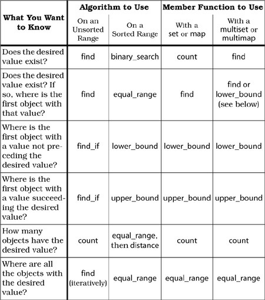

# _Effective C++_ Notes

- Notes of reading <u>Scott Meyers</u>'s _Effective C++_ series:
    1. *[`Effective C++`](./effective_cpp_notes_01_effective_cpp.md)*
    2. *[`More Effective C++`](./effective_cpp_notes_02_more_effective_cpp.md)*
    3. ***[`Effective STL`](./effective_cpp_notes_03_effective_stl.md)***
    4. *[`Effective Modern C++`](./effective_cpp_notes_04_effective_modern_cpp.md)*


---

## 🌱 _Effective STL_

### 🎯 Chapter 1. Containers

### 📌 Item 1: Choose your containers with care

### 📌 Item 2: Beware the illusion of container-independent code

- Usage of `using` type aliases makes types easier to be extended.  


Given the inevitability of having to change container types from time to time,
you can facilitate such changes in the usual manner: 
by encapsulating, encapsulating, encapsulating. 
One of the easiest ways to do this is through the liberal use of 
`using` type aliases for container types. 
Hence, instead of writing this,
```c++
class Widget { ... };
std::vector<Widget> vw;
Widget bestWidget;
auto it = std::find(vw.begin(), vw.end(), bestWidget); 
```
write this:
```c++
class Widget { ... };
using WidgetContainer = std::vector<Widget>;
WidgetContainer cw;
Widget bestWidget;
auto it = std::find(cw.begin(), cw.end(), bestWidget);
```
This makes it a lot easier to change container types, 
something that’s especially convenient if the change in question 
is simply to add a custom allocator. 
(Such a change doesn’t affect the rules for iterator/pointer/reference invalidation.)
```c++
class Widget { ... };

template <typename T>
class SpecialAllocator { ... };

using WidgetContainer = std::vector<Widget, SpecialAllocator<Widget>>;
WidgetContainer cw;
Widget bestWidget;
auto it = std::find(cw.begin(), cw.end(), bestWidget);
```


### 📌 Item 3: Make copying cheap and correct for objects in containers


An easy way to make copying efficient, correct, and immune to the slicing problem 
is to create containers of _pointers_ instead of containers of objects.
That is, instead of creating a container of `Widget`, create a container of `std::shared_ptr<Widget>`. 
Copying pointers is fast, it always does exactly what you expect 
(it copies the bits making up the pointer), 
and nothing gets sliced when a pointer is copied.
You can read about them in Items 7 and 33. 


### 📌 Item 4: Call `empty()` instead of checking `size()` against zero

- `empty()` is _constant-time_ operation for all standard containers, 
- `std::list<T, Allocator>::size` may take: 
  - constant or _linear time_ `(until C++11)`;
  - constant time `(since C++11)`. 


### 📌 Item 5: Prefer range member functions to their single-element counterparts

- Range member functions are favored over their single-element counterparts because 
  range member functions could be faster under several circumstances 
  (e.g., `std::list<T, Allocator>::assign` involves `pred`/`succ` pointer assignments). 
- Range construction, range insertion, range erasure. 


```c++
std::vector<int> v1, v2;
v1.assign(v2.vbegin() + v2.size() / 2, v2.cend());

// NOT GOOD
// loops, etc. 
```


### 📌 Item 6: Be alert for C++’s most vexing parse

- Notice the difference between parentheses:
  - **Around a parameter name**:
    Are ignored, e.g., `void foo(int (param))`;
  - **Standing by themselves**:
    Indicate the existence of a _parameter list_, e.g., `void foo(int ())`. 
    They announce the presence of a parameter that is itself a pointer to a function.
- To fight C++'s most vexing parse:
  - Pass named arguments instead of anonymous objects; 
  - It’s **not** legal to surround a formal parameter declaration with parentheses, 
    this may be used to prone out the undesired parsing; 
  - Adopt uniform initialization. 


Suppose you have a file of `int`s and you’d like to copy those ints into a `std::list`.
This seems like a reasonable way to do it:
```c++
// Warning! This doesn't do what you think it does
std::ifstream dataFile("ints.dat");
std::list<int> data(std::istream_iterator<int>(dataFile), std::istream_iterator<int>());
```
The idea here is to pass a pair of `std::istream_iterator`s to `std::list`’s range constructor, 
thus copying the ints in the file into the list. 


This code will compile, but at runtime, it **won’t** do anything. 
It **won’t** read any data out of a file. It **won’t** even create a list. 
That’s because the second statement doesn’t declare a list and it doesn’t call a constructor. 


We’ll start with the basics.
This line declares a function `f` taking a `double` and returning an `int`:
```c++
int f(double d);
```
This next line does the same thing. 
The parentheses around the parameter name `d` are superfluous and are ignored:
```c++
int f(double (d));
```
The line below declares the same function. It simply omits the parameter name:
```c++
int f(double);
```
Those three declaration forms should be familiar to you, 
though the ability to put parentheses around a parameter name may have been new. 


Let’s now look at three more function declarations. 
The first one declares a function `g` taking a parameter
that’s a pointer to a function taking nothing and returning a `double`:
```c++
int g(double (* pf)());
```
Here’s another way to say the same thing. 
The only difference is that `pf` is declared using _non-pointer syntax_ 
(a syntax that’s valid in both C and C++):
```c++
// same as above; pf is implicitly a pointer
int g(double pf()); 
```
As usual, parameter names may be omitted, so here’s a third declaration for `g`,
one where the name `pf` has been eliminated:
```c++
// same as above; parameter name is omitted
int g(double ()); 
```
Notice the difference between parentheses: 
- **Around a parameter name**: 
  Are ignored; 
- **Standing by themselves**:
  Indicate the existence of a _parameter list_. 
  They announce the presence of a parameter that is itself a pointer to a function.


Having warmed ourselves up with these declarations for `f` and `g`, 
we are ready to examine the code that began this Item. Here it is again:
```c++
// Warning! This doesn't do what you think it does
std::ifstream dataFile("ints.dat");
std::list<int> data(std::istream_iterator<int>(dataFile), std::istream_iterator<int>());
```
This f**king statement declares a _function_, `data`, whose return type is `std::list<int>`.
The function data takes two parameters:
- **The first parameter** is named `dataFile`. 
  Its type is `std::istream_iterator<int>`.
  The parentheses around `dataFile` are superfluous and are ignored. 
- **The second parameter** has no name. 
  Its type is pointer to function taking nothing and returning an `std::istream_iterator<int>`. 


Amazing, huh? But it’s consistent with a universal rule in C++, 
which says that pretty much anything that can be parsed as a function declaration will be. 
If you’ve been programming in C++ for a while, 
you’ve almost certainly encountered another manifestation of this rule. 
How many times have you seen this mistake?
```c++
class Widget { ... };  // assume Widget has a default constructor
Widget w();            // uh oh...
```
This **doesn’t** declare a `Widget` named `w`, 
it declares a function named `w` that takes nothing and returns a `Widget`. 
Learning to recognize this sh*t is a veritable rite of passage for C++ programmers. 


All of which is interesting (in its own twisted way),
but it doesn’t help us say what we want to say, 
which is that a `std::list<int>` object should be initialized with the contents of a file. 
Now that we know what parse we have to defeat, that’s easy to express. 
It’s **not** legal to surround a formal parameter declaration with parentheses, 
but it is legal to surround an argument to a function call with parentheses,
so by adding a pair of parentheses, we force compilers to see things our way:
```c++
// note new parens around first argument to std::list's constructor
std::list<int> data((std::istream_iterator<int>(dataFile)), std::istream_iterator<int>()); 
```
This is the proper way to declare data, and given the utility of
istream_iterators and range constructors (again, see Item 5), it’s worth
knowing how to do it.


A better solution is to step back from the 
trendy use of anonymous `std::istream_iterator` objects in `data`’s declaration
and simply give those iterators names. 
The following code should work everywhere:
```c++
std::ifstream dataFile("ints.dat");
std::istream_iterator<int> dataBegin(dataFile);
std::istream_iterator<int> dataEnd;
std::list<int> data(dataBegin, dataEnd);
```
This use of named iterator objects runs contrary to common STL programming style, 
but you may decide that’s a price worth paying for code 
that’s unambiguous to both compilers and the humans who have to work with them.


### 📌 Item 7: When using containers of `new`ed pointers, remember to `delete` the pointers before the container is destroyed

- Let containers contain smart pointers to eliminate resource leaks and keep exception safety. 


### 📌 Item 8: Never create containers of `std::auto_ptr`s

- `std::auto_ptr` itself is already deprecated since C++11. 


### 📌 Item 9: Choose carefully among erasing options

- **To eliminate all objects in a container that have a particular value**:
  - If the container is a `std::vector`, `std::string`, or `std::deque`, use the `erase-remove` idiom.
  - If the container is a `std::list`, use `std::list::remove`.
  - If the container is a standard associative container, use its `erase` member function.
- **To eliminate all objects in a container that satisfy a particular predicate**:
  - If the container is a `std::vector`, `std::string`, or `std::deque`, use the `erase-remove_if` idiom.
  - If the container is a `std::list`, use `std::list::remove_if`.
  - If the container is a standard associative container, use `std::remove_copy_if` and `std::swap`, 
    or write a loop to walk the container elements, 
    being sure to postincrement your iterator when you pass it to `erase`. 
- **To do something inside the loop (in addition to erasing objects)**:
  - If the container is a standard sequence container, 
    write a loop to walk the container elements, 
    being sure to update your iterator with `erase`’s return value each time you call it.
  - If the container is a standard associative container, 
    write a loop to walk the container elements, 
    being sure to postincrement your iterator when you pass it to `erase`.
- [Iterator Invalidation](https://en.cppreference.com/w/cpp/container#Iterator_invalidation)


### 📌 Item 10: Be aware of allocator conventions and restrictions

- Things you need to remember if you ever want to write a custom allocator: 
  - Make your allocator a template, with the template parameter `T` 
    representing the type of objects for which you are allocating memory. 
  - Provide the `typedef`s of `pointer` and `reference`, 
    but always have pointer be `T *` and reference be `T &`.
  - **Never** give your allocators per-object state. 
    The standard requires allocators with same `T` be identical with good reasons. 
    That means that allocators should have **no** non`static` data member. 
  - Remember that an allocator’s `allocate` member functions 
    are passed the number of objects for which memory is required, 
    not the number of Bytes needed. 
    Also remember that these functions return `T *` pointers (via the `pointer` `typedef`), 
    even though no `T` objects have yet been constructed. 
  - Allocators for `std::list` and all STL ordered associative containers 
    are **never** asked to allocate memory. 
  - Be sure to provide the nested `rebind` template on which standard containers depend. 


The list of restrictions on allocators begins with 
their vestigial `typedef`s for `pointer`s and `reference`s. 
Allocators were originally conceived of as abstractions for memory models, 
and as such it made sense for allocators to provide `typedef`s 
for `pointer`s and `reference`s in the memory model they defined. 
In the C++ standard, the default allocator for objects of type `T` (`std::allocator<T>`) 
offers the `typedef`s `std::allocator<T>::pointer` and `std::allocator<T>::reference`, 
and it is expected that user-defined allocators will provide these `typedef`s, too. 


Old C++ hands immediately recognize that this is suspect, 
because there’s **no** way to fake a reference in C++. 
Doing so would require the ability to "overload" `operator.`, 
which is actually **not** permitted. 
In addition, creating objects that act like references 
is an example of the use of proxy objects, 
and proxy objects lead to a number of problems. 
(One such problem motivates Item 18. Also refer to More Effective C++ Item 30.)


In the case of allocators in the STL, 
it’s not any technical shortcomings of proxy objects 
that render the `pointer` and `reference` `typedef`s impotent, 
it’s the fact that the Standard explicitly allows library implementers 
to assume that every allocator’s `pointer` `typedef` is a synonym for `T *` 
and every allocator’s `reference` `typedef` is the same as `T &`. 
That’s right, library implementers may ignore the `typedef`s and use raw pointers and references directly! 
So even if you could somehow find a way to write an allocator 
that successfully provided new pointer and reference types, it **wouldn’t** do any good, 
because the STL implementations you were using would be free to ignore your `typedef`s. 


While you’re admiring that quirk of standardization, I’ll introduce another.
Allocators are objects, and that means they may have member functions,
nested types and `typedef`s (such as `pointer` and `reference`), etc., 
but the Standard says that an implementation of the STL is permitted to assume that
all allocator objects of the same type are equivalent and always compare equal. 
Offhand, that doesn’t sound so awful, and there’s certainly good motivation for it. 
Consider this code:
```c++
class Widget { /* ... */ };

template <typename T>
class SpecialAllocator { /* ... */ };

using SpecialWidgetAllocator = SpecialAllocator<Widget>; 

std::list<Widget, SpecialWidgetAllocator> L1;
std::list<Widget, SpecialWidgetAllocator> L2;
L1.splice(L1.begin(), L2);
```
Recall that when `std::list` elements are `splice`d from one `std::list` to another, 
nothing is copied. 
Instead, a few pointers are adjusted, 
and the `std::list` nodes that used to be in one list find themselves in another. 
This makes splicing operations both fast and exception-safe. 
In the example above, the nodes that were in `L2` prior to the `splice` are in `L1` after the `splice`.


When `L1` is destroyed, of course, it must destroy all its nodes (and deallocate their memory), 
and because it now contains nodes that were originally part of `L2`, 
`L1`’s allocator must deallocate the nodes that were originally allocated by `L2`’s allocator. 
Now it should be clear why the Standard permits implementers of the STL to assume that 
allocators of the same type are equivalent. 
It’s so memory allocated by one allocator object (such as `L2`’s) 
may be safely deallocated by another allocator object (such as `L1`’s). 
Without being able to make such an assumption, 
`splice` operations would be more difficult to implement. 
Certainly they wouldn’t be as efficient as they can be now.


That’s all well and good, but the more you think about it, 
the more you’ll realize just how draconian a restriction it is 
that STL implementations may assume that allocators of the same type are equivalent. 
It means that portable allocator objects 
(allocators that will function correctly under different STL implementations) may **not** have state. 


Let’s be explicit about this: 
it means that _portable_ allocators may **not** have any non`static` data members, 
at least not any that affect their behavior. 
That means, for example, you can’t have one `SpecialAllocator<int>` that allocates from one heap 
and a different `SpecialAllocator<int>` that allocates from a different heap. 
Such allocators **wouldn’t** be equivalent, 
and STL implementations exist where attempts to use both allocators 
could lead to corrupt runtime data structures. 


Notice that this is a runtime issue. 
Allocators with state will compile just fine.
They just may not run the way you expect them to. 
The responsibility for ensuring that all allocators of a given type are equivalent is yours. 
**Don’t** expect compilers to issue a warning if you violate this constraint.
The C++ standard (It might be C++03 when Meyers wrote this book?) put the following statement immediately after 
the text that permits STL implementers to assume that allocators of the same type are equivalent:


> Implementors are encouraged to supply libraries that ... support non-equal instances. 
> In such implementations, ... the semantics of containers and algorithms 
> when allocator instances compare non-equal are implementation-defined.


This is a lovely sentiment, 
but as a user of the STL who is considering the development of a custom allocator with state, 
it offers you next to nothing.
You can take advantage of this statement only if:
1. You know that the STL implementations you are using support inequivalent allocators;
2. You are willing to delve into their documentation to determine 
   whether the implementation-defined behavior of “non-equal” allocators is acceptable to you;
3. You are not concerned about porting your code to STL implementations 
   that may take advantage of the latitude expressly extended to them by the Standard. 


I remarked earlier that allocators are like `operator new` in that they allocate raw memory, 
but their interface is different. 
This becomes apparent if you look at the declaration 
of the most common forms of `operator new` and `std::allocator<T>::allocate`:
```c++
void * operator new (std::size_t count);

template <typename T>
[[nodiscard]] constexpr T * std::allocator<T>::allocate(std::size_t n);
```
Both take a parameter specifying how much memory to allocate, 
but in the case of `operator new`, this parameter specifies a certain number of Bytes, 
while in the case of `std::allocator<T>::allocate`, 
it specifies how many `T` objects are to fit in the memory. 
On a platform where `sizeof(long) == 8`, 
you pass `8` to `operator new` if you wanted enough memory to hold an `long`, 
but you pass `1` to `std::allocator<long>::allocate`. 


`operator new` and `std::allocator<T>::allocate` differ in return types, too. 
`operator new` returns a `void *`, 
which is the traditional C++ way of representing a pointer to uninitialized memory. 
`std::allocator<T>::allocate` returns a `T *`, 
which is not only untraditional, but also premeditated fraud. 
The pointer returned from `std::allocator<T>::allocate` doesn’t point to a `T` object, 
because no `T` has yet been constructed! 
Implicit in the STL is the expectation that `std::allocator<T>::allocate`’s caller 
will eventually construct one or more `T` objects in the memory it returns 
(possibly via `std::allocator_traits<std::allocator<T>>::construct`, 
`std::uninitialized_fill`, or some application of `std::raw_storage_iterator`s),
though in the case of `std::vector::reserve` or `std::string::reserve`, that may never happen. 


That brings us to the final curiosity of STL allocators, 
that most of the standard containers never make a single call 
to the allocators with which they are instantiated:
```c++
// Same as std::list<int, std::allocator<int>>. 
// std::allocator<int> is never asked to allocate memory!
std::list<int> L;

class Widget { /* ... */ };

template <typename T>
class SpecialAllocator { /* ... */ };

using SpecialWidgetAllocator = SpecialAllocator<Widget>;

// SpecialWidgetAllocator will never allocate memory! 
std::set<Widget, SpecialWidgetAllocator> s;
```
This oddity is true for list and all STL ordered associative containers. 
That’s because these are _node-based containers_,
i.e., containers based on data structures 
in which a new node is dynamically allocated each time a value is to be stored. 
In the case of `std::list`, the nodes are list nodes. 
In the case of the STL ordered associative containers, 
the nodes are usually tree nodes, 
because the standard associative containers are typically
implemented as red-black trees. 


Think for a moment about how a `std::list<T>` is likely to be implemented.
The list itself will be made up of nodes,
each of which holds a `T` object as well as pointers to the next and previous nodes in the list:
```c++
namespace std
{

template <typename T, typename Allocator = std::allocator<T>>
class list
{
private:
    struct Node
    {
        T data;
        Node * pred;
        Node * succ;
    };
    
    Allocator alloc;
    
    ...
};

}  // namespace std
```
When a new node is added to the list, 
we need to get memory for it from an allocator, 
but we **don’t** need memory for a `T`, 
we need memory for a `std::list::Node` that contains a `T`. 
That makes our allocator object all but useless, 
because it doesn’t allocate memory for `std::list::Node`s, it allocates memory for `T`s. 
Now you understand why `std::list` never asks its allocator to do any allocation: 
the allocator **can’t** provide what `std::list` needs. 


What `std::list` needs is a way to get from the allocator type it has 
to the corresponding allocator for `std::list::Node`s. 
By convention, allocators provide a `typedef` `std::allocator<T>::template rebind<U>::other`that does the job.
```c++
namespace std
{

template <typename T>
class allocator
{
public:
    template <typename U>
    struct rebind
    {
        typedef allocator<U> other;
    };
    
    ...
};

}  // namespace std
```
In the code implementing `std::list<T>`, 
there is a need to determine the type of the allocator for `std::list::Node`s 
that corresponds to the allocator we have for `T`s. 
The type of the allocator we have for `T`s is the template parameter `Allocator`. 
That being the case, the type of the corresponding allocator for `std::list::Node`s is this:
```c++
Allocator::rebind<Node>::other
```
Every allocator template `A` (e.g., `std::allocator`) is expected to have 
a nested struct template called `rebind`. 
`rebind` takes a single type parameter `U`, and defines nothing but a `typedef` `other`. 
`other` is simply a name for `A<U>`. 
As a result, `std::list<T>` can get from its allocator for `T` objects (called `Allocator`) 
to the corresponding allocator for `std::list<T>::Node` objects 
by referring to `Allocator::rebind<std::list<T>::Node>::other`. 


As a user of the STL who may want to write a custom allocator, 
you don’t really need to know how it works. 
What you do need to know is that if you choose to write allocators 
and use them with the standard containers, 
your allocators must provide the `rebind` template, 
because standard containers assume it will be there. 
(For debugging purposes, it’s also helpful to know why node-based containers of `T` objects 
never ask for memory from the allocators for `T` objects.)


### 📌 Item 11: Understand the legitimate uses of custom allocators

- Allocators are used to customize STL container's memory management. 


So you’ve benchmarked, profiled, and experimented your way to the conclusion
that the default STL memory manager (i.e., `std::allocator<T>`) is too slow, wastes memory, 
or suffers excessive fragmentation for your STL needs,
and you’re certain you can do a better job yourself. 
Or you discover that `std::allocator<T>` takes precautions to be thread-safe, 
but you’re interested only in single-threaded execution, 
and you don’t want to pay for the synchronization overhead you don’t need. 
Or you know that objects in certain containers are typically used together, 
so you’d like to place them near one another in a special heap to maximize locality of reference. 
Or you’d like to set up a unique heap that corresponds to shared memory, 
then put one or more containers in that memory, so they can be shared by other processes. 
Each of these scenarios corresponds to a situation 
where custom allocators are well suited to the problem.


For example, suppose you have special routines modeled after `std::malloc` and `std::free`
for managing a heap of shared memory,
and you’d like to make it possible to put the contents of STL containers in that shared memory: 
```c++
[[nodiscard]] void * mallocShared(std::size_t bytesNeeded);
void freeShared(void * ptr) noexcept;

template <typename T>
class SharedMemoryAllocator 
{
public:
    ...
    
    pointer allocate(size_type numObjects, const void * localityHint = 0)
    {
        return static_cast<pointer>(mallocShared(numObjects * sizeof(T)));
    }
    
    void deallocate(pointer ptrToMemory, size_type numObjects)
    {
        freeShared(ptrToMemory);
    }
    
    ...
};
```
You could use `SharedMemoryAllocator` like this:
```c++
using SharedDoubleVec = std::vector<double, SharedMemoryAllocator<double>>;

{
    ...
    // create a vector whose elements are in shared memory
    SharedDoubleVec v;  
    ...
}
```
The wording in the comment next to `v`’s definition is important. 
`v` is using a `SharedMemoryAllocator`, 
so the memory `v` allocates to hold its elements will come from shared memory.
However, `v` itself (including all its data members) will almost certainly **not** be placed in shared memory. 
`v` is just a normal stack-based object, 
so it will be located in whatever memory the runtime system uses for all normal stack-based objects. 
That’s almost never shared memory. 
To put both `v`’s contents and `v` itself into shared memory, you’d have to do something like this:
```c++
// allocate enough shared memory to hold a SharedDoubleVec object
void * pVectorMemory = mallocShared(sizeof(SharedDoubleVec));

// use "placement new" to construct a SharedDoubleVec object in the memory
SharedDoubleVec * pv = new (pVectorMemory) SharedDoubleVec;

// use the object (via pv)
// ...

// destruct the object in the shared memory
pv->~SharedDoubleVec();

// deallocate the initial chunk of shared  memory
freeShared(pVectorMemory);
```
Fundamentally, you acquire some shared memory, 
then construct a `std::vector` in it that uses shared memory for its own internal allocations. 
When you’re done with the vector, you invoke its destructor, 
then release the memory the vector occupied. 
The code isn’t terribly complicated, 
but it’s a lot more demanding than just declaring a local variable as we did above. 
Unless you really need a container (as opposed to its elements) to be in shared memory, 
I encourage you to avoid this manual four-step allocate/construct/destroy/deallocate process.


In this example, you’ve doubtless noticed that the code ignores the possibility
that `mallocShared` might return a null pointer. 
Obviously, production code would have to take such a possibility into account. 
Also, construction of the vector in the shared memory is accomplished by _placement `new`_.


As a second example of the utility of allocators, 
suppose you have two heaps, identified by the classes `Heap1` and `Heap2`. 
Each heap class has `static` member functions for performing allocation and deallocation:
```c++
class Heap1 
{
public:
    ...
    static void * alloc(std::size_t numBytes, const void *memoryBlockToBeNear);
    static void dealloc(void * ptr);
    ...
};

// has the same interface
class Heap2 { ... }; 
```
Further, suppose you’d like to co-locate the contents of some STL containers in different heaps. 
First you write an allocator designed to use classes like `Heap1` and `Heap2` for the actual memory management:
```c++
template <typename T, typename Heap>
class SpecificHeapAllocator
{
public:
    ...

    pointer allocate(size_type numObjects, const void * localityHint = 0)
    {
        return static_cast<pointer>(Heap::alloc(numObjects * sizeof(T), localityHint));
    }

    void deallocate(pointer ptrToMemory, size_type numObjects)
    {
        Heap::dealloc(ptrToMemory);
    }

    ...
};
```
Then you use `SpecificHeapAllocator` to cluster containers’ elements together:
```c++
// put both v's and s's elements in Heap1
std::vector<int, SpecificHeapAllocator<int, Heap1>> v; 
std::set<int, SpecificHeapAllocator<int, Heap1>> s;

// put both L's and m's elements in Heap2
std::list<Widget, SpecificHeapAllocator<Widget, Heap2>> L; 
std::map<int, std::string, 
         std::less<int>, 
         SpecificHeapAllocator<std::pair<const int, std::string>, Heap2>> m;
```
In this example, it’s quite important that `Heap1` and `Heap2` be types and not objects. 
The STL offers a syntax for initializing different STL containers with different allocator objects of the same type, 
but I’m not going to show you what it is. 
That’s because if `Heap1` and `Heap2` were objects instead of types,
they’d be inequivalent allocators, 
and that would violate the equivalence constraint on allocators that is detailed in Item 10.


As these examples demonstrate, 
allocators are useful in a number of contexts.
As long as you obey the constraint that 
all allocators of the same type must be equivalent, 
you’ll have no trouble employing custom allocators 
to control general memory management strategies, 
clustering relationships, and use of shared memory and other special heaps.


### 📌 Item 12: Have realistic expectations about the thread safety of STL containers

- STL has **no** thread-safety guarantees on its algorithms and containers. 
- Use `std::lock_guard` to manage `std::mutex`es when accessing STL containers. 


**None** of the following locking policies on STL containers are thread-safe:
- Lock a container for the duration of each call to its member functions. 
- Lock a container for the lifetime of each iterator it returns (via, e.g., calls to `begin` or `end`).
- Lock a container for the duration of each algorithm invoked on that container.
  (This actually makes no sense, because, as Item 32 explains, 
  algorithms have no way to identify the container on which they are operating. 
  Nevertheless, we’ll examine this option here, because it’s instructive to see 
  why it wouldn’t work even if it were possible.)


Now consider the following code. 
It searches a `std::vector<int>` for the first occurrence of the value `5` and changes that value to `0`.
```c++
std::vector<int> v;
auto it = std::find(v.begin(), v.end(), 5);  // Line 1
if (it != v.end())                           // Line 2
{ 
    *it = 0;                                 // Line 3
}
```
In a multithreaded environment, 
it’s possible that a different thread will modify the data in `v` 
immediately after completion of Line 1. 
If that were to happen, the test of `it` against `v.end` on Line 2 would be meaningless, 
because `v`’s values would be different from what they were at the end of Line 1. 

In fact, such a test could yield undefined results, 
because another thread could have intervened between Lines 1 and 2 and invalidated `it`, 
perhaps by performing an insertion that caused the vector to reallocate its underlying memory. 
(That would invalidate all the vector’s iterators. 
For details on this reallocation behavior, turn to Item 14.) 
Similarly, the assignment to `*it` on Line 3 is unsafe,
because another thread might execute between Lines 2 and 3 in such a way as to invalidate `it`, 
perhaps by erasing the element it points to (or at least used to point to).


**None** of the approaches to locking listed above would prevent these problems. 
The calls to `begin` and `end` in Line 1 both return too quickly to offer any help, 
the iterators they generate last only until the end of that line, 
and `std::find` also returns at the end of that line.


For the code above to be thread safe, 
`v` must remain locked from Line 1 through Line 3, 
and it’s difficult to imagine how an STL implementation could deduce that automatically. 
Bearing in mind the typically high cost of synchronization primitives 
(e.g., semaphores, mutexes, etc.), 
it’s even more difficult to imagine how an implementation could do it 
without imposing a significant performance penalty on programs that knew a priori, 
that were designed in such a way that 
no more than one thread had access to `v` during the course of Lines 1-3.


Such considerations explain why you **can’t** expect 
any STL implementation to make your threading woes disappear. 
Instead, you’ll have to manually take charge of synchronization control in these kinds of scenarios. 
In this example, you might do it like this:
```c++
std::vector<int> vec {0, 1, 2, 3, 4, 5};
std::mutex vecMutex;

{
    std::lock_guard g(vecMutex);
    auto it = std::find(vec.begin(), vec.end(), 5);
    if (it != vec.end())  *it = 0;
}
```


### 🎯 Chapter 2. `std::vector` and `std::string`


All the STL containers are useful, 
but you’ll likely find yourself reaching for `std::vector` and `std::string` more often than their compatriots.
`std::vector` and `std::string` are designed to replace most applications of arrays. 
The Items in this chapter cover `std::vector`s and `std::string`s from a number of perspectives. 
We begin with a discussion of why the switch from arrays is worthwhile, 
then look at ways to improve `std::vector` and `std::string` performance,
identify important variations in `std::string` implementations, 
examine how to pass `std::vector` and `std::string` data to APIs that understand only C, 
and learn how to eliminate excess memory allocation. 
We conclude with an examination of an instructive anomaly, `std::vector<bool>`.


### 📌 Item 13: Prefer `std::vector` and `std::string` to dynamically allocated arrays

- Just use them. 
  They save you from manual memory management, 
  offer you with full STL generic algorithms,
  and has C API compatability. 
- One concern involved referenced-counted `std::string`s 
  under multi-threading environments, 
  where reference-counting can hit performance. 


The minute you decide to use `new` for a dynamic allocation, you adopt the following responsibilities:
1. You must make sure that somebody will later `delete` the allocation.
   Without a subsequent `delete`, your new will yield a resource leak.
2. You must ensure that the correct form of `delete` is used. 
   For an allocation of a single object from `new`, `delete` must be used. 
   For an array allocation from `new []`, `delete []` is required. 
   If the wrong form of `delete` is used, results will be undefined. 
   On some platforms, the program will crash at runtime.
   On others, it will silently blunder forward, 
   sometimes leaking resources and corrupting memory as it goes.
3. You must make sure that `delete` is used exactly once. 
   If an allocation is `delete`d more than once, results are again undefined.


That’s quite a set of responsibilities. 
Thanks to `std::vector` and `std::string`, 
it is no longer necessary as often as it used to be. 


Any time you find yourself getting ready to dynamically allocate an array 
(i.e., plotting to write `new T[...]`), 
you should consider using a `std::vector` or a `std::string` instead. 
(In general, use `std::string` when `T` is a character type and use `std::vector` when it’s not, 
though later in this Item, 
we’ll encounter a scenario where a `std::vector<char>` may be a reasonable design choice.)
`std::vector` and `std::string` eliminate the burdens above, because they manage their own memory. 
Their memory grows as elements are added to these containers, 
and when a `std::vector` or `std::string` is destroyed, 
its destructor automatically destroys the elements in the container 
and deallocates the memory holding those elements.


In addition, `std::vector` and `std::string` are full-fledged STL sequence containers, 
so they put at your disposal the complete arsenal of STL algorithms that work on such containers. 
True, arrays can be used with STL algorithms, too,
but arrays **don’t** offer member functions like `begin`, `end`, and `size`, 
**nor** do they have nested `typedef`s like `iterator`, `reverse_iterator`, or `value_type`. 
And of course `char *` pointers can hardly compete with 
the scores of specialized member functions proffered by `std::string`. 
The more you work with the STL, 
the more jaundiced the eye with which you’ll come to view built-in arrays.


If you’re concerned about the legacy code you must continue to support, 
all of which is based on arrays, relax and use `std::vector` and `std::string` anyway. 
Item 16 shows how easy it is to pass the data in `std::vector` and `std::string` to APIs that expect arrays, 
so integration with legacy code is generally not a problem.


There is one legitimate cause for concern in 
replacing dynamically allocated arrays with `std::vector` and `std::string`, 
and it applies only to `std::string`s. 
Many `std::string` implementations employ reference counting behind the scenes (see Item 15), 
a strategy that eliminates some unnecessary memory allocations and copying of characters 
and that can improve performance for many applications. 
In fact, the ability to optimize `std::string` via reference counting was considered so important, 
the C++ Standardization Committee took specific steps to make sure it was a valid implementation. 


Unfortunately, if you use reference-counted `std::string` in a multi-threading environment, 
you may find that the time saved by avoiding allocations and copying 
is dwarfed by the time spent on behind-the-scenes concurrency control. 
If you’re using reference-counted `std::string`s in a multi-threading environment, 
then it makes sense to keep an eye out for performance problems 
arising from their support for thread safety.


To determine whether you’re using a reference-counting implementation for `std::string`, 
it’s often easiest to consult the documentation for your library.
Because reference counting is considered an optimization, 
vendors generally tout it as a feature. 
An alternative is to look at the source code for your libraries’ implementations of `std::string`. 
I don’t generally recommend trying to figure things out from library source code, 
but sometimes it’s the only way to find out what you need to know. 
If you choose this approach, remember that `std::string` is a `typedef` for `std::basic_string<char>` 
(and `std::wstring` is a `typedef` for `std::basic_string<wchar_t>`), 
so what you really want to look at is the template `std::basic_string`. 
The easiest thing to check is probably the class’s _copy constructor_. 
Look to see if it increments a reference count somewhere. 
If it does, `std::string` is reference counted. 
If it does not, either `std::string` isn’t reference counted or you misread the code. 


If the `std::string` implementations available to you are reference counted, 
and you are running in a multi-threading environment 
where you’ve determined that `std::string`’s reference counting support is a performance problem, 
you have at least three reasonable choices, **none** of which involves abandoning the STL. 
Check to see if your library implementation is one
that makes it possible to disable reference counting, 
often by changing the value of a preprocessor variable. 
This won’t be portable, but given the amount of work involved, it’s worth investigating. 

Find or develop an alternative `std::string` implementation (or partial implementation) 
that doesn’t use reference counting. 

Consider using a `std::vector<char>` instead of a `std::string`. 
`std::vector` implementations are **not** allowed to be reference counted, 
so hidden multi-threading performance issues fail to arise. 
Of course, you forgo `std::string`’s fancy member functions if you switch to `std::vector<char>`, 
but most of that functionality is available through STL algorithms anyway, 
so you’re not so much giving up functionality as you are trading one syntax for another. 


The upshot of all this is simple. 
If you’re dynamically allocating arrays, 
you’re probably taking on more work than you need to. 
To lighten your load, use `std::vector`s or `std::string`s instead.


### 📌 Item 14: Use `reserve` to avoid unnecessary re-allocations

- There are two common ways to use `reserve` to avoid unneeded re-allocations: 
1. `reserve` the appropriate amount of space in advance 
   if you know exactly or approximately how many elements will ultimately end up in your container.
2. `reserve` the maximum space you could ever need, 
   then trim off any excess capacity once you’ve added all your data (see Item 17).


### 📌 Item 15: Be aware of variations in `std::string` implementations

- There are multiple viable `std::string` implementations. 


What is the size of a `std::string `object? 
In other words, what value does `sizeof(std::string)` return? 
This could be an important question if you’re keeping a close eye on memory consumption, 
and you’re thinking of replacing a raw `char *` pointer with a `std::string` object.


The news about `sizeof(std::string)` is “interesting,”
which is almost certainly what you do not want to hear if you’re concerned about space. 
While it’s not uncommon to find `std::string` implementations 
in which `std::string`s are the same size as `char *` pointers, 
it’s also easy to find `std::string` implementations 
where each `std::string` is seven times that size. 


Why the difference? 
To understand that, we have to know what data a `std::string` is likely to store
as well as where it might decide to store it.


Virtually every `std::string` implementation holds the following information:
- The **size** of the string, i.e., the number of characters it contains.
- The **capacity** of the memory holding the string’s characters. 
- The **value** of the string, i.e., the characters making up the string.
- A copy of its **allocator**. 
- The **reference count** for the value.


In implementation A, each `std::string` object contains a copy of its allocator, 
the string’s size, its capacity, and a pointer to a dynamically allocated buffer 
containing both the reference count and the string’s value. 
In this implementation, a `std::string` object using the default allocator 
is four times the size of a pointer. 
With a custom allocator, the `std::string` object would be bigger 
by about the size of the allocator object:
```
  std::string Object (Implementation A)
┌───────────┐
│ Allocator │
├───────────┤         ┌────────┬───────┐
│   Size    │         │ RefCnt │ Value │
├───────────┤         └────────┴───────┘
│ Capacity  │                  ↑
├───────────┤                  │
│  Pointer  ├──────────────────┘
└───────────┘
```
Implementation B’s `std::string` objects are the same size as a pointer, 
because they contain nothing but a pointer to a struct. 
Again, this assumes that the default allocator is used. 
If a custom allocator is used, the `std::string` object’s size will increase
by about the size of the allocator object.
The object pointed to by B’s `std::string` contains 
the string’s size, capacity, and reference count, 
as well as a pointer to a dynamically allocated buffer holding the string’s value. 
The object also contains some additional data related to concurrency control in multi-threading systems. 
Such data is labeled as "Other". 
```
          std::string Object (Implementation B)
┌─────────┐       ┌──────────┐         
│ Pointer ├──────→│   Size   │
└─────────┘       ├──────────┤  
                  │ Capacity │
                  ├──────────┤       ┌────────┬───────┐
                  │ Pointer  ├──────→│ RefCnt │ Value │
                  ├──────────┤       └────────┴───────┘
                  │  Other   │
                  └──────────┘
```
`std::string` objects under Implementation C are always the size of a pointer, 
but this pointer points to a dynamically allocated buffer 
containing everything related to the string: 
its size, capacity, reference count, and value. 
There is **no** per-object allocator support. 
The buffer also holds some data concerning the _shareability_ of the value 
(see More Effective C++ Item 29). 
```
          std::string Object (Implementation C)
┌─────────┐       ┌──────────────┐         
│ Pointer ├──────→│     Size     │
└─────────┘       ├──────────────┤  
                  │   Capacity   │
                  ├──────────────┤       ┌────────┬───────┐
                  │    RefCnt    ├──────→│ RefCnt │ Value │
                  ├──────────────┤       └────────┴───────┘
                  │ Shareability │
                  └──────────────┘
```
Implementation D’s `std::string` objects are seven times the size of a pointer 
(still assuming use of the default allocator). 
This implementation employs **no** reference counting, 
but each `std::string` contains an internal buffer 
large enough to represent string values of up to 15 characters. 
Small strings can thus be stored entirely within the `std::string` object, 
a feature sometimes known as the _small string optimization_. 
When a string ’s capacity exceeds 15, 
the first part of the buffer is used as a pointer to dynamically allocated memory, 
and the `std::string`’s value resides in that memory:
```
         std::string Object (Implementation D)
 Size <= 15                15 < Capacity       
┌───────────┐              ┌───────────┐
│ Allocator │              │ Allocator │
├───────────┤              ├───────────┤       ┌───────┐
│   Small   │              │  Pointer  ├──────→│ Value │
│   Value   │              ├───────────┤       └───────┘
│  Buffer   │              │  Unused   │     
├───────────┤              ├───────────┤         
│   Size    │              │   Size    │                  
├───────────┤              ├───────────┤                  
│ Capacity  │              │ Capacity  │
└───────────┘              └───────────┘
```


### 📌 Item 16: Know how to pass `std::vector` and `std::string` data to legacy APIs

- `std::vector<T>::data` does **not** handle zero-sized vectors (may or may **not** return a null pointer). 
- `std::string::c_str` properly returns a null pointer for zero-sized strings. 


### 📌 Item 17: Know the outdated `swap` trick to trim excess capacity

This is how you trim the excess capacity from a `std::vector` prior to C++11:
```c++
std::vector<Contestant> contestants { /* ... */ };
std::vector<Contestant>(contestants.begin(), contestants.end()).swap(contestants);
```
Also applies to `std::string`s:
```c++
std::string s = "...";
std::string(s.begin(), s.end()).swap(s);
```
In C++11, just call `shrick_to_fit` function. 


### 📌 Item 18: Avoid using `std::vector<bool>`

- `std::vector<bool>` uses proxy classes as return values of `operator[]` 
  and does **not** follow the STL routines. 
- Consider `std::deque<bool>` (that really contain `bool`s) or `std::bitset<N>` as an alternative. 


### 🎯 Chapter 3. Associative Containers

### 📌 Item 19: Understand the difference between equality and equivalence

- _Equality_ is based on `operator==`, while _equivalence_ is usually based on `operator<`. 


The `std::find` algorithm and `std::set`'s `insert` member function
are representative of many functions that must determine whether two values are the same.
Yet they do it in different ways.
`std::find`’s definition of "the same" is _equality_, which is based on `operator==`. 
`std::set<T>::insert`’s definition of "the same" is _equivalence_, which is usually based on `operator<`.
Because these are different definitions,
it’s possible for one definition to dictate that two objects have the same value
while the other definition decrees that they do not. 
As a result, you must understand the difference between equality and equivalence 
if you are to make effective use of the STL. 

#### Equality

Operationally, the notion of equality is based on `operator==`. 
If the expression `x == y` returns `true`, `x` and `y` have equal values, otherwise they don’t. 
That’s pretty straightforward, though it’s useful to bear in mind that 
just because `x` and `y` have equal values does **not** necessarily imply that 
all of their data members have equal values. 
Recall the famous interview joke (originally in JavaScript): 
```c++
// Is it possible that (a == 1 && a == 2 && a == 3) == true? 

struct S
{
    S() : v(1) {}
    explicit S(int i) : v(i) {}
    int v;
};

inline bool operator==(S & a, int b)
{
    return a.v++ == b;
}

S a(1);

if (a == 1 && a == 2 && a == 3)
{
    std::cout << "wtf\n";
}
```
Or, consider files with `lastAccessed` timestamps. 
Two files are considered the same if they have same content, 
while their timestamp could be different. 


#### Equivalence


_Equivalence_ is based on the relative ordering of object values in a sorted range. 
Equivalence makes the most sense if you think about it 
in terms of the sort order that is part of ordered associative containers. 
Two objects `x` and `y` have equivalent values with respect to 
the sort order used by an associative container `c` 
if neither precedes the other in `c`’s sort order. 
```c++
!(w1 < x2) && !(w2 < w1)
```
Two values are equivalent (with respect to some ordering criterion) 
if neither precedes the other (according to that criterion). 

In the general case, 
the comparison function for an associative container isn’t `operator<` or even `std::less`, 
it’s a user-defined predicate. 
Every standard associative container makes its sorting predicate available 
through its `key_comp` member function, 
so two objects `x` and `y` have equivalent values
with respect to an associative container c’s sorting criterion 
if the following evaluates to `true`:
```c++
!c.key_comp()(x, y) && !c.key_comp()(y, x)
```


### 📌 Item 20: Specify comparison types for ordered associative containers of pointers

- Pointers are sorted with their addresses, **not** their underlying values-pointed-to. 
- Ordered associative containers want a type of the `Compare` predicate to instantiate a functor,
  **not** an exact function. 


`std::set<std::string *>` is a short for 
```c++
std::set<std::string *, 
         std::less<std::string *>, 
         std::allocator<std::string *>>
```


### 📌 Item 21: Always have comparison predicates return `false` for equal values

- Just a convention that comparison predicates should represent strict weak ordering. 
  Failure to comply will result in undefined behavior. 


E.g., `std::sort` swaps the underlying values of two adjacent iterators 
if `comp(it + 1, it) == true`. 
If `comp` is not a strict weak ordering, 
e.g., returns `true` for two identical values, 
`std::sort` will fall into infinite loops. 


E.g., for `std::multiset`s:
```c++
std::multiset<int, std::less_equal<int>> s;  // s is ssorted by "<="
s.insert(10);                                // insert 10A
s.insert(10);                                // insert 10B
```
`s` now has two copies of `10` in it, 
so we’d expect that if we do an `std::equal_range`on it, 
we’ll get back a pair of iterators 
that define a range containing both copies. 
But that’s **not** possible. 
`std::equal_range` doesn’t identify a range of equal values. 
It identifies a range of _equivalent_ values instead. 
In this example, `s`’s comparison function says that `10A` and `10B` are not equivalent, 
so there’s no way that both can be in the range identified by `std::equal_range`.


### 📌 Item 22: Avoid in-place key modification in `std::set` and `std::multiset`

- Elements are `const` in `std::set`s and `std::multiset`s, 
  even when de-referencing their non-`const` iterators. 
- Key types in `std::map`s and `std::multimap`s are `const`. 
- Code modifying set elements might or might not compile on different platforms, 
  so such code is **not** portable.
- If you want to change an element in a `std::set`, `std::multiset`, `std::map`, or `std::multimap`
  in a way that always works and is always safe, do it in five simple steps:
  1. Locate the container element you want to change.
  2. Make a copy of the element to be modified.
     In the case of a `std::map` or `std::multimap`,
     be sure **not** to declare the first component of the copy const.
     After all, you want to change it!
  3. Modify the copy, so it has the value you want to be in the container.
  4. Remove the element from the container, typically via a call to `erase`.
  5. Insert the new value into the container.
     If the location of the new element in the container’s sort order
     is likely to be the same or adjacent to that of the removed element,
     use the `hint` form of `insert` to improve the efficiency of the insertion
     from logarithmic-time to amortized constant-time.
     Use the iterator you got from Step 1 as the `hint`.


Like other ordered associative containers, 
`std::set` and `std::multiset` keep their elements in sorted order,
and the proper behavior of these containers is dependent on their remaining sorted. 
If you change the value of an element in an associative container (e.g., change a `10` to a `1000`), 
the new value might **not** be in the correct location,
and that would break the sorted-ness of the container. 


It’s especially simple for `std::map` and `std::multimap`, 
because programs that attempt to change the value of a key in these containers won’t compile:
```c++
// error! map keys can't be changed
std::map<int, std::string> m;
m.begin()->first = 10;

// error! multimap keys can't be changed, either
std::multimap<int, std::string> mm;
mm.begin()->first = 20;
```
That’s because the elements in an object of type `std::map<K, V>` or `std::multimap<K, V>`
are of type `std::pair<const K, V>`. 
Because the type of the key is `const K`, it **can’t** be changed.
(Well, you can probably change it if you employ a `const_cast`.)


But notice that the title of this Item **doesn’t** mention `std::map` or `std::multimap`, 
because it's already **impossible** to modify keys for `std::map`s and `std::multimap`s (unless you use a cast), 
but it may be possible for `std::set` and `std::multiset`. 
For objects of type `std::set<T>` or `std::multiset<T>`,
the type of the elements stored in the container is simply `T`, not `const T`. 
Hence, the elements in a `std::set` or `std::multiset` may be changed anytime you want to. 
No cast is required.


The reason why the elements in a `std::set` or `std::multiset` **aren’t** `const`
is that set elements might have non-`const` member functions to call.
Though the same reason also applies to `std::map`s and `std::multimap`s, 
that is, there may be non-`const` member functions of map key types that
won't break the sorted-ness of the map. 
But the Standardization Committee simply set that rule, so just follow it. 


Even if `std::set` and `std::multiset` elements aren’t `const`,
there are ways for implementations to keep them from being modified. 
For example, an implementation could have `operator*` for a `set<T>::iterator` return a `const T &`.
That is, it could have the result of de-referencing a set iterator be a reference-to-const `element` of the set. 
Under such an implementation, there would be no way to modify `std::set` or `std::multiset` elements, 
because all the ways of accessing the elements would add a `const` before letting you at them.


Still, the Standardization Committee has since clarified that elements in a `set` or `map` 
should **not** be modifiable without a `const_cast`. 
However, versions of the STL implemented prior to this clarification continue to be used. 
So, the following might or might not compile.
Code that attempts to modify elements in a `std::set` or `std::multiset` **isn’t** portable. 
```c++
std::set<int> set {1, 2, 3};
auto it = set.begin();
it->v = 10;  // might or might not compile
```
For casts. 
You should use `const_cast` to cast-away `const`ness and modify a value. 
If you try to cast-away `const`ness with a `static_cast` or C-style/function-style cast, 
the code will compile but will not work. 
This is because these casts will actually return a new temporary!
```c++
std::set<Widget> set;
... 

auto it = set.begin();
const_cast<Widget &>(*it).nonConstMemberFunction();  // good
static_cast<Widget>(*it).nonConstMemberFunction();   // wrong!
((Widget)(*it)).nonConstMemberFunction();            // wrong!

std::map<int, BigWidget> map;
...

// good (tuple unpacking valid since C++17)
for (const auto & [k, v] : map) ...

// correct but why bother?
for (const std::pair<const int, BigWidget> & e : map) ... 

// WRONG! TEMPORARIES ARE CREATED AND BOUNDED TO THE REFERENCE!
for (const std::pair<int, BigWidget> & e : map) ...
```
If you want to change an element in a `std::set`, `std::multiset`, `std::map`, or `std::multimap` 
in a way that always works and is always safe, do it in five simple steps:
1. Locate the container element you want to change.
2. Make a copy of the element to be modified. 
   In the case of a `std::map` or `std::multimap`, 
   be sure **not** to declare the first component of the copy const.
   After all, you want to change it!
3. Modify the copy so it has the value you want to be in the container. 
4. Remove the element from the container, typically via a call to `erase`. 
5. Insert the new value into the container. 
   If the location of the new element in the container’s sort order 
   is likely to be the same or adjacent to that of the removed element, 
   use the `hint` form of `insert` to improve the efficiency of the insertion 
   from logarithmic-time to amortized constant-time. 
   Use the iterator you got from Step 1 as the `hint`.


### 📌 Item 23: Consider replacing ordered associative containers with unordered associative containers or sorted `std::vector`s

- Sorted `std::vector`s has smaller space overhead than tree-based ordered associative containers. 
- Hashmap-based unordered associative containers has faster lookup speed than ordered associative containers. 
- Mimicking maps with vectors gives up the `const`ness of key types in the map entries. 


If lookup speed is really important, it’s worthwhile to consider the unordered (hashed) containers 
like `std::unordered_set`, `std::unordered_multiset`, `std::unordered_map`, `std::unordered_multimap`. 
With suitable hashing functions, hashed containers can be expected to offer constant-time lookups. 
(With poorly chosen hashing functions or with table sizes that are too small,
the performance of hash table lookups may degrade significantly,
but this is relatively uncommon in practice.) 
For many applications, the expected constant-time lookups of hashed containers 
are preferable to the guaranteed logarithmic-time lookups 
that are the hallmark of `std::set`, `std::map` and their `multi` companions. 


Even if logarithmic-time lookup is what you want, 
the associative containers may not be your best bet. 
Counterintuitively, it's common for the associative containers 
to offer performance that is **inferior** to that of the lowly `std::vector`. 
If you want to make effective use of the STL, 
you need to understand when and how a `std::vector` can
offer faster lookups than an associative container.


The standard ordered associative containers are typically implemented as balanced binary search trees, 
many implementation pick red-black trees. 
In general, there’s no way to predict what the next operation on the binary search tree will be.


Many applications use their data structures in a less chaotic manner. 
Their use of data structures fall into three distinct phases, which can be summarized like this:
1. **Setup**. 
   Create a new data structure by inserting lots of elements into it.
   During this phase, almost all operations are insertions and erasures.
   Lookups are rare or nonexistent.
2. **Lookup**. 
   Consult the data structure to find specific pieces of information. 
   During this phase, almost all operations are lookups.
   Insertions and erasures are rare or nonexistent. 
   There are so many lookups, the performance of this phase
   makes the performance of the other phases incidental.
3. **Reorganize**. 
   Modify the contents of the data structure, 
   perhaps by erasing all the current data and inserting new data in its place. 
   Behaviorally, this phase is equivalent to phase 1. 
   Once this phase is completed, the application returns to phase 2. 


For applications that use their data structures in this way, 
a `std::vector` is likely to offer better performance (in both time and space) 
than an associative container. 
But not just any `std::vector` will do. 
It has to be a _sorted_ `std::vector`, 
because only sorted containers work correctly with the lookup algorithms
`std::binary_search`, `std::lower_bound`, `std::equal_range`, etc. (see Item 34). 
But why should a binary search through a (sorted) vector offer better performance 
than a binary search through a binary search tree? 


The answer is size overhead and locality. 
Suppose we need a container to hold `Widget`objects. 
Because lookup speed is important to us, 
we are considering both an associative container of `Widget`s and a sorted `std::vector<Widget>`. 
If we choose an associative container, 
we’ll almost certainly be using a balanced binary search tree. 
Such a tree would be made up of tree nodes, 
each holding not only a `Widget`, but also a pointer to the node’s left child, 
a pointer to its right child, and (typically) a pointer to its parent. 
That means that the space overhead for storing a `Widget` in an associative container 
would be at least three pointers.


In contrast, there is no overhead when we store a `Widget` in a `std::vector`. 
We simply store a `Widget`. 
The `std::vector` itself has overhead, of course, 
and there may be empty (reserved) space at the end of the vector, 
but the per-vector overhead is typically insignificant 
(usually three _machine words_, e.g., three pointers or two pointers and an `int`), 
and the empty space at the end can be `shrink_to_fit`ed if necessary. 
Even if the extra space is not eliminated, 
it’s unimportant for the analysis below, 
because that memory won’t be referenced when doing a lookup.


Assuming our data structures are big enough, 
they’ll be split across multiple memory pages, 
but the `std::vector` will require fewer pages than the associative container. 
That’s because the `std::vector` requires no per-`Widget` overhead,
while the associative container exacts three pointers per `Widget`.
To see why this is important, suppose you’re working on a system 
where a `Widget` is 12 Bytes in size, pointers are 4 Bytes, and a memory page holds 4096 (4K) Bytes.
Ignoring the per-container overhead, 
you can fit 341 `Widgets` on a page when they are stored in a `std::vector`, 
but you can fit at most 170 when they are stored in an associative container 
(still being over-optimistic that all nodes are closely clustered). 
You’ll thus use about twice as much memory for the associative container as you would for the `std::vector`. 
If you’re working in an environment where virtual memory is available, 
it’s easy to see how that can translate into a lot more page faults, 
therefore a system that is significantly slower for large sets of data.


Things get a bit more interesting 
when you decide to replace a `std::map` or `std::multimap` with a `std::vector`, 
because the `std::vector` must hold `std::pair` objects. 
After all, that’s what `std::map`s and `std::multimap`s hold. 
Recall, however, that if you declare an object of type `std::map<K, V>`, 
the type of elements stored in the map is `std::pair<const K, V>`. 
To emulate a `std::map` or `std::multimap` using a `std::vector`, 
you must omit the const, because when you sort the vector, 
the values of its elements will get moved around via assignment,
and that means that both components of the pair must be assignable. 
When using a vector to emulate a `std::map<K, V>`, then,
the type of the data stored in the `std::vector` will be `std::pair<K, V>`, 
not `std::pair<const K, V>`.


`std::map`s and `std::multimap`s keep their elements in sorted order, 
but they look only at the key part of the element 
(_the first_ component of the `std::pair`) for sorting purposes, 
and you must do the same when sorting a `std::vector`. 
You’ll need to write a custom comparison predicate for your `std::pair`s, 
because `std::pair`’s default `operator<` looks at _both_ components of the `std::pair`.


### 📌 Item 24: Choose carefully between `std::map::operator[]` and `std::map::insert` when efficiency is important

- The call to `std::map::operator[]` performs lookup first, 
  and performs insertion of a default-constructed entry when lookup fails.
  Inserting new values via `operator[]` degrades performance 
  as it default-constructs a temporary and then assigns it. 
- The call to `std::map::insert` requires an argument of type `std::map::value_type` 
  (i.e., `pair<const key_type, mapped_type>`), 
  so we must construct and destruct an object of that type.
- Efficiency dictate that `insert` is preferable 
  when adding an element to a `std::map`. 
  Both efficiency and aesthetics dictate that `operator[]` is preferable 
  when updating the value of an element that’s already in the map. 
- Use `std::lower_bound` to manually implement the efficient insert-or-assign functionality.
  Consider `std::map<Key, T, Compare, Allocator>::insert_or_assign` `(since C++17)`. 


### 📌 Item 25: Familiarize yourself with the nonstandard hashed containers

- Hashmap-based unordered associative containers are already available in STL. 


```c++
template <class Key,
          class Hash = std::hash<Key>,
          class KeyEqual = std::equal_to<Key>,
          class Allocator = std::allocator<Key>> 
class unordered_set;

namespace pmr 
{

template <class Key,
          class Hash = std::hash<Key>,
          class Pred = std::equal_to<Key>>
using unordered_set = std::unordered_set<Key, Hash, Pred, std::pmr::polymorphic_allocator<Key>>;

}  // namespace std::pmr
```


### 🎯 Chapter 4. Iterators

### 📌 Item 26: Prefer `iterator` to `const_iterator`, `reverse_iterator`, and `const_reverse_iterator`

- Deprecated. Refer to _Effective Modern C++_ Item 13 for details. 

### 📌 Item 27: Use `distance` and `advance` to convert a container’s `const_iterator`s to `iterator`s

- Deprecated. Refer to _Effective Modern C++_ Item 13 for details. 

### 📌 Item 28: Understand how to use a `reverse_iterator`’s base `iterator`

- To emulate **insertion** at a position specified by a `reverse_iterator` `rit`,
  insert at the position `rit.base()` instead.
  For purposes of insertion, `rit` and `rit.base()` are equivalent,
  and `rit.base()` is truly the `iterator` corresponding to `rit`.
- To emulate **erasure** at a position specified by a `reverse_iterator` `rit`,
  erase at the position _preceding_ `ri.base()` instead.
  For purposes of erasure, `rit` and `ri.base()` are **not** equivalent,
  and `rit.base()` is **not** the `iterator` corresponding to `rit`.


Invoking the `base` member function on a `reverse_iterator` yields the "corresponding" `iterator`, 
but it’s not really clear what that means. 
```c++
std::vector<int> v {1, 2, 3, 4, 5};

// rit is of type std::vector<int>::reverse_iterator
auto rit = std::find(v.rbegin(), v.rend(), 3);

// it is of type std::vector<int>::iterator
auto it(rit.base());
```
```
v.rend()      rit  v.rbegin()
   ↓           ↓       ↓  
 ┌───┬───┬───┬───┬───┬───┬───┐
 │   │ 1 │ 2 │ 3 │ 4 │ 5 │   │
 └───┴───┴───┴───┴───┴───┴───┘
       ↑           ↑       ↑
   v.begin()      it    v.end()
             (rit.base())
```
`std::vector<int>::insert` accepts only `std::vector<int>:iterator`s or `std::vector<int>::const_iterator`s, 
so, you **can't** directly insert a new element at the location identified by `rit`. 
You will have a similar problem if you wanted to `erase` the element pointed to by `rit`. 
The `erase` member functions reject `reverse_iterator`s. 
To perform insertions or erasures, 
you must convert `reverse_iterator`s into `iterator`s via `base`, 
then use the `iterator`s to get the jobs done. 


So let’s suppose you _do_ want to insert a new element into `v` at the position indicated by `rit`. 
In particular, let’s assume you want to insert the value `99`.
Bearing in mind that `rit` is part of a traversal from right to left in the picture above 
and that insertion takes place _in front of_ the element 
indicated by the iterator used to specify the insertion position, 
we’d expect the `99` to end up in front of the `3` with respect to a reverse traversal.
After the insertion, then, `v` would look like this: 
```
┌───┬───┬───┬────┬───┬───┐
│ 1 │ 2 │ 3 │ 99 │ 4 │ 5 │
└───┴───┴───┴────┴───┴───┘
```
Of course, we can’t use `rit` to indicate where to insert something, 
because it’s **not** an iterator. 
We must use `it` instead. 
As noted above, when `rit` points at `3`, `it` (which is `rit.base()`) points at `4`.
- To emulate **insertion** at a position specified by a `reverse_iterator` `rit`, 
  insert at the position `rit.base()` instead. 
  For purposes of insertion, `rit` and `rit.base()` are equivalent, 
  and `rit.base()` is truly the `iterator` corresponding to `rit`. 


Let us now consider erasing an element. 
Look again at the relationship between `rit` and `it` in the original vector:
```
v.rend()      rit  v.rbegin()
   ↓           ↓       ↓  
 ┌───┬───┬───┬───┬───┬───┬───┐
 │   │ 1 │ 2 │ 3 │ 4 │ 5 │   │
 └───┴───┴───┴───┴───┴───┴───┘
       ↑           ↑       ↑
   v.begin()      it    v.end()
             (rit.base())
```
If we want to erase the element pointed to by `rit`, 
we **can’t** just use `it`, 
because `it` doesn’t point to the same element as `rit`. 
Instead, we must erase the element _preceding_ `it`. 
- To emulate **erasure** at a position specified by a `reverse_iterator` `rit`, 
  erase at the position _preceding_ `ri.base()` instead. 
  For purposes of erasure, `rit` and `ri.base()` are **not** equivalent, 
  and `rit.base()` is **not** the `iterator` corresponding to `rit`.
```c++
std::vector<int> v {1, 2, 3, 4, 5};
auto rit = std::find(v.rbegin(), v.rend(), 3);

// one possible implementation
v.erase(--rit.base());

// another possible implementation
v.erase((++rit).base());
```


### 📌 Item 29: Consider Un-formatted `std::istreambuf_iterator`s over formatted `std::istream_iterator`s for character-by-character input

- For raw character-by-character input tasks, 
  un-formatted `std::istreambuf_iterator`s has better performance than formatted `std::istream_iterator`s. 


Let’s suppose you would like to copy a text file into a `std::string` object: 
```c++
std::ifstream fin {"interestingData.txt"};
std::string fileData((std::istream_iterator<char>(fin)), std::istream_iterator<char>());
```
It wouldn’t take long before you notice that 
this approach fails to copy _whitespace_ in the file into the `std::string`. 
That’s because `std::istream_iterator`s use `operator>>` to do the actual reading, 
and `operator>>` skips whitespace by default. 
Assuming you’d like to retain the whitespace, 
all you need to do is override the default. 
Just clear the `std::ios::skipws` flag for the input stream: 
```c++
std::ifstream fin {"interestingData.txt"};
fin.unsetf(std::ios::skipws);
std::string fileData((std::istream_iterator<char>(fin)), std::istream_iterator<char>());
```
Now all the characters in `interestingData.txt` are copied into `fileData`.


Alas, you may discover that they **aren’t** copied as quickly as you’d like. 
The `operator>>` functions on which `std::istream_iterator`s depend 
perform _formatted input_, 
and that means they must undertake a fair amount of work on your behalf each time you call one. 
They have to create and destroy _sentry objects_ 
(special `std::iostream` objects that perform setup and cleanup activities 
for each call to `operator>>`), 
they have to check stream flags that might affect their behavior (e.g., `std::ios::skipws`), 
they have to perform comprehensive checking for read errors, 
and, if they encounter a problem, they have to check the stream’s exception mask 
to determine whether an exception should be thrown. 
Those are all important activities if you’re performing formatted input, 
but if all you want to do is grab the next character from the input stream, it’s overkill. 


A more efficient approach is to use one of the STL’s best kept secrets: `std::istreambuf_iterator`s. 
You use `std::istreambuf_iterator`s like `std::istream_iterator`s, 
but where `std::istream_iterator<char>` objects use `operator>>` 
to read individual characters from an input stream, 
`std::istreambuf_iterator<char>` objects go straight to the stream’s buffer 
and read the next character directly. 
(More specifically, an `std::istreambuf_iterator<char>` object reading from an `std::istream`s 
will call `s.rdbuf()->sgetc()` to read `s`’s next character.)
```c++
std::ifstream fin {"interestingData.txt"};
std::string fileData((std::istreambuf_iterator<char>(fin)), std::istreambuf_iterator<char>());
```
Notice how there’s **no** need to `unsetf` the `std::ios::skipws` flag here.
`std::istreambuf_iterator`s **never** skip any characters. 
Whatever’s next in the stream buffer, that’s what they grab.

`std::istreambuf_iterator`s grab raw characters up to 40% faster than `std::istream_iterator`s. 
Don’t be surprised if the speed advantage increases over time, too,
because `std::istreambuf_iterator`s inhabit a seldom-visited corner of the STL 
where implementers haven’t yet spent a lot of time on optimizations. 


If you need to read the characters in a stream one by one,
you **don’t** need the power of formatted input, 
and you care about how long it takes to read the stream, 
typing three extra characters per iterator is a small price to pay 
for what is often a significant increase in performance. 
For unformatted character-by-character input, 
you should always consider `std::istreambuf_iterator`s.


While you’re at it, you should also consider ostreambuf_iterator s for the
corresponding unformatted character-by-character output operations. They
avoid the overhead (and flexibility) of their ostream_iterator cousins, so they
generally outperform them, too.


### 🎯 Chapter 5. Algorithms

### 📌 Item 30: Make sure destination ranges are big enough

- Insert iterators can expand destination container while writing new values. 
  - [`std::back_inserter`](https://en.cppreference.com/w/cpp/iterator/back_inserter)
  - [`std::front_inserter`](https://en.cppreference.com/w/cpp/iterator/front_inserter)
  - [`std::inserter`](https://en.cppreference.com/w/cpp/iterator/inserter)
- Call `reserve` to minimize the expense for re-allocation for `std::vector`s and `std::string`s. 
  - `reserve` increases only capacity; the container’s size remains unchanged. 
    Even after calling `reserve`, you still use insert iterators to insert new elements. 


### 📌 Item 31: Know your sorting options

- Possible sorting options (performance from best to worst):
  - [`std::partition`](https://en.cppreference.com/w/cpp/algorithm/partition):
    - Un-sorted yes-no routine. 
    - Unstable.
    - Requires bidirectional iterators and applies to all standard sequence containers. 
  - [`std::stable_partition`](https://en.cppreference.com/w/cpp/algorithm/stable_partition):
    - Un-sorted yes-no routine. 
    - Stable.
    - Requires bidirectional iterators and applies to all standard sequence containers. 
  - [`std::nth_element`](https://en.cppreference.com/w/cpp/algorithm/nth_element):
    - Un-sorted smallest-n routine. 
    - Unstable. 
    - Requires random access iterators
      (thus only applies to `std::vector`s, `std::string`s, `std::deque`s, and `std::array`s). 
  - [`std::partial_sort`](https://en.cppreference.com/w/cpp/algorithm/partial_sort): 
    - Sorted smallest-n routine. 
    - Unstable. 
    - Requires random access iterators
      (thus only applies to `std::vector`s, `std::string`s, `std::deque`s, and `std::array`s). 
  - [`std::sort`](https://en.cppreference.com/w/cpp/algorithm/sort):
    - Full sort. 
    - Unstable. 
    - Requires random access iterators
      (thus only applies to `std::vector`s, `std::string`s, `std::deque`s, and `std::array`s). 
  - [`std::stable_sort`](https://en.cppreference.com/w/cpp/algorithm/stable_sort): 
    - Full sort. 
    - Stable. 
    - Requires random access iterators
      (thus only applies to `std::vector`s, `std::string`s, `std::deque`s, and `std::array`s). 
- Eliminate the sorting requirements: 
  - [Standard ordered associative containers](https://en.cppreference.com/w/cpp/container#Associative_containers). 
  - [`std::priority_queue`](https://en.cppreference.com/w/cpp/container/priority_queue). 
- Let’s summarize your sorting options.
  - If you need to perform a full sort on a `std::vector`, `std::string`, `std::deque`, or `std::array`,
    you can use sort or `std::stable_sort` .
  - If you have a `std::vector` , `std::string` , `std::deque` , or `std::array`, 
    and you need to put only the top n elements in order, `std::partial_sort` is available.
  - If you have a `std::vector`, `std::string`, `std::deque`, or `std::array`,
    and you need to identify the element at position `n`, 
    or you need to identify the top `n` elements 
    **without** putting them in order, 
    `std::nth_element` is at your beck and call. 
  - If you need to separate the elements of a standard sequence container or an `std::array` 
    into those that do and do not satisfy some criterion, 
    you’re probably looking for `std::partition` or `std::stable_partition`.
  - If your data is in a `std::list`, 
    you can use `std::partition` and `std::stable_partition` directly, 
    and you can use `std::list::sort` in place of `std::stable_sort`. 
    If you need the effects offered by `std::partial_sort` or `std::nth_element`, 
    you’ll have to approach the task indirectly. 


If you want to sort a `std::list`, then, you can, 
but if you want to use `std::partial_sort` or `std::nth_element` on a `std::list`, 
you have to do it indirectly.
1. Copy the elements into a container with random access iterators, 
   then apply the desired algorithm to that.
2. Create a container of `std::list::iterator`s, 
   use the algorithm on that container,
   then access the `std::list` elements via the iterators.
3. Use the information in an ordered container of iterators 
   to iteratively splice the `std::list`’s elements 
   into the positions you’d like them to be in.
As you can see, there are lots of options.


### 📌 Item 32: Follow `remove`-like algorithms by `erase` if you really want to remove something

- `std::remove` does **not** remove elements as that invalidates iterators. 
- `std::remove` is actually "sorting" algorithm. 
- Follow `std::remove` or `remove_if` with container's `erase` member function. 
- `std::list::remove` and `std::list::unique` really removes elements. 


### 📌 Item 33: Do not call `remove`-like algorithms on containers of raw pointers

- Do **not** call `remove`-like algorithms on containers of pointers.
  `remove`-like invalidates all elements after its return value. 
  Calling `remove`-like algorithms on containers of pointers will result in resource leak.
- If you have to call `remove`-like algorithms on containers of raw pointers,  
  call `delete` on all elements-to-be-removed manually prior to `remove`. 
- `remove`-like algorithms are safe on containers of smart pointers. 


### 📌 Item 34: Note which algorithms expect sorted ranges

- STL generic algorithms requiring sorted ranges: 
  - Binary search algorithms
    - [`std::binary_search`](https://en.cppreference.com/w/cpp/algorithm/binary_search)
    - [`std::lower_bound`](https://en.cppreference.com/w/cpp/algorithm/lower_bound)
    - [`std::upper_bound`](https://en.cppreference.com/w/cpp/algorithm/upper_bound)
    - [`std::equal_range`](https://en.cppreference.com/w/cpp/algorithm/equal_range)
  - Set algorithms
    - [`std::includes`](https://en.cppreference.com/w/cpp/algorithm/includes)
    - [`std::set_union`](https://en.cppreference.com/w/cpp/algorithm/set_union)
    - [`std::set_intersection`](https://en.cppreference.com/w/cpp/algorithm/set_intersection)
    - [`std::set_difference`](https://en.cppreference.com/w/cpp/algorithm/set_difference)
    - [`std::set_symmetric_difference`](https://en.cppreference.com/w/cpp/algorithm/set_symmetric_difference)
  - Merge algorithms
    - [`std::merge`](https://en.cppreference.com/w/cpp/algorithm/merge)
    - [`std::inplace_merge`](https://en.cppreference.com/w/cpp/algorithm/inplace_merge)
- STL generic algorithms typically used on sorted ranges but don't require sorted ranges: 
  - [`std::unique`](https://en.cppreference.com/w/cpp/algorithm/unique)
  - [`std::unique_copy`](https://en.cppreference.com/w/cpp/algorithm/unique_copy)


### 📌 Item 35: Implement simple case-insensitive string comparisons via `std::mismatch` or `std::lexicographical_compare`

- [`std::mismatch`](https://en.cppreference.com/w/cpp/algorithm/mismatch)
- [`std::lexicographical_compare`](https://en.cppreference.com/w/cpp/algorithm/lexicographical_compare)


### 📌 Item 36: Understand the proper implementation of `std::copy_if`

- [`std::copy`, `std::copy_if`](https://en.cppreference.com/w/cpp/algorithm/copy)
- See the [C++ Primer Notes](./cpp_primer_notes.md) for a copy of cppreference manual page. 


### 📌 Item 37: Use `std::accumulate` or `std::for_each` to summarize ranges

- [`std::accumulate`](https://en.cppreference.com/w/cpp/algorithm/accumulate)
- [`std::for_each`](https://en.cppreference.com/w/cpp/algorithm/for_each)


### 🎯 Chapter 6. Functors, Functor Classes, Functions, etc. 

### 📌 Item 38: Design functor classes for pass-by-value

- Just telling you how to design polymorphic function objects with the Pimpl Idiom. 
- Predicates are passed-by-value into STL generic algorithms, so they should be cheap-copyable. 


### 📌 Item 39: Make predicates pure functions

- A _pure function_ is a function whose return value depends _only_ on its parameters. 
  If `f` is a pure function and `x` and `y` are its arguments, 
  the return value of `f(x, y)` can change only if the value of `x` or `y` changes. 
- C++ standard requires predicates to be pure functions, otherwise the result is undefined. 
  - [A predicate function object should not apply any non-constant function through the de-referenced iterator](https://en.cppreference.com/w/cpp/named_req/Predicate).
  - STL generic algorithms might make _multiple copies_ of the predicate! 


In C++, all data consulted by _pure functions_ are 
either passed in as parameters or are constant for the life of the function. 
(Naturally, such constant data should be declared `const`.) 
If a pure function consulted data that might change between calls, 
invoking the function at different times with the same parameters might yield different results, 
and that would be contrary to the definition of a pure function. 


Function objects are passed by value, so you should design function objects to be copied.
For function objects that are predicates,
there is another reason to design them to behave well when they are copied. 
Algorithms may make copies of functors and hold on to them a while before using them, 
and some algorithm implementations take advantage of this freedom. 
A critical repercussion of this observation is that predicate functions must be pure functions.
To appreciate why this is the case, 
let’s suppose you were to violate this constraint.
Consider the following (badly designed) predicate class.
Regardless of the arguments that are passed, 
it returns `true` exactly once: the third time it is called. 
The rest of the time it returns `false`.
```c++
class BadPredicate
{
public:
    BadPredicate() : timesCalled(0) {}
    ~BadPredicate() = default;
    
    bool operator()(const Widgert &)
    {
        return ++timesCalled == 3;
    }
    
private:
    std::size_t timesCalled;
};

class BadPredicate
{
public:
    BadPredicate() : timesCalled(0) {}
    ~BadPredicate() = default;
    
    bool operator()(const Widgert &) const
    {
        // error: modifying non-mutable data members in const member functions
        return ++timesCalled == 3;
    }
    
private:
    std::size_t timesCalled;
};
```
Consider the following code:
```c++
std::vector<Widget> vec;
...
vec.erase(std::remove_if(vec.begin(), vec.end(), BadPredicate()), vec.end());
```
This code _looks_ quite reasonable, but with many STL implementations,
it will eliminate not just the third element from `vec`, it will also eliminate the sixth!
To understand how this can happen, 
it’s helpful to see how `remove_if` is often implemented. 
Bear in mind that `remove_if` does not have to be implemented this way.
```c++
template <typename ForwardIterator, typename Predicate>
ForwardIteratorIterator remove_if(ForwardIterator begin, FwdIterator end, Predicate p)
{
    begin = find_if(begin, end, p);
    
    if (begin == end)
    {
        return begin;
    }
    else 
    {
        FwdIterator next = begin;
        return remove_copy_if(++next, end, begin, p);
    }
}
```


### 📌 Item 40: Make functor classes adaptable

- More and more functor classes are being deprecated since C++17. 
  Just use lambdas instead. 


### 📌 Item 41: Understand the reasons for `std::ptr_fun`, `std::mem_fun`, and `std::mem_fun_ref`

- More and more functor classes are being deprecated since C++17. 
  Just use lambdas instead. 


### 📌 Item 42: Make sure `std::less<T>` means `operator<`

- NO ZUO NO DIE. Don't play with fire. 
- **Never** overload/define anything with name opposite to its functionality. 


### 🎯 Chapter 7. Programming with the STL 

### 📌 Item 43: Prefer algorithm calls to hand-written loops

- There are three reasons to prefer algorithm calls to hand-written loops: 
  - **Efficiency**: 
    Algorithms are often more efficient than the loops programmers produce.
  - **Correctness**: 
    Writing loops is more subject to errors than is calling algorithms.
  - **Maintainability**: 
    Algorithm calls often yield code that is clearer and more straightforward
    than the corresponding explicit loops.


### 📌 Item 44: Prefer member functions to algorithms with the same names

- Member functions are more specified and thus much more efficient than the generic non-member alternatives. 


### 📌 Item 45: Distinguish among `std::count`, `std::find`, `std::binary_search`, `std::lower_bound`, `std::upper_bound`, and `std::equal_range`

- Non-modifying sequence operations
  - [`std::count`](https://en.cppreference.com/w/cpp/algorithm/count)
  - [`std::find`](https://en.cppreference.com/w/cpp/algorithm/find)
- Binary search operations (on sorted ranges)
  - [`std::binary_search`](https://en.cppreference.com/w/cpp/algorithm/binary_search)
  - [`std::lower_bound`](https://en.cppreference.com/w/cpp/algorithm/lower_bound)
  - [`std::upper_bound`](https://en.cppreference.com/w/cpp/algorithm/upper_bound)
  - [`std::equal_range`](https://en.cppreference.com/w/cpp/algorithm/equal_range)
- Algorithm Or Member Function to Use
  - 


### 📌 Item 46: Consider Inline Function Objects instead of functions as algorithm predicates

- Functions passed into STL generic algorithms as function pointers
  That blocks auto `inline`ing and could hit performance badly (by 50%). 
- Prefer inline function objects (**not** `std::function` objects) or lambdas as predicates. 


### 📌 Item 47: Avoid producing write-only code

- Use STL but **don't** play with it. 


Suppose you have a `std::vector<int>`, 
and you’d like to get rid of all the elements in the vector 
whose value is less than `x` 
and that occur after the last value at least as big as `y`. 
Does the following instantly spring to mind? 
```c++
std::vector<int> v;
int x, y;
...
// "F U N C T I O N A L    P R O G R A M M I N G"
v.erase(std::remove_if(std::find_if(v.rbegin(), 
                                    v.rend(), 
                                    std::bind2nd(std::greater_equal<int>(), y)).base(), 
                       v.end(),
                       std::bind2nd(std::less<int>(), x)),
        v.end());
```
One statement, and the job is done. Clear and straightforward. 
But _does_ this strike you as reasonable, maintainable code? 
The s**t above is identical to something like this:
```c++
v.f1(f2(f3(v.f4(), v.f5(), f6(f7(), y)).f8(), v.f9(), f6(f10(), x)), v.f9());
```


### 📌 Item 48: Always `#include` the proper headers

- Always `#include` the proper headers, 
  even if your development platform lets you get away without it.
  This will pay off in reduced stress 
  when you find yourself porting to a different platform.


### 📌 Item 49: Learn to decipher STL-related compiler diagnostics

- This must be a duplicate to another Item in another book among the Effective C++ series. 


### 📌 Item 50: Familiarize yourself with STL-related websites

- [cppreference.com](https://en.cppreference.com/w/)


