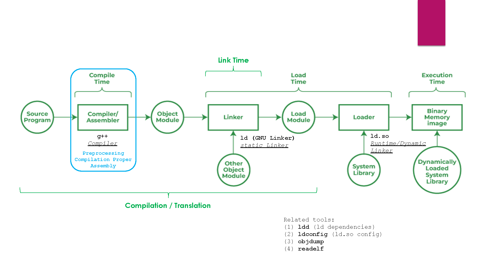

# C/C++ Translation And Loading Toolchain

## Translation And Loading Pipeline

- Compilation (Compile Time)
  - Done by `g++`, GNU C and C++ compiler
  - Three (NOT four, on purpose) steps:
    - Preprocessing
    - Compliation Proper
    - Assembly
    - Linking (see below)
- Linking (Link Time)
  - Sometimes considered part of compile time (when talking about comtile time / runtime)
  - Done by `ld` (GNU static linker)
  - Simply invoked by `g++`, `g++` fowards its own -Wl,-xxx,-xxx,... commandline arguments to it
- Loading (Load Time)
  - Happens right after an executable is launched, and before it really starts running
  - Done by `ld.so`, the runtime linker (also called loader, or dynamic linker)
  - Loads components from disk into memory
    - "Load modules" (output of the static linker)
    - System libraries
    - Shared libraries, also called dynamically-loaded libraries.
- Runtime
  - Loads dynamically loaded system libraries

## Compile Time

- **GNU C And C++ Compiler g++**: [man g++(1)](https://www.man7.org/linux/man-pages/man1/g++.1.html)
  - **Overview**
    - GCC normally does preprocessing, compliation, assembly and linking;
    - "Overall Options" (below) could stop this process at intermediate stages:
      - E,g., \-c says not to run the linker, so output is the assembler output. 
    - Other options are passed on to one or more states of processing
    - Invoke g++ instead of gcc when compiling C++ program
      - g++ has some minor different default behaviours compared to gcc. 
  - **Commandline Basics**
    - Multiple single-letter options must **not** be grouped!
      - E,g., \-dv is very different from \-d \-v. 
    - You can mix options and other arguments;
    - Order of most arguments does not matter:
      - However, e.g., 
        - \-L modifies search directories, search order matters!
        - Placement order of \-l also matters!
          - Only loads components needed by previous-specified objects. 
    - Many options have long names starting with \-f or with \-W-; Most of these have both positive and negative forms: 
      - E.g., \-fmove-loop-invariants, \-Wformat;
      - E.g., \-ffoo v.s. \-fno-foo. 
    - Some options take one or more arguments: 
      - Typically separated by a space or by the equals sign (=) from the option name. 
    - An argument can be either numeric or a string.  
      - Numeric arguments must typically be small unsigned decimal or hexadecimal integers. 
      - Hexadecimal arguments must begin with the 0x prefix.
  - **Option Summary**
    - **Overall Options**
      - \-c
      - \-S
      - \-E
      - \-o *file*
    - C Language Options
    - C++ Language Options
    - Objective-C and Objective-C++ Language Options
    - Diagnostic Message Formatting Options
    - **Warning Options**
      - \-Wall: Does not include all warning options, just a subset;
      - \-Wextra: Yet another subset of warning options;
      - \-Werror: Treat warnings as errors... 
    - C and Objective-C-only Warning Options
    - **Debugging Options**
      - \-g
      - \-g*level*
      - \-ggdb
    - **Optimization Options**
      - \-O
      - \-O[ 0 | 1 | 2 | 3 | s | fast | g ]
    - Program Instrumentation Options
    - Preprocessor Options
    - **Assembler Options**
      - \-Wa,*option*
      - \-Xassembler *option*
    - **Linker Options**
      - \-l*library*
      - \-pthread
      - \-Wl,*option*
      - \-Xlinker *option*
    - **Directory Options**
      - \-I*dir*
      - \-L*dir*
    - Code Generation Options
    - Developer Options
    - Machine-Dependent Options
  - **Overall Options**: Options Controlling the Kind of Output
    - Compilation can involve up to four stages, always in that order: 
      - Preprocessing
      - Compilation Proper
      - Assembly
      - Linking
    - The kind of compilation done is determined by input files' suffixes:
      - *file*.c: C source code that must be processed;
      - *file*.i: C source code that should not be preprocessed;
      - *file*.ii: C++ source code that should not be preprocessed;
      - *file*.h: C/C++ header file to be turned into a precompiled header;
      - *file*.cc, *file*.cxx, *file*.cpp, *file*.c++, *file*.C: C++ source code that must be preprocessed:
        - "x" in ".cxx" must both be literally "x";
        - ".C" refers to a literal capital "C".
      - *file*.hh, *file*.H, *file*.hxx, *file*.hpp, *file*.hPP, *file*.h++: C++ source code that must be preprocessed;
      - *file*.S: Assembler code;
      - *file*.S, *file*.sx: Assembler code that must be preprocessed;
      - *other*: An object file to be fed straight into linking: 
        - Any file name with no recognized suffix is treated this way.
    - Only want some of the stages of compilation?
      - Use \-x (or filename suffixes) to tell gcc where to start;
        - \-x *language*
          - Specify explicitly the language for the following input files;
            - Rather than letting the compiler choose a default based on the file name suffix; 
            - This option applies to all following input files until the next \-x option.
        - \-x none
          - Turn off any specification of a language;
          - Subsequent files are handled according to their file name suffixes, as they are if \-x has not been used at all.
      - Use one of the options \-c, \-S, or \-E to say where gcc is to stop; 
        - \-c
          - Compile or assemble the source files, but do not link.
          - The linking stage simply is not done.  
          - Output is in the form of an ".o" object file for each source file.
        - \-S
          - Stop after the stage of compilation proper; do not assemble.
          - output is in the form of an ".s" assembler code file for each non-assembler input file.
        - \-E
          - Stop after the preprocessing stage; do not run the compiler proper. 
          - The output is in the form of preprocessed source code, which is sent to the standard output.
        - \-o *file*
          - Place output in file *file*.
          - If not specified, the default is to put: 
            - executable file in a.out, 
            - object file for source.suffix in source.o,
            - its assembler file in source.s, 
            - a precompiled header file in source.suffix.gch, 
            - all preprocessed C source on standard output.
        - \-v 
          - Print on stderr the commands executed to run the stages of compilation.  
          - Also print the version number of  the compiler driver program and of the preprocessor and the compiler proper.
      - Note that some combinations (for example, \-x cpp-output \-E) instruct gcc to do nothing at all.
  - **Debugging Options**: Options for Debugging Your Program
    - Overview
      - \-g: Emit extra information for use by a debugger;
      - GCC allows \-g to be used with \-o:
        - Use optimizer for programs that might have bugs. 
      - Use \-Og with \-g if not using other optimization options. 
        - With no \-O option, some compiler passes that collect information useful for debugging do not run
        - Thus \-Og may result in a better debugging experience.
    - \-g
    - \-ggdb
      - Produce debugging information for use by GDB.  
      - This means to use the most expressive format available
    - \-g*level*
      - \-g0 negates \-g (no debugging info at all);
      - \-g1: minimal info, good for backtraces and line numbers, no local variables;
      - \-g3: extra info, e.g., macro definitions
    - If you use multiple \-g options, with or without level numbers, the last such option is the one that is effective.
  - **Optimization Options**: Options That Control Optimization
    - Overview
      - Not all optimizations are controlled directly by a flag.  
      - Most optimizations are completely disabled at \-O0 or if an \-O level is not set on the command line. 
        - Even if individual optimization flags are specified.  
        - Similarly, \-Og suppresses many optimization passes.
    - \-O, \-O1
    - \-O2
    - \-O3
    - \-O0: Reduce compilation time, turn off most optimizations. Default. 
    - \-Os: Optimize for size. Enables most \-O2 optimizations. 
    - \-Ofast: Enables all \-O3 optimizations, and enables those invalid for standard-compliant programs. 
    - \-Og: Optimize debugging experience. 
      - Enables most \-O1 optimizations;
      - Better choice than \-O0 for producing debuggable code; 
      - Some compiler passes that collect debug information are disabled at \-O0. 
  - **Assembler Options**: Passing Options to the Assembler
    - \-Wa,*option*
      - Pass *option* as an option to the assembler. 
      - If *option* contains commas, it is split into multiple options at the commas.
    - \-Xassembler *option*
      - Pass *option* as an option to the assembler.  
      - Used to supply system-specific assembler options that GCC does not recognize.
      - Pass an option that takes an argument:
        - Must use \-Xassembler twice, once for the option and once for the argument.
  - **Linker Options**: Options for Linking
    - \-l*library*, 
      - Search the library named library when linking.  
        - \-l *library* syntax (with space) is also valid, but not recommended. Just for POSIX compliance. 
      - Passed directly to the linker by GCC. 
      - The linker searches a standard list of directories for the library. The directories searched include several standard system directories plus any that you specify with \-L.
        - *Static libraries* are archives of object files, and have file names like liblibrary.a.  
        - Some targets also support *shared libraries*, which typically have names like liblibrary.so.  
        - If both static and shared libraries are found, the linker gives preference to linking with the shared library unless the
        \-static option is used.
      - **Order** of this option w.r.t. other options **matters**: 
        - The linker searches and processes libraries and object files in the order they are specified.  
        - Thus, `foo.o -lz bar.o` searches library `z` after file `foo.o` but before `bar.o`.  
        - If `bar.o` refers to functions in `z`, those functions may not be loaded.
    - \-pthread
      - Link with the POSIX threads library.
    - \-pie
      - Produce a dynamically linked position independent executable on targets that support it. 
      - For predictable results, you must also specify the same set of options used for compilation (\-fpie, \-fPIE, or model suboptions) when you specify this linker option. 
    - \-no-pie
      - Don't produce a dynamically linked position independent executable.
    - \-static-pie
      - Produce a static position independent executable on targets that support it. 
      - A static position independent executable is similar to a static executable, but can be loaded at any address without a dynamic linker. 
      - For predictable results, you must also specify the same set of options used for compilation (\-fpie, \-fPIE, or model suboptions) when you specify this linker option.
    - \-r
      - Produce a relocatable object as output. This is also known as partial linking.
    - \-static
      - On systems that support dynamic linking, this overrides \-pie and prevents linking with the shared libraries.
      - On other systems, this option has no effect.
    - \-shared
      - **Produce a shared object** `.so` which can then be linked with other objects to form an executable. 
        - Note that, to create **static archieves** `.a`, we need another tool called `ar`
          - The GNU ar program creates, modifies, and extracts from archives
      - Not all systems support this option. 
      - For predictable results, you must also specify the same set of options used for compilation (\-fpic, \-fPIC, or model suboptions) when you specify this linker option.
    - \-Xlinker *option*
      - Pass option as an option to the linker. 
      - Use this to supply system-specific linker options that GCC does not recognize.
      - If you want to pass an option that takes a separate argument: 
        - You must use \-Xlinker twice, once for the option and once for the argument. 
        - E.g., to pass `-assert` definitions, you must write `-Xlinker -assert -Xlinker` definitions. 
        - It does not work to write `-Xlinker -"assert definitions"`, because this passes the entire string as a single argument, which is not what the linker expects.
      - When using the GNU linker, pass arguments to linker options using the `option=value` syntax than as separate arguments. 
        - E.g., specify `-Xlinker -Map=output.map` rather than `-Xlinker -Map -Xlinker output.map`. 
        - Other linkers may not support this syntax for command-line options.
    - \-Wl,*option*
      - Pass option as an option to the linker. 
      - If option contains commas, it is split into multiple options at the commas.
      - You can use this syntax to pass an argument to the option. 
        - E.g., `-Wl,-Map,output.map` passes `-Map output.map` to the linker.  
        - When using the GNU linker, you can also get the same effect with `-Wl,-Map=output.map`.
    - \-u *symbol*
      - Pretend the symbol *symbol* is undefined, to force linking of library modules to define it. 
      - You can use \-u multiple times with different symbols to force loading of additional library modules.
  - **Directory Options**
    - \-I*dir*, \-iquote *dir*, \-isystem *dir*, \-idirafter *dir*
      - Add the directory *dir* to the list of directories to be searched for header files during preprocessing. 
      - If *dir* begins with `=` or `$SYSROOT`, then the `=` or `$SYSROOT` is replaced by the sysroot prefix.
        - See \--sysroot and \-isysroot.
      - Quote v.s. bracket includes: 
        - Directories specified with \-iquote apply only to the quote form of the directive, `#include "file"`. 
        - Directories specified with \-I, \-isystem, or \-idirafter apply to lookup for both the `#include "file"` and `#include <file>` directives.
      - You can specify any number or combination of these options on the command line to search for header files in several directories. The lookup order is as follows:
         1. For the quote form of the include directive, the directory of the current file is searched first.
         2. For the quote form of the include directive, the directories specified by -iquote options are searched in left-to-right order, as they appear on the command line.
         3. Directories specified with -I options are scanned in left-to-right order.
         4. Directories specified with -isystem options are scanned in left-to-right order.
         5. Standard system directories are scanned.
         6. Directories specified with -idirafter options are scanned in left-to-right order.
      - You can use \-I to override a system header file, substituting your own version, since these directories are searched before the standard system header file directories.  
        - However, you should not use this option to add directories that contain vendor-supplied system header files; use \-isystem for that.
      - The \-isystem and \-idirafter options also mark the directory as a system directory, so that it gets the same special treatment that is applied to the standard system directories.
      - If a standard system include directory, or a directory specified with \-isystem, is also specified with \-I, the \-I option is ignored.  
      - The directory is still searched but as a system directory at its normal position in the system include chain.
        - This is to ensure that GCC's procedure to fix buggy system headers and the ordering for the `#include_next` directive are not inadvertently changed.  
        - If you really need to change the search order for system directories, use the \-nostdinc and/or \-isystem options.
    - \-I-
      - **This option has been deprecated**.
    - \-L*dir*
      - Add directory *dir* to the list of directories to be searched for -l.
    - \-B*prefix*
      - This option specifies where to find the executables, libraries, include files, and data files of the compiler itself.

## Link Time

- **GNU Static Linker ld** [man ld(1)](https://man7.org/linux/man-pages/man1/ld.1.html)
  - Overview
    - Combines a number of object and archive files, relocates their data and ties up symbol references. 
      - Usually the last step in compiling a program is to run `ld`.
    - E.g., To link a file `hello.o`: `ld -o <output> /lib/crt0.o hello.o -lc`
      - Tells ld to produce a file called `output` as the result of linking the file `/lib/crt0.o` with `hello.o` and the library
       `libc.a`, which will come from the standard search directories.
    - Some of the command-line options to ld may be specified at any point in the command line. 
      - However, **file options**, such as \-l, cause the file to be read at the point at which the option appears in the command line, relative to the object files and other file options.
      - Repeating **non-file options** with a different argument will either have no further effect, or override prior occurrences (those further to the left on the command line) of that option. 
    - **Non-option arguments** are object files or archives which are to be linked together. 
      - They may follow, precede, or be mixed in with command-line options, except that an object file argument may not be placed between an option and its argument.
    - For options whose names are a single letter, option arguments must either follow the option letter without intervening
     whitespace, or be given as separate arguments immediately following the option that requires them.
    - For options whose names are multiple letters, either one dash or two can precede the option name; for example, \-trace-symbol and \--trace-symbol are equivalent. 
      - Note: There is one exception to this rule. 
      - Multiple letter options that start with a lower case `o` can only be preceded by two dashes. 
      - This is to reduce confusion with the `-o` option. 
      - So for example `-omagic` sets the output file name to magic whereas `--omagic` sets the NMAGIC flag on the output.
    - Arguments to multiple-letter options must either be separated from the option name by an equals sign, or be given as separate arguments immediately following the option that requires them.
      - For example, `--trace-symbol foo` and `--trace-symbol=foo` are equivalent. 
      - Unique abbreviations of the names of multiple-letter options are accepted.
      - Note: If the linker is being invoked indirectly, via a compiler driver (e.g. `gcc`) then all the linker command-line options should be prefixed by `-Wl`, (or whatever is appropriate for the particular compiler driver) like `gcc -Wl,--start-group foo.o bar.o -Wl,--end-group`
      - This is important, because otherwise the compiler driver program may silently drop the linker options, resulting in a bad link.
      - Confusion may also arise when passing options that require values through a driver, as the use of a space between option and argument acts as a separator, and causes the driver to pass only the option to the linker and the argument to the compiler. 
        - In this case, it is simplest to use the joined forms of both single-and multiple-letter options, such as `gcc foo.o bar.o -Wl,-eENTRY -Wl,-Map=a.map`. 
    - \-l *namespec*, \-\-library=*namespec*
      - Add the archive or object file specified by *namespec* to the list of files to link.
      - This option may be used any number of times.  
      - If *namespec* is of the form *:filename*, ld will search the library path for a file called *filename*, otherwise it will search the library path for a file called *libnamespec.a*.
      - Shared libraries: 
        - On systems which support shared libraries, ld may also search for files other than *libnamespec.a*. 
        - Specifically, on ELF and SunOS systems, ld will search a directory for a library called *libnamespec.so* before searching for one called *libnamespec.a*. 
          - By convention, a ".so" extension indicates a shared library.
          - Note that this behavior does not apply to *:filename*, which always specifies a file called *filename*.
      - The linker will search an archive only once, at the location where it is specified on the command line. 
        - If the archive defines a symbol which was undefined in some object which appeared before the archive on the command line, the linker will include the appropriate file(s) from the archive.
        - However, an undefined symbol in an object appearing later on the command line will not cause the linker to search the archive again.
          - See the `-(` option for a way to force the linker to search archives multiple times.
        - You may list the same archive multiple times on the command line.
    - \-L *searchdir*, \-\-library-path=*searchdir*
      - Add path *searchdir* to the list of paths that ld will search for archive libraries and ld control scripts. 
      - You may use this option any number of times. 
      - The directories are searched in the order in which they are specified on the command line. 
      - Directories specified on the command line are searched before the default directories.  
      - All \-L options apply to all \-l options, regardless of the order in which the options appear.  
      - If searchdir begins with "=" or $SYSROOT, then this prefix will be replaced by the sysroot prefix, controlled by the \-\-sysroot option, or specified when the linker is configured.
      - The default set of paths searched (without being specified with \-L) depends on which emulation mode ld is using, and in some cases also on how it was configured.
      - The paths can also be specified in a link script with the "SEARCH_DIR" command. 
      - Directories specified this way are searched at the point in which the linker script appears in the command line.
- **Shared Object Dependencies ldd** [man ldd(1)](https://man7.org/linux/man-pages/man1/ldd.1.html)
  - **Overview**
    - Prints the shared objects (shared libraries) required by each **program** or **shared object** specified on the command line.  
    - In the usual case, ldd invokes the standard dynamic linker (see [man ld.so(8)](https://man7.org/linux/man-pages/man8/ld.so.8.html)) with the LD_TRACE_LOADED_OBJECTS environment variable set to 1.  
      - This causes the dynamic linker to inspect the program's dynamic dependencies, and find (according to the rules described in [man ld.so(8)](https://man7.org/linux/man-pages/man8/ld.so.8.html)) and load the objects that satisfy those dependencies. 
      - For each dependency, ldd displays the location of the matching object and the (hexadecimal) address at which it is loaded. 
    - **Security**: 
      - ldd may execute of whatever code is defined in the program's ELF interpreter, and perhaps to execution of the program itself. 
      - Never employ ldd on an untrusted executable. 
      - A safer alternative when dealing with untrusted executables is `$ objdump -p /path/to/program | grep NEEDED`
        - Note, however, that this alternative shows only the direct dependencies of the executable; 
        - While ldd shows the entire dependency tree of the executable.
  - **Options**
    - \-v, \-\-verbose
      - Print all information, including, for example, symbol versioning information.
    - \-u, \-\-unused
      - Print unused direct dependencies.

## Load Time

- **Dynamic Linker/Loader ld.so** [man ld.so(8)](https://man7.org/linux/man-pages/man8/ld.so.8.html)
  - **Overview**
    - 1
  - 1
  - 2

